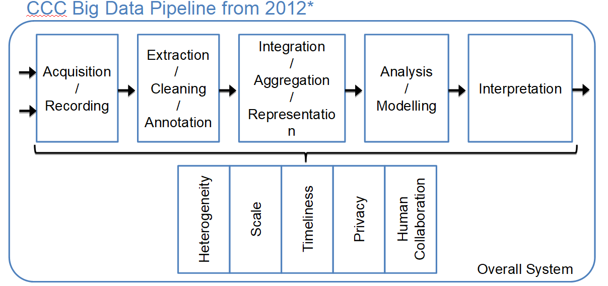
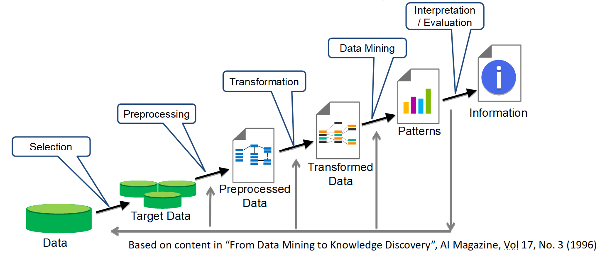
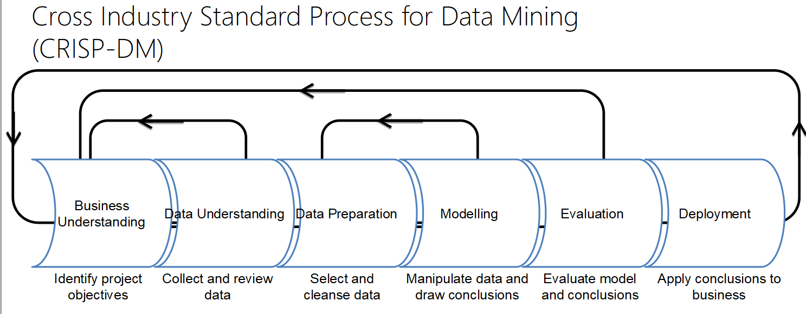
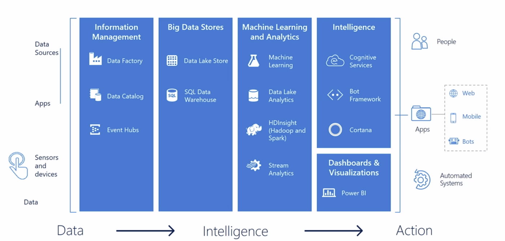
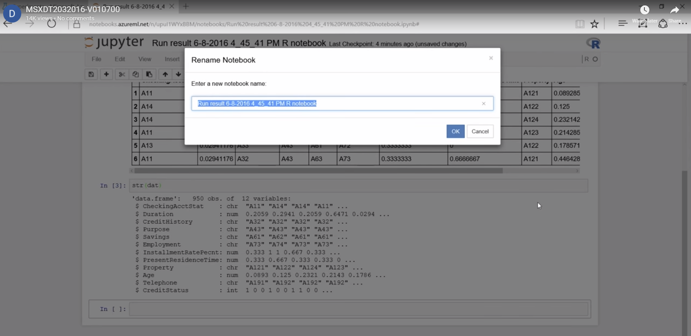
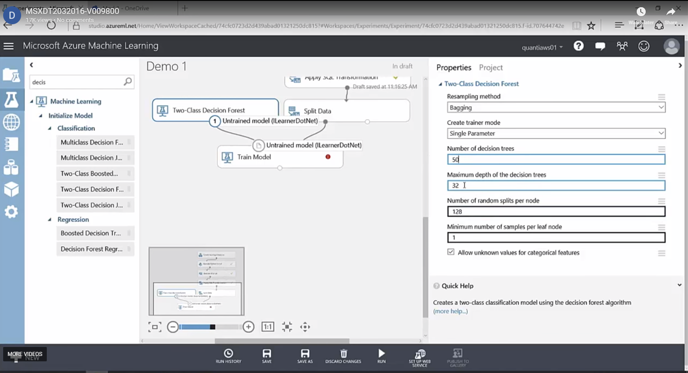
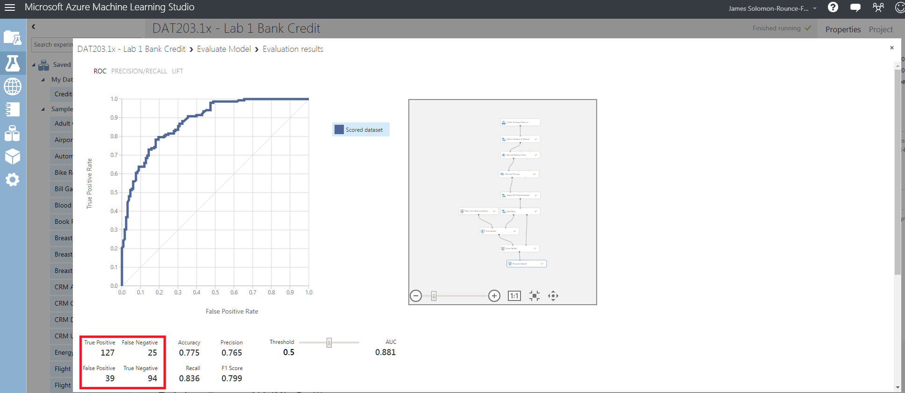

# Data Science Essentials
***
Notes taken during/inspired by the edX course 'Data Science Essentials - Microsoft: DAT203.1x' by Graeme Malcolm, Steve Elston and Cynthia Rudin.

**_Course Handouts_**

* [Course Setup Guide](../files/DSEssentials/DAT203.1x-Setup-Guide.PDF)
* [Slides](../files/DSEssentials/Slides)
* [Handouts](../files/DSEssentials/Handouts) 
* [Labs](../files/DSEssentials/Labs)
* [GitHib Repo for course including course materials, slides, labs etc](https://microsoftlearning.github.io/Data-Science-Essentials/)

**_Key Ponts_**
* [Key Points for Principles of Data Science](../files/DSEssentials/KeyPoints/PrinciplesofDataScience.PDF)


**_Other useful links_**
* []()

## Principles of Data Science

The course uses the following definition of data science:

> Data Science is the exploration and quantitative analysis of all available structured and unstructured data to develop understanding, extract knowledge, and formulate actionable results.

We are interested in 'Data Analytical Thinking' which effectivley moves us away from intution to data driven analytical decisions.  Originally data was used to inform decisions, however advances have made analysis to be more real time e.g. prescriptive analytics, and also help consider future trends i.e. predictive analytics.

For instance in a medical sense, we no longer wait for a patient to present themselves, we can take more regular readings such as blood tests, surveys and so on, then identify which patients are more at risk and undertake preventive work.  In a similar way, aircraft manufacturers are building in measurement devices and applications to record data and report it, so that abnormal part behaviour is picked up earlier leading to preventative maintenance.  Equally in fraud detection, we can now look not just at real time transactions which look odd, but anomolies across multiple accounts which may indicate large scale fraud using anomaly detection.

There is some terminology to learn, for instance if we were looking at whether a crime had been predicted by the same person, we might call that a crime series:

* Crime Series = Cluster in ML  
* Modus Operandi = Subspace in ML  

Whilst the actual process is a bit more detailed, but the method used to detect this wasn't far off k-means clustering.

Big Data was originally called this by a pair of Astronomers who also suggested a data pipeline.

```{r Big Data Pipeline, echo = FALSE, fig.cap='Big Data Pipeline'}

```

At the same time, a seperate group were trying to create a representation for the knowledge discovery in databases (KDD) process.

```{r KDD, echo = FALSE, fig.cap='Knowledge Discovery in Databases or KDD'}

```

So they have the same exact steps, which suggests at some commonality between fields in terms of data and knowledge discovery.  Data Mining is only one part of the process.  CRISP-DM is a similar process, but also includes Business Need and Data Understanding.  As the diagrams indicate, there are backwards flows, indicating we move in an iterative process.

```{r CRISP-DM, echo = FALSE, fig.cap='CRISP-DM'}

```

Part of the data preperation process can involve turning things like unstructured text in to something more useable for ML i.e. a vector.  People often thinking the modelling step is where the 'magic' happens, but if the data has been properly prepared, then it will be quite straightforward.

Predictive modelling means machine learning or statistical modelling, it may not mean predicting the future, it can often mean predicting a new case or person outcome that you have not seen before.

### Data Science Technologies

There's a huge range of tools and technologists that you can use as a data scientist; ranging from spreadsheet tools like Microsoft Excel with through to large-scale data processing platforms like Apache Spark.  The course focuses on a core set of tools that you can use to perform most data exploration, cleaning, and modeling tasks - and which you will use in the course labs. These tools are provided in the Microsoft Azure Machine Learning service, which includes:

* A graphical environment called Azure Machine Learning Studio, in which you can create data science experiments and publish machine learning models as web services.  
* Jupyter Notebooks - an online tool for running custom R or Python code to explore and visualize data.  

Azure Machine Learning (AML) is easy to use and don't require a lot of programming, but they do require understanding of data science and the model building process.  R and Python are widely used tools that are highly interactive with good visualisations, both have good development environments.  Python is more systematic and faster, but R wins in other ways like the range of packages, is faster with graphics and is easier to learn.  

There is a 'stack' within Microsoft Cortana Intelligence, as shown below, the focus of the course is on the Machine Learning and Analytics element.

```{r Stack, echo = FALSE, fig.cap='Microsoft Cortana Stack'}

```

AML is easy to use and requires a bit of Data Science knowledge so you know what you are doing.  You can quickly deploy your tools to the web or into production.  AS it runs in Azure, it can be scaleable and secure.  They also work with Juypter notebooks.  Azure Machine Learning Studio is the 'studio' in to which we build our work flow.  AML Studio allows you to build a DS workflow using graphical tools, but also allows you to code elements, in SQL, R and Python.  Azure Machine Learning however is a production environment, it is not an interactive development environment.  If you wish to develop, this is best done in an IDE like R Studio.  An IDE has as a more powerful editor and debugger, amungst other things, that AML does not.  You can then, when finished, cut and paste your code in to AML.  An alternative would be to use Juypter, then cut and paste in to AML.  We can use SQL to read data from Azure SQL, a SQL Server, or from an SQL database.  You can also run the Apply SQL Transformation module, which runs SQLite _in line_ with your expriment.  This allows you to then filter and structure your data in a SQL way, if you are more comfortable or exprienced with that.

At the end of setp or a workflow, it is possible to export the resulting file to a csv (using convert to csv), then right click the output port and select 'open in a new newbook' and choose your language/kernel of choice.  The resulting notebook can be used for interactive exploration and will be saved in to the AML workspace, you can rename the notebook by selecting the title e.g. the 'Run result 6-8-2016 ...' next to the Jupyter logo in the image shown below.

```{r Jupyter, echo = FALSE, fig.cap='Rename Jupyter Notebook'}

```

It is possible to use built in functions inside AML to do things like create the test/train split, with parameters for the fraction of the data to use for the test split and set the seed.  In the same fashion, we can add a random forest classification (decision tree) model to our experiment in AML and set things like the depth and the number of trees as illistrated below.

```{r RF in AMLS, echo = FALSE, fig.cap='Setting Random Forest Hyperparameters in AML Studio'}

```

### LAB One

The first lab introduces AML Studio and asks for a basic model to be built for Credit Scoring.  The assessment asks for the true positive and negative counts, as shown in the 'Evaluate Model' output confusion matrix shown below.

```{r Lab 1 in AMLS, echo = FALSE, fig.cap='Lab 1 Evaluate Model Visualisation'}

```
