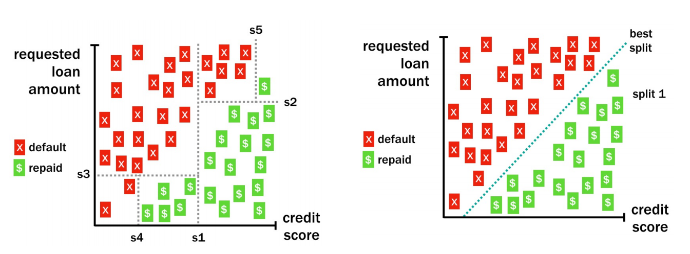
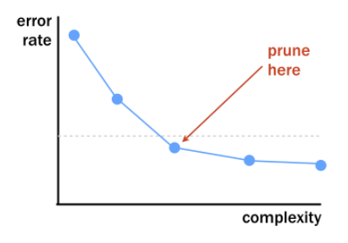

# Supervised Learning In R Classification
***
Notes taken during/inspired by the DataCamp course 'Supervised Learning In R Classification' by Brett Lantz.

**_Course Handouts_**

* [Part 1 - k-Nearest Neighbors (kNN)](./files/SLinRClassification/chapter1.pdf)
* [Part 2 - Naive Bayes](./files/SLinRClassification/chapter2.pdf)
* [Part 3 - Logistic Regression](./files/SLinRClassification/chapter3.pdf)
* [Part 4 - Classification Trees](./files/SLinRClassification/chapter3.pdf)

**_Other useful links_**

* [Introduction to Tree Based Methods from ISL](https://www.youtube.com/watch?v=6ENTbK3yQUQ)

## k-Nearest Neighbors (kNN)

Machine Learning uses computers to turn data in to insight and action.  This course looks at supervised learning, where we train the machine to learn from prior examples.  When the concept to be learned is a set of categories, the objective is classification. In autonomous driving, we may want our car to undertake some action, like brake, when certain roads signs are observed. After a period of time observing a drivers behaviour, the computer will build a database of signs and appropriate responses.  Some if one stop sign is observed, it will try and place where this sign is in relation to other signs it has seen before, then determine what type or class the sign is and do the appropriate action.  

To do this, it calculates the distance between the new sign and past signs, using co-ordinates in feature space. For instance, signs could be classified in three dimensions using RGB, then signs of a similar colour will be located together.  Distance is then measured based on the signs location in the co-ordinate space. We could for instance measure Euclidean distance, which is used by many NN algorithms, and can be done in R using the knn function.

First let us load the data.

```{r}
# Load the signs data 
traffic_signs <- read.csv("./files/SLinRClassification/knn_traffic_signs.csv", stringsAsFactors = FALSE)
signs <- subset(traffic_signs, sample == "train")
signs$id <- NULL
signs$sample <- NULL
signs_test <- subset(traffic_signs, sample == "test")
signs_test$id <- NULL
signs_test$sample <- NULL

library(class)
next_sign <- signs[146,]
signs     <- signs[1:145,]
sign_types <- signs$sign_type
signs_actual <- signs_test$sign_type
rm(traffic_signs)

#Load the locations and where9am data
locations <-  read.csv("./files/SLinRClassification/locations.csv", stringsAsFactors = FALSE)
where9am <- subset(locations, hour == 9)
```

After several trips with a human behind the wheel, it is time for the self-driving car to attempt the test course alone.

As it begins to drive away, its camera captures an image.LEt's write some code so that a kNN classifier helps the car recognize the sign.

```{r, eval = FALSE}
# Load the 'class' package
library(class)

# Create a vector of labels
sign_types <- signs$sign_type

# Classify the next sign observed - the first column of the signs dataset is removed as the class is specified in the cl = vector
knn(train = signs[-1], test = next_sign, cl = sign_types)
```

Each previously observed street sign was divided into a 4x4 grid, and the red, green, and blue level for each of the 16 center pixels is recorded.
The result is a dataset that records the sign_type as well as 16 x 3 = 48 color properties of each sign.

```{r}
# Examine the structure of the signs dataset
str(signs)

# Count the number of signs of each type
table(signs$sign_type)

# Check r10's average red level by sign type
aggregate(r10 ~ sign_type, data = signs, mean)
```

Next we want to try and see how well the predict signs match the actual signs classified by a human.  We will also create a confusion matrix to see where it worked and a accuracy measure.

```{r, eval = FALSE}
# Use kNN to identify the test road signs
sign_types <- signs$sign_type
signs_pred <- knn(train = signs[-1], test = test_signs[-1], cl = sign_types)

# Create a confusion matrix of the actual versus predicted values
signs_actual <- test_signs$sign_type
table(signs_pred, signs_actual)

# Compute the accuracy
mean(signs_pred == signs_actual)
```

When we use kNN, the K signifies the number of neighbours to consider when making the classification.  Unless specified, R will use k = 1 i.e. it will only consider the nearest neighbour. However, as other elements, such as road sign background and lighting, might cause an incorrect road sign to be the nearest based on such factors, this can cause problems. If we use a greater value for K, there is in effect a vote from the nearest neighbours (k) on which sign is the most likely.  In the case of a tie, the winner is typically set by random.  Setting a high value for K isn't always the best approach, as it can introduce noise in to a pattern.  Setting a low value for k might enable it to identify more subtle patterns, but may lead to overfitting and errors.

** Some people suggest setting K to the square root of the number of observations in the training data ** So if we observed 100 road signs, we would set k to 10.  A better approach would be to set k to mutiple values, then run the model against some unseen (test) data and see how it performs.

In the following example we set k = 1 (default), 7 then 15 and compare the levels of accuracy.

```{r, eval = FALSE}
# Compute the accuracy of the baseline model (default k = 1)
k_1 <- knn(train = signs[,-1], test = signs_test[,-1], cl = signs[,1])
mean(k_1 == signs_actual)

# Modify the above to set k = 7
k_7 <- knn(train = signs[,-1], test = signs_test[,-1], cl = signs[,1], k = 7)
mean(k_7 == signs_actual)

# Set k = 15 and compare to the above
k_15 <- knn(train = signs[,-1], test = signs_test[,-1], cl = signs[,1], k = 15)
mean(k_15 == signs_actual)
```

K = 7 gives the highest level of accuracy.

When multiple nearest neighbors hold a vote, it can sometimes be useful to examine whether the voters were unanimous or widely separated.  There is a option we can set using prob = TRUE parameter to compute the vote proportions for a kNN model.

```{r, eval = FALSE}
# Use the prob parameter to get the proportion of votes for the winning class
sign_pred <- knn(train = signs[,-1], test = signs_test[,-1], cl = signs[,1], k = 7, prob = TRUE)

# Get the "prob" attribute from the predicted classes
sign_prob <- attr(sign_pred, "prob")

# Examine the first several predictions
head(sign_pred)

# Examine the proportion of votes for the winning class
head(sign_prob)
```

kNN models calculate distance, therefore kNN assumes the data is in numeric format e.g. we don't have yellow we have RGB values.  If something cannot be easily converted to a numeric, we can create dummy variables e.g. to indicate the shape such as triangle = 1, square = 0, circle = 0 might be for one particular sign. This dummy set of vars can then be used in distance calculations.

When we then introduce another variable - the original RGB 0-255 and shape 0-1 - we can have problems as they are on different scales.  The variables with a larger scale can have a disproportionate effect on the calculation of distance, therefore we need to normalise the data.  So we change our RGB vlues to go in to the range of 0 to 1.  To do this you could create a function yourself, or use one which is included in some packages like caret.

## Naive Bayes

Bayes proposed rules for estimating probabilties in light of historic data.  This section will look at applying these methods to phone data to help forecast action.  We take the number of times and event happened / all possible events (how many times it could of occured). But we should also incorporate other variables, like time of day, to give a single probability estimate.  This therefore becomes the joint probability P(A and B) e.g. P(work and evening) = 1%, P(work and afternoon) = 20%.

We also have the conditional probability P(A¦B) = P(A and B) / P(B) = P (work ¦ evening) = 1/25 = 4% or P (work ¦ afternoon) = 20/25 = 80%.  WE can do these calculations using the the naivebayes package in R.

The where9am data frame contains 91 days (thirteen weeks) worth of data in which Brett recorded his location at 9am each day as well as whether the daytype was a weekend or weekday.

```{r}
# Compute P(A) 
p_A <- nrow(subset(where9am, location == 'office')) / nrow(where9am)

# Compute P(B)
p_B <- nrow(subset(where9am, daytype == 'weekday')) / nrow(where9am)

# Compute the observed P(A and B)
p_AB <- nrow(subset(where9am, location == 'office' & daytype == 'weekday')) / nrow(where9am)

# Compute then print P(A | B)
p_A_given_B <- p_AB / p_B
p_A_given_B
```

Next we can use th naive bayes model to predict Brett's location and two different times and days - 9am on a Thursday and 9 am on a Saturday.
```{r}
# Setup our variables for prediction
days <- data.frame(daytype = factor(c("weekday","weekend")))
thursday9am <- subset(days, daytype == 'weekday')
saturday9am <- subset(days, daytype == 'weekend')

# Load the naivebayes package
library(naivebayes)

# Build the location prediction model
locmodel <- naive_bayes(location ~ daytype, data = where9am)

# Predict Thursday's 9am location
predict(locmodel, thursday9am)

# Predict Saturdays's 9am location
predict(locmodel, saturday9am)

```

Brett is most likely at the office at 9am on a Thursday, but at home at the same time on a Saturday.  Note that the structure of the variables and their levels matter, for instance if we had a factor variable with just one level and not all possible levels e.g. saturday9am with a daytype of weekend but a factor variable with only the level observed (weekend) and not including the other possability of weekday in the factor levels, we would get a different result - a result of office. So data structure is important.

We can examine the _a priori_ (overall) probabilities just by examing the model and some of it's sub-components.

```{r}
locmodel$tables$daytype
locmodel$prior
```

We can then compare these probabilities to those we obtain when using a model.

```{r}
# Obtain the predicted probabilities for Thursday at 9am
predict(locmodel, thursday9am, type = "prob")

# Obtain the predicted probabilities for Saturday at 9am
predict(locmodel, saturday9am, type = "prob")
```

So on a Saturday there is 0% chance Brett is at the office and a 100% chance he is at home.

In Bayesian statistics, we say that independent events occur when knowing the outcome of one event does not help predict the other.  For example, knowing if it's raining in London doesn't help you predict the weather in Manchester. The weather events in the two cities are independent of each other.

### Putting the Naivety in Naive Bayes

With simple conditions where we have one predictor, daytime of the week, the conditional probability is based on the overlap between the two events.  As we add more events, the degree of overlap illistrated through Venn diagrams can become complex and messy.  The computer will find it inefficient to calculate the overlap, so the computer uses a shortcut to calculate the conditional probability we hope to compute.  

Instead of looking for the intersection between all possible events, the computer will make a naive assumption about the data, it assumes that the events are independent. When this occurs, the joint probability can be calculated by mutiplying the individual probabilities. So simpler calculations can be performed based on limited intersections mutiplied together.

One of the problems with this approach is that when an event has not been previously observed - such as going to work on a weekend - we immediatly get calculation problems, since this individual probability is zero, so the results become zero despite how many other conditions in the caulaution may be likely.  The solution is to add a small amount, such as 1%, to all the individual components - we call this the Laplace correction. So there will be at least some predicted probability, even if it has never been seen before.

Next we will build a more complicated model using the locations data, which is similar to the where9am data but contains 24hours of data recorded at hourly intervals over 13 weeks and also contains other variables such as hour type.

```{r}
head(locations, n = 10)
```

Then we setup our variables to be predicted

```{r}
weekday_afternoon <- locations[13,c(4,6,7)]
weekday_evening <- locations[19,c(4,6,7)]
weekend_afternoon <- locations[85,c(4,6,7)]
```

Then we build our mutiple variable model and predict 

```{r}
# Build a NB model of location
locmodel <- naive_bayes(location ~ daytype + hourtype, data = locations)

# Predict Brett's location on a weekday afternoon
predict(locmodel, weekday_afternoon)

# Predict Brett's location on a weekday evening
predict(locmodel, weekday_evening)
```

Or with probabilities

```{r}
# Predict Brett's location on a weekday afternoon
predict(locmodel, weekday_afternoon, type = "prob")

# Predict Brett's location on a weekday evening
predict(locmodel, weekday_evening, type = "prob")
```

Next we will try to predict where Brett would be on a weekend afternoon.  Since there are some locations he has never been to before at this time of day e.g. the campus, office or theatre, we will predict probabilities both with and without the Laplace correction.  Adding the Laplace correction allows for the small chance that Brett might go to the office on the weekend in the future.  Without the Laplace correction, some potential outcomes may be predicted to be impossible.

```{r}
# Observe the predicted probabilities for a weekend afternoon
predict(locmodel, weekend_afternoon, type = "prob")

# Build a new model using the Laplace correction
locmodel2 <- naive_bayes(location ~ daytype + hourtype, laplace =1, data = locations)

# Observe the new predicted probabilities for a weekend afternoon
predict(locmodel2, weekend_afternoon, type = "prob")
```

### Applying Naive Bayes (NB) to other problems

NB is useful when attirbutes from multiple factors need to be considered at the same time, then evaluated as a whole, a bit like a Doctor looking at a patient then making a reccomendation.  There are some considerations to be aware of whan apply NB to other scenarios.

Bayes works by calculating conditional probabilites, it builds frequency tables of the number of times a particular condition overlaps with our condition of interest, then the probabilities are multiplied Naively in a chain of events.  Each predictor typically comprises a set of categories, numeric data like time of day or age, are difficult without modification.  Unstructured text data also causes problems.  

We can bin numeric data - like age bands - to make Bayes handle the data better.  Or use quintiles.  Text data is best adjusted using the bag of words approach.  This in effect creates a table, where each sentenence or document becomes a row, and the columns become some numeric value for the presence of words, usually dummy vars.  NB trained with the bag of words approach can be very effective text classifiers.

## Logistic regression - binary predictions with regression

Regression models are one of the commonest forms of machine learning.  If we have a binary outcome (1 or 0), using a standard regression may result in results either above or below this range.  With logistic regression, we create a curve, a logistic function (s curve).  Our result therfore becomes a probability between 0 and 1.  We can caulate this using a glm model, setting the family to binomial, which we can then use in the predict model.  If we use the type = "response" argument with predict, we get the predicted probabilites rather than the default log-odds.  WE then use these probabilites and set some parameters using an ifelse statement e.g. if the predicted probability is greater than 50%, then we might say that is a 1 e.g. pred <- ifelse(prob >0.5, 1, 0). 

The donors dataset contains 93,462 examples of people mailed in a fundraising solicitation for paralyzed military veterans. The donated column is 1 if the person made a donation in response to the mailing and 0 otherwise.  The remaining columns are features of the prospective donors that may influence their donation behavior - the independent variables.

```{r}

# Load the data
donors <- read.csv("./files/SLinRClassification/donors.csv", stringsAsFactors = TRUE)

# Examine the dataset to identify potential independent variables
str(donors)

# Explore the dependent variable
table(donors$donated)

# Build the donation model
donation_model <- glm(donated ~ bad_address + interest_religion + interest_veterans, 
                      data = donors, family = "binomial")

# Summarize the model results
summary(donation_model)

```

We can anow apply this model.  Remember that the default output is the log-odds of an outcome, so we need to use type = "response" to convert this to a probability.

```{r}
# Estimate the donation probability
donors$donation_prob <- predict(donation_model, type = "response")

# Find the donation probability of the average prospect
mean(donors$donated)

# Predict a donation if probability of donation is greater than average (0.0504)
donors$donation_pred <- ifelse(donors$donation_prob > 0.0504, 1, 0)

# Calculate the model's accuracy
mean(donors$donation_pred == donors$donated)
```

So the model appears to be accurate - circa 80%.  But, the outcome of interest is quite rare (the second element above, the mean) is only around 5%, so had the model predicted not donated for every person, it would have been accurate 95% of the time.

To visual;ise this trade off between positive and negative predictions we can use an ROC curve.  With an ROC curve we want to be away from the diagonal (an Area Under the Curve or AUC of 0.5) and towards the top left hand corner (top left would be an AUC of 1.0).  But as curves of different shapes/gradients can have the same AUC, we should also look at the curve as well as the AUC value. 

Next we can plot an ROC and calculate the AUC for our model.

```{r}
# Load the pROC package
library(pROC)

# Create a ROC curve
ROC <- roc(donors$donated, donors$donation_prob)

# Plot the ROC curve
plot(ROC, col = "blue")

# Calculate the area under the curve (AUC)
auc(ROC)
```

With the line almost on the diagonal and an AUC of just over 0.5 our model isn't doing much better than making predictions at random.

### Dummy variables, missing data, and interactions

All of the variables in a regression analysis must be numeric e.g. all categorical data must be represented as a number. With missing data, we can no longer use this information to make predictions.  

We use dummy variables - also sometimes called one hot encoding - for logistic regression.  The GLM function will automatically convert factor type variables in to dummy vars used in the model.  We just use the factor function to the data first, if the data/variable is not already a factor. 

If we have missing data, our model will automatically exclude these cases (rows) in the model.  You can create a categorical variable option (a factor level) for missing e.g. low, medium, high and missing.  However for numerical data we have more options, perhaps we might use the mean or median, or build a more complex model if we like to impute this missing variable.  Either way, it is a good idea to add a column/variable to indicate if a variable was imputed.  Sometimes, this missing_var (1 = yes) can become an important predictor in a model.

An interaction effect considers that certain variables, when combined, may have more of an influence together than the sum of their individual components.  The combination may strenthen, weaken or completly eliminate the strength of the individual predictors.  In the model function, we can use the multiplication symbol (*) to indicate an interaction.  The result will include individual components as well as combined effects.

In the next example, we classify a variable as a factor (wealth_rating), then set the reference category for the variable to Medium and finally build a model with this variable.

```{r}
# Convert the wealth rating to a factor
donors$wealth_rating <- factor(donors$wealth_rating, levels = c(0,1,2,3), labels = c("Unknown", "Low", "Medium", "High"))

# Use relevel() to change reference category
donors$wealth_rating <- relevel(donors$wealth_rating, ref = "Medium")

# See how our factor coding impacts the model
summary(glm(donated ~ wealth_rating, data = donors, family = "binomial"))
```

As mentioned before, in cases where a variable is NA, R will exclude these cases when building a model.  Therefore we should try and attempt to handle such cases, one option is imputation as shown below.  We also create a new variable to indicate whether the age value was imputed, as a missing value can be an indicator of something more meaningful going on, it could be related to the outcome.

```{r}
# Find the average age among non-missing values
summary(donors$age)

# Impute missing age values with mean(age)
donors$imputed_age <- ifelse(is.na(donors$age), round(mean(donors$age, na.rm = TRUE),2), donors$age)

# Create missing value indicator for age
donors$missing_age <- ifelse(is.na(donors$age),1,0)
```

Donors that haven given both recently and frequently may be especially likely to give again; in other words, the combined impact of recency and frequency may be greater than the sum of the separate effects.  In Marketing terms this is known as the RFM Model (recency, freqeuncy and money).

Because these predictors together have a greater impact on the dependent variable, their joint effect must be modeled as an interaction.

```{r}
# Build a recency, frequency, and money (RFM) model
rfm_model <- glm(donated ~ money + recency * frequency, data = donors, family = "binomial")

# Summarize the RFM model to see how the parameters were coded
summary(rfm_model)

# Compute predicted probabilities for the RFM model
rfm_prob <- predict(rfm_model, type = "response")

# Plot the ROC curve and find AUC for the new model
library(pROC)
ROC <- roc(donors$donated, rfm_prob)
plot(ROC, col = "red")
auc(ROC)
```

### Automatic feature selection

So far we have been selecting which variables to put in our model manually ourselves.  We've had to logically build our model using some fundraising knowledge, thinking about what variables may influence donations.  There is a process to speed this up using automatic feature selection called stepwise feature selection.

Stepwise feature selection builds a model each variable at a time and sees which predictor adds value to the final model.  Backward deletion begins with a model containing all the features, then variables are deleted as long as the removal of a variable does not negatively impact the models overall ability to predict the outcome.  At each step, the predictor that impacts the model the least is removed.

Forward stepwise selection does this in reverse, starting with no predictors, then adding in each predictor by first assessing each predictor to determine which has the greatest ability to predict the outcome at each step and adding that predictor, then re-assessing all remaining predictors.

The results of a forward and backward stepwise process can result in different results AND neither may be the best possible model.  This process coul be accused asbeing akin to p-hacking and violates some of our science principles, namely to generate then test a hypothesis - it is atheortical as there is no theory about how things work.  But if the goal is prediction, this might not be such a great concern.  But it might be best to consider stepwise regression as a tool to start from.  

To run stepwise, we set our null model, then our full model, then use step to iteratie either forward or backward between these models.

```{r}
# Specify a null model with no predictors
null_model <- glm(donated ~ 1, data = donors, family = "binomial")

# Specify the full model using all of the potential predictors
full_model <- glm(donated ~ ., data = donors, family = "binomial")

# Use a forward stepwise algorithm to build a parsimonious model
step_model <- step(null_model, scope = list(lower = null_model, upper = full_model), direction = "forward")

# Estimate the stepwise donation probability
step_prob <- predict(step_model, type = "response")

# Plot the ROC of the stepwise model
library(pROC)
ROC <- roc(donors$donated, step_prob)
plot(ROC, col = "red")
auc(ROC)
```

It is perhaps useful when we lack subject matter expertise and wish to try and find the or some of the most important features which help to predict the outcome of interest.

## Classification Trees

Also known as decisions trees break down data in to a serious of steps or questions (if else) then help to define action.  The goal is to model predictors against an outcome of interest.  If someone is applying for a loan, we can use past data to determine and build a tree that helps to determine how probable it is that new applicant will repay the debt.  

```{r Tree, echo = FALSE, fig.cap='Decision Tree'}
knitr::include_graphics("images/SLinRClassification/Tree.png")
```

One of those most common R packages is rpart where the part stands for recursive partitioning.  There is a good description of how this works in practice in the [Introduction to Tree Based Methods from ISL](https://www.youtube.com/watch?v=6ENTbK3yQUQ).

The loans dataset contains 11,312 randomly-selected people who were applied for and later received loans from Lending Club, a US-based peer-to-peer lending company.

You will use a decision tree to try to learn patterns in the outcome of these loans (either repaid or default) based on the requested loan amount and credit score at the time of application.

First let's prepare the data.

```{r}
#Load the loans data and subset to just those randomly selected rows
loans_full <-  read.csv("./files/SLinRClassification/loans.csv", stringsAsFactors = TRUE)
loans <- subset(loans_full, keep == 1)

# Record default to our variable of interest outcome
loans$outcome[loans$default=="0"] <- "2"
loans$outcome[loans$default=="1"] <- "1"

# Convert the column to a factor and provide names for the levels
loans$outcome <- factor(loans$outcome)
levels(loans$outcome) <- c("default", "repaid")

# Remove the unneccessary columns
loans <- loans[-c(1:3)]
```

Next we do the modelling.

```{r}
# Load the rpart package
library(rpart)

# Build a lending model predicting loan outcome versus loan amount and credit score
loan_model <- rpart(outcome ~ loan_amount + credit_score, data = loans, method = "class", control = rpart.control(cp = 0))

# Make a prediction for someone with good credit
# predict(loan_model, good_credit, type = "class")

# Make a prediction for someone with bad credit
# predict(loan_model, bad_credit, type = "class")
```

The structure of classification trees can be depicted visually, which helps to understand how the tree makes its decisions.  This might be useful for Transparency reasons.

```{r}
# Examine the loan_model object
loan_model

# Load the rpart.plot package
library(rpart.plot)

# Plot the loan_model with default settings
rpart.plot(loan_model)

# Plot the loan_model with customized settings
rpart.plot(loan_model, type = 3, box.palette = c("red", "green"), fallen.leaves = TRUE)
```

When choosing between different split options - for instance choosing whether to split on loan amount or credit score - the decision tree will provide a split for both, then look and how homogenous the resulting options are.  In the diagram below, even though split B (based on loan amount) produces a very similar group for one partition (14/15 defaulted) it is much more mixed for the other partition (19/32 defaulted).  In comparison, split A is more pure, so will be choosen first.  It will then proceed to look at the next split which results in the most homogenous/similar partition. 

```{r SplitChoice, echo = FALSE, fig.cap='Tree Split Choice'}
knitr::include_graphics("images/SLinRClassification/SplitChoice.png")
```

As the tree begins to grow, it results in smaller and more homogeous partions (below left).  An easy option would be to draw a diagonal line (below right) however these requires, in this example, consideration of two different variables, which is not possible with the 'divide and conquer' process.  A decision tree creates what are called axis parallel splits, which can mean for some patterns in data they can become overly complex.

```{r Axis Splits, echo = FALSE, fig.cap='Axis parallel split'}

```

Decision trees can divide and conquer until it either runs out of features or cases to classify, which can result in large trees which are over-fitted.  So we can split out a test set for evaluation - we create a hold out group or set.  The sample() function can be used to generate a random sample of rows to include in the training set. Simply supply it the total number of observations and the number needed for training.
We use the resulting vector of row IDs to subset the loans into training and testing datasets.

```{r}
# Determine the number of rows for training
train <- nrow(loans) * .75

# Create a random sample of row IDs
sample_rows <- sample(nrow(loans), train)

# Create the training dataset
loans_train <- loans[sample_rows,]

# Create the test dataset
loans_test <- loans[-sample_rows,]
```

So far we have onlt built our model based on a couple of the available variables. Next we can use all of the available applicant data to build a more sophisticated lending model using the random training dataset created previously. Then, we use this model to make predictions on the testing dataset to estimate the performance of the model on future loan applications.

```{r}
# Grow a tree using all of the available applicant data
loan_model <- rpart(outcome ~ ., data = loans_train, method = "class", control = rpart.control(cp = 0))

# Make predictions on the test dataset
loans_test$pred <- predict(loan_model, loans_test, type = "class")

# Examine the confusion matrix
table(loans_test$pred, loans_test$outcome)

# Compute the accuracy on the test dataset
mean(loans_test$pred == loans_test$outcome) 
```

### Tending to classification trees

As classification trees can overfit, we may need to prune the trees.  One method of achieving this is stopping the growing method early by limiting the tree depth and is known as pre-pruning. e.g. we have a max tree depth of 7 levels or branches.  Another option is to set the minimum number of observations that can occur in any one branch, perhaps the tree if stopped if there are few than 10 observations on any one branch.  However, trees stopped early may miss some patterns that might have been discovered later.

An alternative is to post-pruning where a complex, over-fitted tree is built first, then pruned back to reduce the size.  After the tree is built we remove nodes or branches that have little impact on the overall accuracy.  To do this we can plot the degree of error reduction on the vertical axis against the tree depth (aka complexity) as shown below and look for a 'dog leg' or kink in the curve.  As the tree grows, each successive branch or node improves the accuracy quite a lot, however later branches or nodes only improve the accuracy by a smaller amount.  So we can try and find the point at which the curve flattens.

```{r Dog Leg, echo = FALSE, fig.cap='Dog Leg'}

```

The rpart packages provides this chart and options for pre and post pruning.  The pre-pruning is done using the rpart.control function which is then passed to the model as the control.  For post pruning, we create the model then use the plotcp(model) to identify the error rate to tree depth trade off, then use the prune(model, cp = n) function to prune the tree, when cp is the complexity parameter. 

In the example below, we apply pre-pruning to our applicant data, first by setting the max tree depth to 6, then by setting the min. number of observations at a node to 500.

```{r}
# Grow a tree with maxdepth of 6
loan_model <- rpart(outcome ~ ., data = loans_train, method = "class", control = rpart.control(maxdepth = 6, cp = 0))

# Compute the accuracy of the simpler tree
loans_test$pred <- predict(loan_model, loans_test, type = "class")
mean(loans_test$pred == loans_test$outcome)

# Grow a tree with minsplit of 500
loan_model2 <- rpart(outcome ~ ., data = loans_train, method = "class", control = rpart.control(minsplit = 500, cp = 0))

# Compute the accuracy of the simpler tree
loans_test$pred2 <- predict(loan_model2, loans_test, type = "class")
mean(loans_test$pred2 == loans_test$outcome)
```

In both these cases, we see the mean accuracy on the test data, despite fitting a simpler tree, is actually higher than the unpruned tree.

Next we use post-pruning and see that this too improves the predictive accuracy on the test data, despite being a simpler tree.

```{r}
# Grow an overly complex tree
loan_model <- rpart(outcome ~ ., data = loans_train, method = "class", control = rpart.control(cp = 0))

# Compute the accuracy of the unpruned tree
loans_test$pred1 <- predict(loan_model, loans_test, type = "class")
mean(loans_test$pred1 == loans_test$outcome)

# Examine the complexity plot
plotcp(loan_model)

# Prune the tree
loan_model_pruned <- prune(loan_model, cp = 0.0014)

# Compute the accuracy of the pruned tree
loans_test$pred <- predict(loan_model_pruned, loans_test, type = "class")
mean(loans_test$pred == loans_test$outcome)
```

A number of classification trees can be combined together to create a forest of classification trees.  Each of the trees is diverse but simple and by combining them together we can help to udnerstand the complexity in the underlying data.  But growing different trees requires differing conditions for each tree, otherwise growing 100 trees on the same data would result in 100 identical trees.  To do this, we allocate each tree a random subset of data, we do this using the random forest approach.  So each tree is give a small random sample which grows a simple tree, and is then combine.  This can seem counter intuitive, since we might think havign a single complex tree is more accurate.  A bit like an effective team, it is better to have specialised skills.  Combining multiple learners together is known as ensemble models, where each tree or model is given a vote on a particular observation.  The teamwork-based approach of the random forest may help it find important trends a single tree may miss.

We use the randomForest package in R and specify the ntree parameter for the size of the forest and mtry is the number of features selected at random for each tree.  We can typically use the default number of features which is sqrt(p) where p is the total number of parameters. 

```{r}
# Load the randomForest package
library(randomForest)

# Build a random forest model, first with default values and second with 500 trees and each tree with sqrt(p) less the outcome var
loan_model_rf <- randomForest(outcome ~ ., data = loans_train)
loan_model_rf2 <- randomForest(outcome ~ ., data = loans, ntree = 500, mtry = round(sqrt(ncol(loans)-1)))

# Compute the accuracy of the random forest
loans_test$pred <- predict(loan_model_rf, loans_test, type = "class")
loans_test$pred2 <- predict(loan_model_rf2, loans_test, type = "class")
mean(loans_test$pred == loans_test$outcome)
mean(loans_test$pred2 == loans_test$outcome)
```

