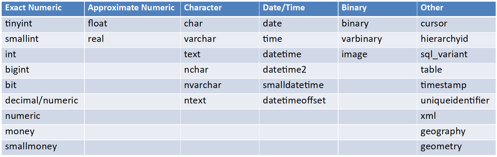
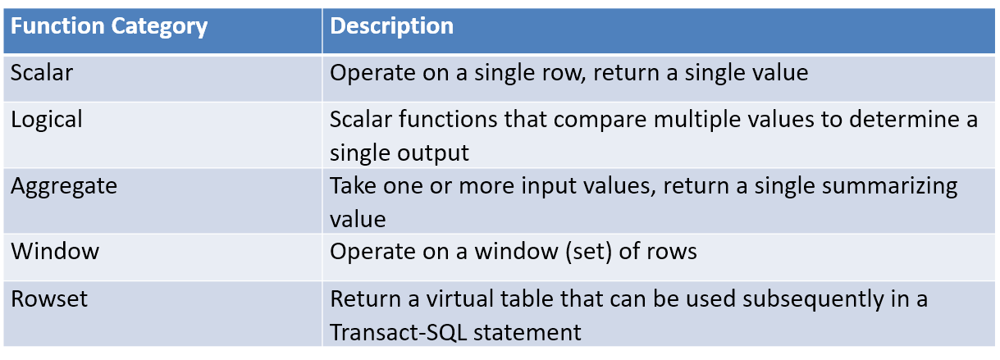

# Querying Data with Transact-SQL
***
Notes taken during/inspired by the edX course 'Querying Data with Transact-SQL - Microsoft: DAT201x' by Graeme Malcolm and Geoff Allix.

**_Course Handouts_**

* [Course Syllabus](../files/TSQL/Syllabus.PDF)
* [Getting Started Guide Including Install](../files/TSQL/DAT201x.PDF)
* [Adventure Works Entity Relationship Diagram](../files/TSQL/AW_ER.pdf)
* [Adeventure Works db install script](../files/TSQL/AW-oltp-install-script)  
NOTE: Remember to ensure read only access for everyone to the folder containing the .SQL and other files
* [GitHib Repo for course including course materials, slids, labs etc](https://microsoftlearning.github.io/QueryingT-SQL/)
* [A copy of the above materials should they be changed or removed](../files/TSQL/TSQLCourseFiles.zip)

**_Other useful links_**
* [Transact-SQL Refrence](https://docs.microsoft.com/en-gb/sql/t-sql/language-reference)

```{r setup}
library(DBI)

# creates a connection to the SQL database
# note that "con" will be used later in each connection to the database
con <- DBI::dbConnect(odbc::odbc(), 
                      Driver = "SQL Server", 
                      Server = "localhost\\SQLEXPRESS", 
                      Database = "AdventureWorksLT", 
                      Trusted_Connection = "True")

# Sets knitr to use this connection as the default so we don't need to specify it for every chunk
knitr::opts_chunk$set(connection = "con")
```

## Introduction to Transact-SQL

SQL or Structured Query Language was first developed in the 1970s by IBM as a way of interacting with databases. Other vendors have specfic versions of SQL for instance Oracle is PL/SQL, Microsoft's implentation is TSQL or Transact SQL.  Both SQL Server (on prem) and Azure SQL Databases (cloud) use the same query language, however Azure is a subset of full TSQL since it some commands relate to local files and data functions within .NET that relate only to SQL Server.  However, as new features are added to Azure, some new commands are being added to Azure. 

SQL is a declarative language - you express what it is that you want, the results - rather than specifying the steps taken to acheive that - it is not prodecural like other programming languages, it is set theory based.  It is possible to write proceedural elements or steps within TSQL, however if this is ocurring a lot, it is perhaps better done in another language, which may also perform or run better.  

In databases, we typically talk about entities - one type of thing - which is contained in each table.  
* Entities are represented as relations (tables) 
* And entity attributes as domains (columns)

Most relationships are normalized, with relationships between primary and foreign keys.  This helps to reduce duplication, however there are instances where de-normalised data is desired.  

Schemas are namespaces for database objects - is shows a logical layout for all or part of a relational database, _"As part of a data dictionary, a database schema indicates how the entities that make up the database relate to one another, including tables, views, stored procedures, and more."_(see [Lucid Chart on Database Schemas](https://www.lucidchart.com/pages/database-diagram/database-schema)).  The process of creating a database schema is called data modelling.  

When referring to objects in a database, we could use a fully qualified name, such as:

* [server_name.][database_name.][schema_name.]object_name

This is only really relevant for SQL Server, since Azure will only work with one database at a time.  Most of the time we typically just use

* schema_name.object_name

The schema name somwtimes be discarded, but it is considered best practice to include this, since there is sometimes some ambiguity about tables e.g. if we have two tables - Product.Order and Customer.Order  - which order table is being referred to, that in the customer or product schema?

SQL has a number of SQL Statement Types:

* DML or Data Manipulation Language - SELECT, INSERT, UPDATE, DELETE
* DDL or Data Definition Language - CREATE, ALTER, DROP
* DCL or Data Control Language - GRANT, REVOKE, DENY

The course focuses on DML which is typically for working with data.  

**SELECT** statement has a number of possible sub-components:

* FROM [table]
* WHERE [condition for filtering rows]
* GROUP BY [arranges rows by groups]
* HAVING [condition for filtering groups]
* ORDER BY [sorts the output]

Whilst a SQL statement can look like English, it doesn't neccessarily run from top to bottom in terms of the sequence of elements that are run in a query.  For instance, the FROM is the first thing that will be run, then the WHERE filter will be run, then we GROUP BY, then  SELECT the columns we are interested in and finally ORDER the results.  This can be important when running some queries, which will be explored later in the course.  When we run a query, it is not an actual table in a database that is return but a set of rows or record set or subset.

### Data Types

There are a number of different data types in T-SQL as shown below, which are grouped in to a number of different types.  

```{r Data Types, echo = FALSE, fig.cap='Transact-SQL Data Types'}

```

This is more relevant when designing a database, however it is useful to know when querying what data type you have in a broad sense - numeric, data, string and so on - as the types will determine what type of combinations can be combined together in expressions  e.g. you can concatenate strings or add numbers together, but you can't concatenate a string and a number together. 

Sometimes it is neccessary to convert data from one type to another, there are two ways this could happen

* Implicit conversion - compatible data types are automatically converted 
* Explicit conversion - requires an explicit function e.g. CAST / TRY_CAST, STR, PARSE ? TRY_PARSE, CONVERT / TRY_CONVERT

The TRY options will attempt a conversion and if it does not work, a NULL will be returned rather than an error in the non-TRY version.   

### Working with NULLs

There are recognised standards for treating NULL values - ANSI - which says that anythign involving a NULL should return a NULL.  There are functions that help us handle NULL values:

* ISNULL(column/variable, value) - Returns _value_ (which you can specify) if the column or variable is NULL
* NULLIF(column/variable, value) - Returns NULL if the column or variable is a value - we are almost recoding a non-null to a null
* COALESCE (column/variable1, column/variable2, ...) - Returns the value of the first non-NULL column or variable in the list - for instance if contact details, someone might not have an email, so we might want a telephone number, if they don't have that, return an address etc

NULL is used to indicate an unknown or missing value. NULL is **not** equivalent to zero or an empty string.

ISNULL can be used like an IF function in excel, for instance:

> SELECT name, ISNULL(TRY_CAST(size AS Integer), 0) AS NumericSize  
  FROM SalesLT.Product;

In this instance, if there is a value that will be returned, if not, the NULL value will be returned as a 0.  

We can also use a CASE statement to return a value whilst integrating NULL in to our query, e.g.

```{sql connection=con}
SELECT name,  
    CASE size  
      WHEN 'S' THEN 'SMALL'  
      WHEN 'M' THEN 'MEDIUM'  
      WHEN 'L' THEN 'LARGE'  
      WHEN 'XL' THEN 'EXTRA LARGE'  
      ELSE ISNULL(Size, 'N/A')  
    END AS PRODUCT  
  FROM SalesLT.Product; 
```

### Lab Exercises

AdventureWorks Cycles is a company that sells directly to retailers, who then sell products to consumers. Each retailer that is an AdventureWorks customer has provided a named contact for all communication from AdventureWorks.

The sales manager at AdventureWorks has asked you to generate some reports containing details of the company's customers to support a direct sales campaign. Let's start with some basic exploration.

First we display the sales person, the customer's title, surname and telephone number

```{sql connection=con}
SELECT SalesPerson, Title + ' ' + LastName AS CustomerName, Phone
FROM SalesLT.Customer;
```

Next we cast the CustomerID column to a VARCHAR and concatenate with the CompanyName column

```{sql connection=con}
SELECT CAST(CustomerID AS VARCHAR) + ': ' + CompanyName AS CustomerCompany
FROM SalesLT.Customer;
```

The SalesLT.SalesOrderHeader table contains records of sales orders. You have been asked to retrieve data for a report that shows:

The sales order number and revision number in the format <Order Number> (<Revision>) (e.g. SO71774 (2)).
The order date converted to ANSI standard format yyyy.mm.dd (e.g. 2015.01.31).

```{sql connection=con}
SELECT SalesOrderNumber + ' (' + STR(RevisionNumber, 1) + ')' AS OrderRevision,
	   CONVERT(NVARCHAR(30), OrderDate, 102) AS OrderDate
FROM SalesLT.SalesOrderHeader;
```

Next we write a query that returns a list of customer names.  We use ISNULL to check for middle names and concatenate with FirstName and LastName.

```{sql connection=con}
SELECT FirstName + ' ' + ISNULL(MiddleName + ' ', '') + LastName
AS CustomerName
FROM SalesLT.Customer;
```

Next, we will imagine that some data has been deleted - customer email addresses - then we try to find contact details in sequence.  

```{sql connection=con}
UPDATE SalesLT.Customer
SET EmailAddress = NULL
WHERE CustomerID % 7 = 1;
```

Next we write a query that returns a list of customer IDs in one column, and a second column named PrimaryContact that contains the email address if known, and otherwise the phone number.

```{sql connection=con}
SELECT CustomerID, COALESCE(EmailAddress, Phone) AS PrimaryContact
FROM SalesLT.Customer;
```

You have been asked to create a query that returns a list of sales order IDs and order dates with a column named ShippingStatus that contains the text "Shipped" for orders with a known ship date, and "Awaiting Shipment" for orders with no ship date.

Again, we imagine that some data is missing by deleting some first.

```{sql connection=con}
UPDATE SalesLT.SalesOrderHeader
SET ShipDate = NULL
WHERE SalesOrderID > 71899;
```

```{sql connection=con}
SELECT SalesOrderID, OrderDate,
  CASE
    WHEN ShipDate IS NULL THEN 'Awaiting Shipment'
    ELSE 'Shipped'
  END AS ShippingStatus
FROM SalesLT.SalesOrderHeader;
```

## Querying Tables with SELECT

### Removing Duplicates

If we wanted to know what colours our products are, we would run something like the following.

```{sql connection=con}
SELECT Color
FROM SalesLT.Product;
```

Here each product has a row and corresponding colour.  However, if we just want colour, we are typically interested in removing duplicates to just show what colours we are actually producing.  This is achieve using the DISTINCT keyword

```{sql connection=con}
SELECT DISTINCT Color
FROM SalesLT.Product;
```

These results are DISTINCT at the row level, so if we have two combinitions of columns - say size and colour - then it would be DISTINCT colour and size combinations that appear in the database.

```{sql connection=con}
SELECT DISTINCT Color, Size
FROM SalesLT.Product;
```

Here is just the size - here IS NULL will return a 'None' if the Size is missing (NA).

```{sql connection=con}
SELECT DISTINCT ISNULL(Size, 'None') AS Size
FROM SalesLT.Product;
```


### Sorting Results

ORDER By is how we sort the results.  Any aliased fields used in the SELECT element are visible by ORDER BY.  You can oder the results using columns that are not selected in the SELECT clause.  You can also ORDER BY multiple columns, either ascending or descending.

We can also just show the top 10 products, e.g. the top 10 most expensive.  This is done using the keywork TOP

```{sql connection=con}
SELECT TOP (10) ProductCategoryID AS Category, Name, ListPrice
FROM SalesLT.Product
ORDER BY ListPrice DESC, Category;
```

We can also use TOP (N) Percent or TOP (N) WITH TIES.  If we say wanted the bottom 10 items - say those with the lowest price - there is no 'BOTTOM' Keyword, instead we would sort our data so that they are now in the the order we want - with those we are interested at the top - the use TOP again.  

### Paging through results

This is achieved through using the OFFSET-FETCH which is an extension of ORDER BY.  This might be useful if you have a set of web page results and you want to see certain ones.  

You first say how many rows you want to skip using e.g. OFFSET 10 ROWS, then use specify how many rows you are interested in retrieving from the database e.g. FETCH NEXT 10 ROWS ONLY.

### Filtering and Using Predicates

We can use the WHERE clause with a number of coniditions or predicates.  For instance = (equals) <> (not equals), IN, BETWEEN (is an inclusive statement e.g. BETWEEN 100 AND 200 includes 100 and 200), LIKE,  AND, OR and NOT.  IN can be more efficient in coding terms when testing multiple attributes, as you just say color IN (red, blue) rather than colour  = 'red' OR colour = 'blue'.  This becomes more useful when testing multiple conditions e.g. IN (red, blue) AND size = large - this would have more typing with explicit code for each combition.

Like mathematics, SQL works on PEMDAS sequencing - parenthesis, exponents, multiplication, division, addition, subtraction.  

Some examples.

First look for products that start with an FR:

```{sql connection=con}
SELECT Name, Color, Size, ProductNumber
FROM SalesLT.Product
WHERE ProductNumber LIKE 'FR%';
```

Or we can look for products that end in a 58:

```{sql connection=con}
SELECT Name, Color, Size, ProductNumber
FROM SalesLT.Product
WHERE ProductNumber LIKE '%58';
```

Or we can use underscores to specify a number of charecters e.g. one _ is one missing charecter.  A wildcard (%) would match any number of chars.  The figures in brackets then are like regex, so if we want a numeric value between 0 and 9 we use [0-9].  Equally we could use a similar query to find things like email addresses in a string, or email addresses that end in a .co.uk.

```{sql connection=con}
SELECT Name, Color, Size, ProductNumber
FROM SalesLT.Product
WHERE ProductNumber LIKE 'BK-_[0-9][0-9]_-[0-9][0-9]';
```

We can use the BETWEEN clause on things like dates to select all products that were removed from sale in 2016:

```{sql connection=con}
SELECT Name
FROM SalesLT.Product 
WHERE SellEndDate BETWEEN '2006/1/1' AND '2006/12/31';
```

Note that it is often useful to order results in the order you want, even if it currently appears it the correct order.  Sometimes these queries may change as data or the database does, so it is best to be explicit and use an ORDER BY.  

### Lab Exercises

You are being told that transportation costs are increasing and you need to identify the heaviest products.

```{sql connection=con}
-- select the top 10 percent from the Name column
SELECT TOP (10) Percent Name, Weight
FROM SalesLT.Product
-- order by the weight in descending order
ORDER BY Weight DESC;
```

Next, we want to ignore the first 10 records - to page through using offset

```{sql connection=con}
SELECT Name
FROM SalesLT.Product
ORDER BY Weight DESC
-- offset 10 rows and get the next 100
OFFSET 10 ROWS FETCH NEXT 100 ROWS ONLY;
```

Next we create a query to find the names, colors, and sizes of the products with a product model ID of 1.

```{sql connection=con}
-- select the Name, Color, and Size columns
SELECT Name, Color, Size
FROM SalesLT.Product
-- check ProductModelID is 1
WHERE ProductModelID = 1;
```

Now we would like more information on products of certain colors and sizes.  We retrieve the product number and name of the products that have a Color of 'Black', 'Red', or 'White' and a Size of 'S' or 'M'.

```{sql connection=con}
-- select the ProductNumber and Name columns
SELECT ProductNumber, Name
FROM SalesLT.Product
-- check that Color is one of 'Black', 'Red' or 'White'
-- check that Size is one of 'S' or 'M'
WHERE Color IN ('Black', 'Red', 'White') AND Size IN ('S', 'M');
```

Next you have been asked to retrieve the product number, name, and list price of products that have a product number beginning with 'BK-'.

```{sql connection=con}
-- select the ProductNumber, Name, and ListPrice columns
SELECT ProductNumber, Name, ListPrice
FROM SalesLT.Product
-- filter for product numbers beginning with BK- using LIKE
WHERE ProductNumber LIKE 'BK-%';
```

Finally, the product manager is interested in a slight variation of the last request regarding product numbers with a particular prefix.

We are interested in products with product number beginning with 'BK-' followed by any character other than 'R', and ending with a '-' followed by any two numerals.  Not an R is [^R].

```{sql connection=con}
-- select the ProductNumber, Name, and ListPrice columns
SELECT ProductNumber, Name, ListPrice
FROM SalesLT.Product
-- filter for ProductNumbers
WHERE ProductNumber LIKE 'BK-[^R]%-[0-9][0-9]';
```

## Querying Tables with Joins

We usually join tables based on primary key - foreign key relationships.  We don't run two queries then join, but match at the time of the query.  When we are talking about joins, we typically represent them as Venn diagrams.  

The convention (ANSI SQL-92) is to specify the JOIN operator in the FROM clause:

> SELECT ...
  FROM Table1 JOIN Table 2
  ON <on_predicate>;
  
There is an older standard (ANSI SQL-89) where the tables are joined using commas in the FROM clause and using a WHERE operator, but this can lead to accidental cartesian (aka cross) products.

### INNER Joins

INNER Joins are typically the most common join type.  It involves a join only where a match is found in both input tables.  You can add multiple joins after each other.

Some examples - first a basic inner join where the schema, table and column are explicitly stated. 

```{sql connection=con}
SELECT SalesLT.Product.Name AS ProductName, SalesLT.ProductCategory.Name AS Category
FROM SalesLT.Product
INNER JOIN SalesLT.ProductCategory
ON SalesLT.Product.ProductCategoryID = SalesLT.ProductCategory.ProductCategoryID;
```

Next, we can do the same query but make this less cumbersome by using table aliases.

```{sql connection=con}
SELECT p.Name AS ProductName, c.Name AS Category
FROM SalesLT.Product AS p
INNER JOIN SalesLT.ProductCategory AS c
on p.ProductCategoryID = c.ProductCategoryID;
```

Next, we look at joining multiple tables, where we want the sales, including order level details, the products in the order and the product details.  If we don't specify the join type, the assumption is it is a INNER join, as shown below.

```{sql connection=con}
SELECT oh.OrderDate, oh.SalesOrderNumber, p.Name As ProductName, od.OrderQty, od.UnitPrice, od.LineTotal
FROM SalesLT.SalesOrderHeader AS oh
JOIN SalesLT.SalesOrderDetail AS od
ON od.SalesOrderID = oh.SalesOrderID
JOIN SalesLT.Product AS p
ON od.ProductID = p.ProductID
ORDER BY oh.OrderDate, oh.SalesOrderID, od.SalesOrderDetailID;
```

It is possible to do joins based on more than one criteria, e.g. we could join based on the productID and where the ListPrice is less than the unitprice i.e. there has been a discount.

```{sql connection=con}
-- Multiple join predicates
SELECT oh.OrderDate, oh.SalesOrderNumber, p.Name As ProductName, od.OrderQty, od.UnitPrice, od.LineTotal
FROM SalesLT.SalesOrderHeader AS oh
JOIN SalesLT.SalesOrderDetail AS od
ON od.SalesOrderID = oh.SalesOrderID
JOIN SalesLT.Product AS p
ON od.ProductID = p.ProductID AND od.UnitPrice < p.ListPrice --Note multiple predicates
ORDER BY oh.OrderDate, oh.SalesOrderID, od.SalesOrderDetailID; 
```

### OUTER Joins

In an outer join we return all the rows from one table, and any matching rows from the second table.  The records in the 'outer' table are preserved, typically we use language such as LEFT, RIGHT and FULL keywords.  We are pulling in records from that OUTER table.  FULL keeps records from both tables, but are typically not seen in practice.  OUTER is OPTIONAL e.g. LEFT JOIN is the same as LEFT OUTER JOIN.  

Now some examples.  First, we bring up a list of customers, with any matching sales records i.e. we have a list of customers who HAVE bought someting and those WHO HAVE NOT.  

```{sql connection=con}
--Get all customers, with sales orders for those who've bought anything
SELECT c.FirstName, c.LastName, oh.SalesOrderNumber
FROM SalesLT.Customer AS c
LEFT OUTER JOIN SalesLT.SalesOrderHeader AS oh
ON c.CustomerID = oh.CustomerID
ORDER BY c.CustomerID;
```

Next we can look just for those customers who have not purchased anything using IS NULL.

```{sql connection=con}
--Return only customers who haven't purchased anything
SELECT c.FirstName, c.LastName, oh.SalesOrderNumber
FROM SalesLT.Customer AS c
LEFT OUTER JOIN SalesLT.SalesOrderHeader AS oh
ON c.CustomerID = oh.CustomerID
WHERE oh.SalesOrderNumber IS NULL 
ORDER BY c.CustomerID;
```

Next we add records from multiple tables.  If we add tables on to the chain of tables, having first decleared a left or right join, you have to keep using LEFT joins.  You could use an INNER Join but you would loose some records e.g. if you used an INNER join on the second table below, you would loose those records (products) that had never been sold.  

Sometimes it is neccessary to go through one table to get to another e.g. to Products -> Orders requires going through order details first. Even if, we are not brining back any tables from the intermediary table.

```{sql connection=con}
--More than 2 tables
SELECT p.Name As ProductName, oh.SalesOrderNumber
FROM SalesLT.Product AS p
LEFT JOIN SalesLT.SalesOrderDetail AS od
ON p.ProductID = od.ProductID
LEFT JOIN SalesLT.SalesOrderHeader AS oh --Additional tables added to the right must also use a left join
ON od.SalesOrderID = oh.SalesOrderID
ORDER BY p.ProductID;
```

Next another example with multiple tables, but this time the order of the tables is different.  We SELECT from the product table, then we LEFT Join the Order details so we can identify products that have never sold, then we LEFT JOIN to the order header table so we can get the order number where we use a left outer join as we are left joining those records to our original table.  Then we INNER Join product category, because we are joining product category back to the first table - Products.  The final table joins back to our original table, before the outer joins.  So whether you need to use an OUTER or INNER join depends on where you wish to place the records based on the current list of tables, however you could reorder the tables to do it differently e.g. do the INNER JOIN first, then then LEFT JOINS.

```{sql connection=con}
SELECT p.Name As ProductName, c.Name AS Category, oh.SalesOrderNumber
FROM SalesLT.Product AS p
LEFT OUTER JOIN SalesLT.SalesOrderDetail AS od
ON p.ProductID = od.ProductID
LEFT OUTER JOIN SalesLT.SalesOrderHeader AS oh
ON od.SalesOrderID = oh.SalesOrderID
INNER JOIN SalesLT.ProductCategory AS c --Added to the left, so can use inner join
ON p.ProductCategoryID = c.ProductCategoryID
ORDER BY p.ProductID;
```

** Key Points** 

* Use a Left Outer Join to include all rows from the first table and values from matched rows in the second table. Columns in the second table for which no matching rows exist are populated with NULLs.  
* Use a Right Outer Join to include all rows from the second table and values from matched rows in the first table. Columns in the first table for which no matching rows exist are populated with NULLs.  
* Use a Full Outer Join to include all rows from the first and second tables. Columns in the either table for which no matching rows exist are populated with NULLs.

### Cross Joins

Cross Joins create caretesian products - they combine each row from the first table with each row from the second table - to give all possible combinations of products.

One example of it being used would be if we have a list of staff with their attributes, we might want to compare them to the attributes required for all jobs to see which they match, perhaps as an internal job search.  Another example is if we have two list of addresses and we calculate the edit distance between the two addresses from the different sources, to try and match those addresses.  We would rank the addresses based on their edit distance, with those scoring highest the closest and most likely to be the same address.  It can be used to generate test data also.  

An example

```{sql connection=con}
--Call each customer once per product - perhaps not the most realistic example!
SELECT p.Name, c.FirstName, c.LastName, c.Phone
FROM SalesLT.Product as p
CROSS JOIN SalesLT.Customer as c;
```

### Self Joins

You might want to join data on to itself but in a different sequence.  For instance, we might want to join a person's manager on to their employee(s), but managers are also employees, so this would be a self join.  We would use aliases for the table names as we have the same table twice.  So when defining a self-join, you must specify an alias for at least one instance of the table being joined.

So our original table looks like this:

```{sql connection=con}
SELECT *
FROM SalesLT.Employee;
```
Then the actual self join query - we use a left join as some people i.e. the CEO, will not have a manager.

```{sql connection=con}
SELECT e.EmployeeName, m.EmployeeName AS ManagerName
FROM SalesLT.Employee AS e
LEFT JOIN SalesLT.Employee AS m
ON e.ManagerID = m.EmployeeID
ORDER BY e.ManagerID;
```

### Lab Exercises

Write a query that returns the company name from the Sale.Customer table, the sales order ID and total due from the SalesLT.SalesOrderHeader table. 

```{sql connection=con}
-- select the CompanyName, SalesOrderId, and TotalDue columns from the appropriate tables
SELECT c.CompanyName, oh.SalesOrderId, oh.TotalDue
FROM SalesLT.Customer AS c
JOIN SalesLT.SalesOrderHeader AS oh
-- join tables based on CustomerID
ON c.CustomerID = oh.CustomerID;
```

In order to send out invoices to the customers, we need their addresses.  Extend your customer orders query to include the main office address for each customer, including the full street address, city, state or province, postal code, and country or region. 

```{sql connection=con}
SELECT c.CompanyName, a.AddressLine1, ISNULL(a.AddressLine2, '') AS AddressLine2, a.City, a.StateProvince, a.PostalCode, a.CountryRegion, oh.SalesOrderID, oh.TotalDue
FROM SalesLT.Customer AS c
-- join the SalesOrderHeader table
JOIN SalesLT.SalesOrderHeader AS oh
ON oh.CustomerID = c.CustomerID
-- join the CustomerAddress table
JOIN SalesLT.CustomerAddress AS ca
-- filter for where the AddressType is 'Main Office'
ON c.CustomerID = ca.CustomerID AND AddressType = 'Main Office'
JOIN SalesLT.Address AS a
ON ca.AddressID = a.AddressID;
```

The sales manager wants a list of all customer companies and their contacts (first name and last name), showing the sales order ID and total due for each order they have placed.  Customers who have not placed any orders should be included at the bottom of the list with NULL values for the order ID and total due. 

```{sql connection=con}
-- select the CompanyName, FirstName, LastName, SalesOrderID and TotalDue columns
-- from the appropriate tables
SELECT c.CompanyName, c.FirstName, c.LastName, oh.SalesOrderID, oh.TotalDue
FROM SalesLT.Customer AS c
LEFT JOIN SalesLT.SalesOrderHeader AS oh
-- join based on CustomerID
ON oh.CustomerID  = c.CustomerID
-- order the SalesOrderIDs from highest to lowest
ORDER BY oh.SalesOrderID DESC;
```

A sales employee has noticed that AdventureWorks does not have address information for all customers.  Write a query that returns a list of customer IDs, company names, contact names (first name and last name), and phone numbers for customers with no address stored in the database. 

```{sql connection=con}
SELECT c.CompanyName, c.FirstName, c.LastName, c.Phone
FROM SalesLT.Customer AS c
LEFT JOIN SalesLT.CustomerAddress AS ca
-- join based on CustomerID
ON c.CustomerID = ca.CustomerID
-- filter for when the AddressID doesn't exist
WHERE ca.AddressID IS NULL;
```

Some customers have never placed orders, and some products have never been ordered.

Write a query that returns a column of customer IDs for customers who have never placed an order, and a column of product IDs for products that have never been ordered.

Each row with a customer ID should have a NULL product ID (because the customer has never ordered a product) and each row with a product ID should have a NULL customer ID (because the product has never been ordered by a customer).

```{sql connection=con}
SELECT c.CustomerID, p.ProductID
FROM SalesLT.Customer AS c
FULL JOIN SalesLT.SalesOrderHeader AS oh
ON c.CustomerID = oh.CustomerID
FULL JOIN SalesLT.SalesOrderDetail AS od
-- join based on the SalesOrderID
ON od.SalesOrderID = oh.SalesOrderID
FULL JOIN SalesLT.Product AS p
-- join based on the ProductID
ON p.ProductID = od.ProductID
-- filter for nonexistent SalesOrderIDs
WHERE oh.SalesOrderID IS NULL
ORDER BY ProductID, CustomerID;
```

## Using Set Operators

A union query is unlike a join, where as a join adds more columns, a union typically adds more rows. You put all records from one query on to the records at the end of another query.  NOTE that it is a list of distinct (non duplicate) records - this will be checked every single row in one table and then checks if that record exists across every single row in the other table.  Obviously as more tables are added, checking this can become more time consuming and affects performance.

UNION ALL will not undertake this checking, leading to more performance, but some duplicates. John Smith may appear in the employees table but he may also appear in the customers table.  Sometimes this is the desired result.  In such an instance it makes sense to add a new field using an alias at the time of ther query, such as record type,  so we know where this record occurs.

When using Union:

* It is a good idea to use column aliases, so we know which table the column occurs in.  However, only aliases in the first query are recognised, so any aliases should be set against the first table
* The number of columns must be the same across tables, you can add an additional column but this must be given a specific value or a NULL
* The data types must be approximatley similar i.e. we can do an implicit or explict conversion so they match.

The following example joins the Employees to the customer using Union i.e. removing duplicates.

NOTE: In the following example, views were created (using code provided in the course), before running the queries on the database.  Therefore to reproduce these results, it is neccessary to run that same code (Module 4, Union sql file, in the CourseFiles zip) before the following queries will run on the AdventureWorksLT db.

```{sql connection=con}
SELECT FirstName, LastName
FROM SalesLT.Employees
UNION
SELECT FirstName, LastName
FROM SalesLT.Customers
ORDER BY LastName;
```

This gives 440 rows, if however we use UNION ALL

```{sql connection=con}
SELECT FirstName, LastName
FROM SalesLT.Employees
UNION ALL
SELECT FirstName, LastName
FROM SalesLT.Customers
ORDER BY LastName;
```

This results in 441 rows, so there is 1 row which occurs in both - a Donna Carreras appears both in the customer and emplyee table.  This could be the same person or indeed just someone with the same name. 

It might be useful to know which table the record occurs in, which is where we can introduce a Type column.  Not that after the first alias AS Type, subsequent fields e.g. 'Customer' as shown below do not need to be explicitly aliased, however it can make it easier to understand if we do include the AS Type.

```{sql connection=con}
SELECT FirstName, LastName, 'Employee' AS Type
FROM SalesLT.Employees
UNION 
SELECT FirstName, LastName, 'Customer' AS Type
FROM SalesLT.Customers
ORDER BY LastName
OFFSET 100 ROWS FETCH NEXT 5 ROWS ONLY;
```

Note that even though we have used UNION rather than UNION ALL, this would result in the same number of rows as UNION ALL (441), because the presence of the type column means this is no longer the same person - it is not a duplicate record but a unique one.  However, it is worth using UNION ALL to limit the number of records that have to be checked for duplicates, so improving peformance.

**By default, UNION eliminates duplicate rows. Specify the ALL option to include duplicates (or to avoid the overhead of checking for duplicates when you know in advance that there are none).**

### INTERSECT and EXCEPT Queries

In INTERSECT we look at only rows that appear in each set - we are looking for the duplicates.  Whereas using a JOIN would append columns to the source table, in set theory, we are looking for rows, so in an INTERSECT we are looking for those rows that appear in both datasets.

IN EXCEPT we are looking for records that appear in one source but not the other.  In such a scenario, the order of the tables matters.

If we now try and identify the person who appears in both our datasets, we can identify the person directly.

```{sql connection=con}
SELECT FirstName, LastName
FROM SalesLT.Customers
INTERSECT
SELECT FirstName, LastName
FROM SalesLT.Employees;
```

Next we want to find the EXCEPT - so let's find customers who are not employees, so we don't try and sel products to employees.  There are 104 customers, so we should get 103 rows, as we remove Donna Carreras.

```{sql connection=con}
SELECT FirstName, LastName
FROM SalesLT.Customers
EXCEPT
SELECT FirstName, LastName
FROM SalesLT.Employees;
```

### Lab Exercises

Customers can have two kinds of address: a main office address and a shipping address. The accounts department wants to ensure that the main office address is always used for billing, and have asked you to write a query that clearly identifies the different types of address for each customer.

```{sql connection=con}
-- select the CompanyName, AddressLine1 columns
-- alias as per the instructions
SELECT CompanyName, AddressLine1, City, 'Billing' AS AddressType
FROM SalesLT.Customer AS c
JOIN SalesLT.CustomerAddress AS ca
-- join based on CustomerID
ON c.CustomerID = ca.CustomerID
-- join another table
JOIN SalesLT.Address AS a
-- join based on AddressID
ON ca.AddressID = a.AddressID
-- filter for where the correct AddressType
WHERE ca.AddressType = 'Main Office';
```

Adapt the query to retrieve the company name, first line of the street address, city, and a column named AddressType with the value 'Shipping' for customers where the address type in the SalesLT.CustomerAddress table is 'Shipping'.

```{sql connection=con}
SELECT c.CompanyName, a.AddressLine1, a.City, 'Shipping' AS AddressType
FROM SalesLT.Customer AS c
JOIN SalesLT.CustomerAddress AS ca
ON c.CustomerID = ca.CustomerID
JOIN SalesLT.Address AS a
ON ca.AddressID = a.AddressID
WHERE ca.AddressType = 'Shipping';
```

Next we can union all these records together to create a list of shipping and billing addresses, using UNION ALL.

```{sql connection=con}
SELECT c.CompanyName, a.AddressLine1, a.City, 'Billing' AS AddressType
FROM SalesLT.Customer AS c
JOIN SalesLT.CustomerAddress AS ca
ON c.CustomerID = ca.CustomerID
JOIN SalesLT.Address AS a
ON ca.AddressID = a.AddressID
WHERE ca.AddressType = 'Main Office'
-- UNION
UNION ALL
SELECT c.CompanyName, a.AddressLine1, a.City, 'Shipping' AS AddressType
FROM SalesLT.Customer AS c
JOIN SalesLT.CustomerAddress AS ca
ON c.CustomerID = ca.CustomerID
JOIN SalesLT.Address AS a
ON ca.AddressID = a.AddressID
WHERE ca.AddressType = 'Shipping'
ORDER BY c.CompanyName
OFFSET 10 ROWS;
```

You have created a master list of all customer addresses, but now you have been asked to create filtered lists that show which customers have only a main office address, and which customers have both a main office and a shipping address.


```{sql connection=con}
SELECT c.CompanyName
FROM SalesLT.Customer AS c
INNER JOIN SalesLT.CustomerAddress AS ca
ON c.CustomerID = ca.CustomerID
INNER JOIN SalesLT.Address AS a
ON a.AddressID = ca.AddressID
WHERE ca.AddressType = 'Main Office' --Filters out shipping addresses.  This is a table of all Billing addresses.
EXCEPT
SELECT c.CompanyName
FROM SalesLT.Customer AS c
INNER JOIN SalesLT.CustomerAddress AS ca
ON c.CustomerID = ca.CustomerID
INNER JOIN SalesLT.Address AS a
ON a.AddressID = ca.AddressID
WHERE ca.AddressType = 'Shipping'
ORDER BY c.CompanyName;
```

Or the INTERSECT version to identify the company name of each company that appears in a table of customers with a 'Main Office' address, and also in a table of customers with a 'Shipping' address. 

```{sql connection=con}
SELECT c.CompanyName
FROM SalesLT.Customer AS c
INNER JOIN SalesLT.CustomerAddress AS ca
ON c.CustomerID = ca.CustomerID
INNER JOIN SalesLT.Address AS a
ON a.AddressID = ca.AddressID
WHERE ca.AddressType = 'Main Office' --Filters out shipping addresses.  This is a table of all Billing addresses.
INTERSECT
SELECT c.CompanyName
FROM SalesLT.Customer AS c
INNER JOIN SalesLT.CustomerAddress AS ca
ON c.CustomerID = ca.CustomerID
INNER JOIN SalesLT.Address AS a
ON a.AddressID = ca.AddressID
WHERE ca.AddressType = 'Shipping'
ORDER BY c.CompanyName;
```

## Using Functions and Aggregating Data

Now we are looking to not just bring back individual rows but perform calculations, such as aggregations, on those results.

The functions we will look at are shown below.

```{r Functions, echo = FALSE, fig.cap='Transact-SQL Functions'}

```

### Scalar Functions

A scalar function returns a single value, not a row or column or table.  In database design things can be deterministic or non-deterministic

* Deterministic - we know what the result will be, assuming the data hasn't changed.  The data going in and coming out will be the same
* Non-deterministic - we cannot gaurantee what the result will be.  For instance if we tested if todays date was less than a value in a table, it would depend on the time and day that the query was run.  We can't say what the result will be, based on the data going in/from the db.

A scalar function can be either deterministic or non-deterministic.  Scalar is a set of functions, and can do multiple things - date and times, text and image, mathematical, system and system statistical, metadata and so on.

We might want to extract the year from a date, for instance to determine when a product was first sold.

```{sql connection=con}
SELECT YEAR(SellStartDate) SellStartYear, ProductID, Name
FROM SalesLT.Product
ORDER BY SellStartYear;
```

Other examples might include being able to extract certain parts of the date, like the month or day of the week, this can be achived with the DATENAME function

```{sql connection=con}
SELECT YEAR(SellStartDate) SellStartYear, DATENAME(mm,SellStartDate) SellStartMonth,
       DAY(SellStartDate) SellStartDay, DATENAME(dw, SellStartDate) SellStartWeekday,
	   ProductID, Name
FROM SalesLT.Product
ORDER BY SellStartYear;
```

Or we might want to calculate how long a product has been sold, we can use the DATEDIFF function to work this out.

```{sql connection=con}
SELECT DATEDIFF(yy,SellStartDate, GETDATE()) YearsSold, 
       DATEDIFF(mm,SellStartDate, GETDATE()) MonthsSold,
       ProductID, Name
FROM SalesLT.Product
ORDER BY ProductID;
```

Another common example might be to convert text to upper case.

```{sql connection=con}
SELECT UPPER(Name) AS ProductName
FROM SalesLT.Product;
```

We might want to add two strings together but with a space or other text, so we could use the CONCAT function to achieve this.

```{sql connection=con}
SELECT CONCAT(FirstName + ' ', LastName) AS FullName,
       FirstName, LastName
FROM SalesLT.Customer;
```

Or we might want to return just a specific number of charecters from a string, perhaps there is a structure in the sequence - like the first two chars relate to a product type - so we want to just extract these first two.

```{sql connection=con}
SELECT Name, ProductNumber, LEFT(ProductNumber, 2) AS ProductType
FROM SalesLT.Product;
```

Or we might have something more complex, where we want to find certain elements of text, we can use CHARINDEX to identify where a char occurs, then combine it with SUBSTRING to extract just a portion of the full string which is n chars before or after a particular charecter.

```{sql connection=con}
SELECT Name, ProductNumber, LEFT(ProductNumber, 2) AS ProductType,
                            SUBSTRING(ProductNumber,CHARINDEX('-', ProductNumber) + 1, 4) AS ModelCode,
							              SUBSTRING(ProductNumber, LEN(ProductNumber) - CHARINDEX('-', REVERSE(RIGHT(ProductNumber, 3))) + 2, 2) AS SizeCode
FROM SalesLT.Product;
```

### Logical Functions

Logical functions test if someting is true or not i.e. traditional boolean. But we can use logical functions as filters by using CHOOSE for example, you could use IIF which is also a logical, or we could use CASE to achieve the same result.  

An exmaple might be if we want to return some numeric sizes, for instance if we have a table of data with different size formats:

```{sql connection=con}
SELECT Name, Size
FROM SalesLT.Product;
```

We might only be interested in those that have a numeric type, even though the data is in a char data string, 1 in this instance means true:
```{sql connection=con}
SELECT Name, Size AS NumericSize
FROM SalesLT.Product
WHERE ISNUMERIC(Size) = 1;
```

Or we might want to assign a value to something, like a product type of bike to certain values and other to everything else.

```{sql connection=con}
SELECT Name, IIF(ProductCategoryID IN (5,6,7), 'Bike', 'Other') ProductType
FROM SalesLT.Product;
```

Or a more complicated query where we assign mutiple product types.

```{sql connection=con}
SELECT prd.Name AS ProductName, cat.Name AS Category,
      CHOOSE (cat.ParentProductCategoryID, 'Bikes','Components','Clothing','Accessories') AS ProductType
FROM SalesLT.Product AS prd
JOIN SalesLT.ProductCategory AS cat
ON prd.ProductCategoryID = cat.ProductCategoryID;
```

### Window Functions

A window in this context is a set of rows - a window in to the database or table.  For instance, we might want to RANK a set (or window) of data.  The query below will pull out the top 100 more expensive products (ordered by list price) then creates a ranking based on this list price, then orders the results by this ranking.

```{sql connection=con}
SELECT TOP(100) ProductID, Name, ListPrice,
	RANK() OVER(ORDER BY ListPrice DESC) AS RankByPrice
FROM SalesLT.Product AS p
ORDER BY RankByPrice;
```

Or we might want to partition the results by product category, similar to grouping by product category.  This will result in a ranking for each product category.  The results might look a little odd at first glance.

```{sql connection=con}
SELECT c.Name AS Category, p.Name AS Product, ListPrice,
	RANK() OVER(PARTITION BY c.Name ORDER BY ListPrice DESC) AS RankByPrice
FROM SalesLT.Product AS p
JOIN SalesLT.ProductCategory AS c
ON p.ProductCategoryID = c.ProductcategoryID
ORDER BY Category, RankByPrice;
```

### Aggregate Functions

There are a lot of aggregate functions including some statistical functions like s.d. as well as some more standard things like MIN, MAX, SUM etc over a set of data.  We can use GROUP BY.  

First we can get some headline stats of what is in the table.

```{sql connection=con}
SELECT COUNT(*) AS Products, COUNT(DISTINCT ProductCategoryID) AS Categories, AVG(ListPrice) AS AveragePrice
FROM SalesLT.Product;
```

Or we might be interested in summary figures for just one product type, like bikes.  Note that we use COUNT then the specific item, since using COUNT(*) would return the number of rows, which may include duplicates.

```{sql connection=con}
SELECT COUNT(p.ProductID) BikeModels, AVG(p.ListPrice) AveragePrice
FROM SalesLT.Product AS p
JOIN SalesLT.ProductCategory AS c
ON p.ProductCategoryID = c.ProductCategoryID
WHERE c.Name LIKE '%Bikes';
```

However, our aggregate functions are currently returnign totals.  In practice, we may want to return figures by groups, so we need to use GROUP BY in our queries.  When we use a GROUP BY which groups up the results, we have to group up everything in the select row that isn't being aggregated.  You can't have something in the SELECT which is neither being aggregated nor being grouped.  As we are grouping the results, we don't see individual rows of data anymore.

The following example calulates the sales revenue for each sales person.

```{sql connection=con}
SELECT c.Salesperson, SUM(oh.SubTotal) SalesRevenue
FROM SalesLT.Customer c
JOIN SalesLT.SalesOrderHeader oh
ON c.CustomerID = oh.CustomerID
GROUP BY c.Salesperson
ORDER BY SalesRevenue DESC;
```

Could it be that some sales people have no sales?  If so, we need to return values where the total is NULL, by assigning NULL a value of zero.  WE also use the LEFT JOIN rather than the INNER JOIN previously, we get sales people included who haven't sold anything.

```{sql connection=con}
SELECT c.Salesperson, ISNULL(SUM(oh.SubTotal), 0.00) SalesRevenue
FROM SalesLT.Customer c
LEFT JOIN SalesLT.SalesOrderHeader oh
ON c.CustomerID = oh.CustomerID
GROUP BY c.Salesperson
ORDER BY SalesRevenue DESC;
```

Or we might want to know the number of customers each sales person has.

```{sql connection=con}
SELECT Salesperson, COUNT(CustomerID) Customers
FROM SalesLT.Customer
GROUP BY Salesperson
ORDER BY Salesperson;
```

We might also want to know the sales Revenue by sales person and customer.  Note that we now includer the customer details, we cannot use the CUSTOMER alias from the SELECT query in the GROUP BY, as the SELECT query is run after the GROUP BY.

```{sql connection=con}
SELECT c.Salesperson, CONCAT(c.FirstName +' ', c.LastName) AS Customer, ISNULL(SUM(oh.SubTotal), 0.00) SalesRevenue
FROM SalesLT.Customer c
LEFT JOIN SalesLT.SalesOrderHeader oh
ON c.CustomerID = oh.CustomerID
GROUP BY c.Salesperson, CONCAT(c.FirstName +' ', c.LastName)
ORDER BY SalesRevenue DESC, Customer;
```

Or the number of products in each category.

```{sql connection=con}
SELECT c.Name AS Category, COUNT(p.ProductID) AS Products
FROM SalesLT.Product AS p
JOIN SalesLT.ProductCategory AS c
ON p.ProductCategoryID = c.ProductCategoryID
GROUP BY c.Name
ORDER BY Category;
```

### Filtering Groups

If we want to filter, we can use the WHERE clause as we have seen in some previous examples.  However, most of the time we filter with the HAVING caluse.  **HAVING will filter the resutls RATHER than the input**.

Having clause provides a search condition that each group must satisfy, for instance where the number of orders by a customer is greater than 10.

In the example below, we are interested in finding out which sales people have more than 100 customers. 

```{sql connection=con}
SELECT Salesperson, COUNT(CustomerID) Customers
FROM SalesLT.Customer
GROUP BY Salesperson
HAVING COUNT(CustomerID) > 100
ORDER BY Salesperson;
```

** Key Points **

* You can use GROUP BY with aggregate functions to return aggregations grouped by one or more columns or expressions.  
* All columns in the SELECT clause that are not aggregate function expressions must be included in a GROUP BY clause.  
* The order in which columns or expressions are listed in the GROUP BY clause determines the grouping hierarchy.  
* You can filter the groups that are included in the query results by specifying a HAVING clause.

### Lab Exercises

Write a query to return the product ID of each product, together with the product name formatted as upper case and a column named ApproxWeight with the weight of each product rounded to the nearest whole unit.

```{sql connection=con}
SELECT ProductID, UPPER(Name) AS ProductName, ROUND(WEIGHT, 0) AS ApproxWeight
FROM SalesLT.Product;
```

Extend your query to include columns named SellStartYear and SellStartMonth containing the year and month in which AdventureWorks started selling each product. The month should be displayed as the month name (e.g. 'January').

```{sql connection=con}
SELECT ProductID, UPPER(Name) AS ProductName, ROUND(Weight, 0) AS ApproxWeight,
       YEAR(SellStartDate) as SellStartYear,
       DATENAME(m, SellStartDate) as SellStartMonth
FROM SalesLT.Product;
```

Extend your query to include a column named ProductType that contains the leftmost two characters from the product number.

```{sql connection=con}
SELECT ProductID, UPPER(Name) AS ProductName, ROUND(Weight, 0) AS ApproxWeight,
       YEAR(SellStartDate) as SellStartYear,
       DATENAME(m, SellStartDate) as SellStartMonth,
       LEFT(ProductNumber, 2) AS ProductType
FROM SalesLT.Product;
```

Extend your query to filter the product returned so that only products with a numeric size are included. 

```{sql connection=con}
SELECT ProductID, UPPER(Name) AS ProductName, ROUND(Weight, 0) AS ApproxWeight,
       YEAR(SellStartDate) as SellStartYear,
       DATENAME(m, SellStartDate) as SellStartMonth,
       LEFT(ProductNumber, 2) AS ProductType
FROM SalesLT.Product
WHERE ISNUMERIC(SIZE) = 1;
```

Write a query that returns a list of company names with a ranking of their place in a list of highest TotalDue values from the SalesOrderHeader table. 

```{sql connection=con}
SELECT CompanyName, TotalDue AS Revenue,
       RANK() OVER (ORDER BY TotalDue DESC) AS RankByRevenue
FROM SalesLT.SalesOrderHeader AS SOH
LEFT JOIN SalesLT.Customer AS C
ON SOH.CustomerID = C.CustomerID;
```

Write a query to retrieve a list of the product names and the total revenue calculated as the sum of the LineTotal from the SalesLT.SalesOrderDetail table, with the results sorted in descending order of total revenue. 

```{sql connection=con}
SELECT Name, SUM(LineTotal) AS TotalRevenue
FROM SalesLT.SalesOrderDetail AS SOD
LEFT JOIN SalesLT.Product AS P
ON SOD.ProductID = p.ProductID
GROUP BY P.Name
ORDER BY TotalRevenue DESC;
```

Modify the previous query to include sales totals for products that have a list price of more than 1000. 

```{sql connection=con}
SELECT Name, SUM(LineTotal) AS TotalRevenue
FROM SalesLT.SalesOrderDetail AS SOD
JOIN SalesLT.Product AS P
ON SOD.ProductID = P.ProductID
WHERE ListPrice > 1000
GROUP BY P.Name
ORDER BY TotalRevenue DESC;
```

Modify the previous query to only include products with total sales greater than 20000.

```{sql connection=con}
SELECT Name, SUM(LineTotal) AS TotalRevenue
FROM SalesLT.SalesOrderDetail AS SOD
JOIN SalesLT.Product AS P
ON SOD.ProductID = P.ProductID
WHERE P.ListPrice > 1000
GROUP BY P.Name
-- add having clause as per instructions
HAVING SUM(LineTotal) > 20000
ORDER BY TotalRevenue DESC;
```

## Sub-queries and Apply

Subqueries are queries within queries (nested).  The results of the inner or nested query are pasted to the outer query and behave much like an expression.  

Our subquery might be scalr, for instance we might have a single value which is passed to the outer query.  So we might be interested in the last order (the maxium id) and the details from that order, where the information is held in two different tables.

```{sql connection=con}
SELECT salesorderid, productid, unitprice, orderqty 
From SalesLT.SalesOrderDetail
WHERE salesorderid =
    (SELECT MAX(salesorderid) AS lastorder
    FROM SalesLT.SalesOrderHeader);  
```
 
The subquery is in brackets, and the system will treat whatever is in brackets as an individual unit.
 
In a multi-valued query, mutiple values are returned but as a single column set to the outer query.  So we might be interested in every customer in Mexico.  One will get returned from the subquery is a one dimensional array - a vector.

### Self Contained or Correlated Query
 
Queries we have looked at so far are self contained queries.  The sub-query parts works, then it supplies its value to the outer query.  Correlated sub-queries refer to elements of tables used in the outer query.  Because the sub-query is searching for values in the outer query, this can be resource intensive.  We might, for instance, make a reference to an employee number in the subquery, but that number is dependent on the result of the outer query, so the subqueriy works with the outer query.

As with sub-queries generally, it is best to build the query up iteratively, so you can a) check the query is working and b) check your final sub-query results with those of the individual components to make sure it is doing what it should be.  However, this is more difficult when using a correlated query, since there is a dependency.

So our goal is for each customer list all sales on the last day that they made a sale.

So first, lets get a list of customers with their orders and dates.

```{sql connection=con}
SELECT CustomerID, SalesOrderID, OrderDate
FROM SalesLT.SalesOrderHeader AS SO1
ORDER BY CustomerID,OrderDate
```

Then let's say we want just the latest (max) order date in the db, for each customer ID we have, so we have their individual last order details.

```{sql connection=con}
SELECT CustomerID, SalesOrderID, OrderDate
FROM SalesLT.SalesOrderHeader AS SO1
WHERE orderdate =
    (SELECT MAX(orderdate)
FROM SalesLT.SalesOrderHeader AS SO2
WHERE SO2.CustomerID = SO1.CustomerID)
ORDER BY CustomerID;
```

### The Apply Operator

Using an apply operator and a table function can achieve something similar to a correlated query, but in less complicated code.  A CROSS APPLY applies the right table expression to each row in the left table, a bit like the correlated sub-query, with CROSS APPLY being similar to a CROSS JOIN.

Similarily OUTER APPLY adds rows for those with NULL in columns for the right table, similar to LEFT OUTER JOIN.  In these instances, the right table is the table returned by the APPLY function.

The first thing we need to do is to create a function.  Notice we are passing the function the SalesOrderID, and the most expensive item in the order gets passed back.

```{sql connection=con, eval = FALSE}
-- Setup
CREATE FUNCTION SalesLT.udfMaxUnitPrice (@SalesOrderID int)
RETURNS TABLE
AS
RETURN
SELECT SalesOrderID,Max(UnitPrice) as MaxUnitPrice FROM 
SalesLT.SalesOrderDetail
WHERE SalesOrderID=@SalesOrderID
GROUP BY SalesOrderID;
```

To see what code created a function, to help understand what it does at a later time or if created by someone else, we can use the sp_helptext command. 

```{sql connection=con}
sp_helptext 'saleslt.udfmaxunitprice'
```

Then we can use that query to get the results.  Note this could have been achieved with a correlated sub-query, but this is perahps a little easier to interpret.

```{sql connection=con}
SELECT SOH.SalesOrderID, MUP.MaxUnitPrice 
FROM SalesLT.SalesOrderDetail AS SOH
CROSS APPLY SalesLT.udfMaxUnitPrice(SOH.SalesOrderID) AS MUP
ORDER BY SOH.SalesOrderID;
```

** Key Points **

* The APPLY operator enables you to execute a table-valued function for each row in a rowset returned by a SELECT statement. Conceptually, this approach is similar to a correlated subquery.  
* CROSS APPLY returns matching rows, similar to an inner join. OUTER APPLY returns all rows in the original SELECT query results with NULL values for rows where no match was found.

### Lab Exercises

AdventureWorks products each have a standard cost that indicates the cost of manufacturing the product, and a list price that indicates the recommended selling price for the product. This data is stored in the SalesLT.Product table.

Whenever a product is ordered, the actual unit price at which it was sold is also recorded in the SalesLT.SalesOrderDetail table.

Use subqueries to compare the cost and list prices for each product with the unit prices charged in each sale.

```{sql connection=con}
SELECT ProductID, Name, ListPrice
FROM SalesLT.Product
WHERE ListPrice >
    (SELECT AVG(UnitPRice) FROM SalesLT.SalesOrderDetail)
ORDER BY ProductID;
```

AdventureWorks is interested in finding out which products are being sold at a loss.  Retrieve the product ID, name, and list price for each product where the list price is 100 or more, and the product has been sold for (strictly) less than 100.

```{sql connection=con}
SELECT ProductID, Name, ListPrice
FROM SalesLT.Product
WHERE ProductID IN
  (SELECT ProductID FROM SalesLT.SalesOrderDetail
   WHERE UnitPrice < 100)
AND ListPrice >= 100
ORDER BY ProductID;
```

In order to get an idea of how many products are selling above or below list price, you want to gather some aggregate product data. Retrieve the product ID, name, cost, and list price for each product along with the average unit price for which that product has been sold. 

```{sql connection=con}
SELECT ProductID, Name, StandardCost, ListPrice,
    (SELECT AVG(UnitPrice)
    FROM SalesLT.SalesOrderDetail AS SOD
    WHERE P.ProductID = SOD.ProductID) AS AvgSellingPrice
FROM SalesLT.Product AS P
ORDER BY P.ProductID;
```

AdventureWorks is interested in finding out which products are costing more than they're being sold for, on average.  Filter the query for the previous exercise to include only products where the cost is higher than the average selling price.

```{sql connection=con}
SELECT ProductID, Name, StandardCost, ListPrice,
    (SELECT AVG(UnitPrice)
     FROM SalesLT.SalesOrderDetail AS SOD
     WHERE P.ProductID = SOD.ProductID) AS AvgSellingPrice
FROM SalesLT.Product AS P
WHERE StandardCost >
    (SELECT AVG(UnitPrice)
     FROM SalesLT.SalesOrderDetail AS SOD
     WHERE P.ProductID = SOD.ProductID)
ORDER BY P.ProductID;
```

The AdventureWorksLT database includes a table-valued user-defined function named dbo.ufnGetCustomerInformation. Use this function to retrieve details of customers based on customer ID values retrieved from tables in the database. 

Retrieve the sales order ID, customer ID, first name, last name, and total due for all sales orders from the SalesLT.SalesOrderHeader table and the dbo.ufnGetCustomerInformation function. 

```{sql connection=con}
SELECT SOH.SalesOrderID, SOH.CustomerID, CI.FirstName, CI.LastName, SOH.TotalDue
FROM SalesLT.SalesOrderHeader AS SOH
CROSS APPLY dbo.ufnGetCustomerInformation(SOH.CustomerID) AS CI
ORDER BY SOH.SalesOrderID;
```

Use the table-valued user-defined function dbo.ufnGetCustomerInformation again to retrieve details of customers based on customer ID values retrieved from tables in the database.  Retrieve the customer ID, first name, last name, address line 1 and city for all customers from the SalesLT.Address and SalesLT.CustomerAddress tables, using the dbo.ufnGetCustomerInformation function.

```{sql connection=con}
SELECT CA.CustomerID, CI.FirstName, CI.LastName, A.AddressLine1, A.City
FROM SalesLT.Address AS A
JOIN SalesLT.CustomerAddress AS CA
ON A.AddressID = CA.AddressID
CROSS APPLY dbo.ufnGetCustomerInformation(CA.CustomerID) AS CI
ORDER BY CA.CustomerID;
```

## Using Table Expressions

We can create tables in a number of ways that can then be re-usd, rather than being a one-off query.

### Views

One way we can do this is using a view.  Rather than repeatadly joining and selected fields from two tables, we can create a view that contains the join syntax then just select the view.  This view can be used and queried as if it were a table.  The data is still in the underlying tables, but it is a view or presentation on top of the tables.  It's like a named query, which can make this simpler, plus we can add data at the view level, so they can view rights for the view table, but not the underlying data.  Note that whilst you are able to use insert to add new rows, you can only do this to one of the underlying tables.

First we create a view

```{sql connection=con, eval = FALSE}
-- Create a view
CREATE VIEW SalesLT.vCustomerAddress
AS
SELECT C.CustomerID, FirstName, LastName, AddressLine1, City, StateProvince 
FROM
SalesLT.Customer C JOIN SalesLT.CustomerAddress CA
ON C.CustomerID=CA.CustomerID
JOIN SalesLT.Address A
ON CA.AddressID=A.AddressID
```

Then we can query the view.

```{sql connection=con}
SELECT CustomerID, City
FROM SalesLT.vCustomerAddress
```

And we can join data to that view.

```{sql connection=con}
SELECT c.StateProvince, c.City, ISNULL(SUM(s.TotalDue), 0.00) AS Revenue
FROM SalesLT.vCustomerAddress AS c
LEFT JOIN SalesLT.SalesOrderHeader AS s
ON s.CustomerID = c.CustomerID
GROUP BY c.StateProvince, c.City
ORDER BY c.StateProvince, Revenue DESC;
```

### Using Temporary Tables and Table Variables

Views are persistent database objects, however we might want a temporary table.  We prefix the object with a # symbol and they are created in a seperate temporary database called tempdb, rather than the db you are working in.  Typically using a single # will mean the table exists for the current user session.  If you wanted it to persistent over multiple sessions, use the ## prefix.  

An alternative approach is to use table variables, which were introduced to cause performance problems if used again, as the table has to be re-created each user session, which can become a problem if there are many tables.  If we want to use one we prefix it with an @ sign to signify it is a variable e.g. @varProducts table so we define the variable as a table.  This is connected to the batch rather than the session, so as long as we are in the block of code.  It only works well on small databases or queries.  They are for temporary situations or a temporary holding space.

In the next block of code we show how we create a temporary table then update and query it.

```{sql connection=con}
CREATE TABLE #Colors
(Color varchar(15));

INSERT INTO #Colors
SELECT DISTINCT Color FROM SalesLT.Product;

SELECT * FROM #Colors;
```

A table variable is similar, with some syntax differences, but this works on the code set (batch of commans ran at the same time) rather than being for the entire session.

```{sql connection=con}
DECLARE @Colors AS TABLE (Color varchar(15));

INSERT INTO @Colors
SELECT DISTINCT Color FROM SalesLT.Product;

SELECT * FROM @Colors;
```

** Key Points **

* Temporary tables are prefixed with a # symbol (You can also create global temporary tables that can be accessed by other processes by prefixing the name with ##)  
* Local temporary tables are automatically deleted when the session in which they were created ends. Global temporary tables are deleted when the last user sessions referencing them is closed.  
* Table variables are prefixed with a @ symbol.  
* Table variables are scoped to the batch in which they are created.

### Table Value Functions (TVF)

This is a specific type of function which returns a table.  It is a permanently define database object.  Unlike views, we can pass values in to a TVF.

So first we create a TVF.

```{sql connection=con, eval = FALSE}
CREATE FUNCTION SalesLT.udfCustomersByCity
(@City AS VARCHAR(20))
RETURNS TABLE
AS
RETURN
    (SELECT C.CustomerID, FirstName, LastName, AddressLine1, City, StateProvince
     FROM SalesLT.Customer C JOIN SalesLT.CustomerAddress CA
     ON C.CustomerID=CA.CustomerID
     JOIN SalesLT.Address A ON CA.AddressID=A.AddressID
     WHERE City=@City);
```

Then we can call the TVF passing a parameter - in this instance we prvoide a city name of Bellevue - which will then return the results of the SELECT statement which is a list of customers in that city.

```{sql connection=con}
SELECT * FROM SalesLT.udfCustomersByCity('Bellevue')
```

### Derived Tables

These are derived tables that return a multi column table.  They are a virtual table to simplify a query.  The table only exists within that SELECT query.  It is a programming construct within a SELECT statement, it is used for programming purposes.  They can use internal (aka inline) within the derived table element, or external aliases for columns - outside the () of the derived table.

In the example derived table below, the alias ProdCats is provided external to the query (outside the parentheses).  Other elements such as Category as defined as internal aliases.

```{sql connection=con}
SELECT Category, COUNT(ProductID) AS Products
FROM
	(SELECT p.ProductID, p.Name AS Product, c.Name AS Category
	 FROM SalesLT.Product AS p
	 JOIN SalesLT.ProductCategory AS c
	 ON p.ProductCategoryID = c.ProductCategoryID) AS ProdCats
GROUP BY Category
ORDER BY Category;
```

### Using Common Table Expressions (CTEs)

Similar to a TVF before we are defining a temporary table object which is used within the scope of the query.  But this time aorund we define the CTE first, then make calls to that CTE afterwards.  Unlike a derived query however, you can refer to the CTE mutiple times within the same query/code batch, but it won't live on like a view.  We can also use a CTE for recursive elements like loops, so you might want to get everyone within a management tier, then say you want to go through that process three times for the top 3 levels, using the OPTION(MAXRECURSION 3).

So in the following example, we first define the CTE, then we make reference to it.  The result here is the same as our derived query previously, but perhaps a little easiter to understand.

```{sql connection=con}
WITH ProductsByCategory (ProductID, ProductName, Category)
AS
(
	SELECT p.ProductID, p.Name, c.Name AS Category
	 FROM SalesLT.Product AS p
	 JOIN SalesLT.ProductCategory AS c
	 ON p.ProductCategoryID = c.ProductCategoryID
)

SELECT Category, COUNT(ProductID) AS Products
FROM ProductsByCategory
GROUP BY Category
ORDER BY Category;
```

Next we will look at the our organisation chart example as previously mentioned.  First let's look at our employee table.

```{sql connection=con}
SELECT * FROM SalesLT.Employee
```

We can see that each employee has a manager ID apart from Employee 3 who is the CEO/MD.  So we have a hierarchy of employees.  We will go 3 levels deep this time (three recursions). 

```{sql connection=con}
WITH OrgReport (ManagerID, EmployeeID, EmployeeName, Level)
AS
(
	-- Anchor query
	SELECT e.ManagerID, e.EmployeeID, EmployeeName, 0
	FROM SalesLT.Employee AS e
	WHERE ManagerID IS NULL

	UNION ALL

	-- Recursive query
	SELECT e.ManagerID, e.EmployeeID, e.EmployeeName, Level + 1
	FROM SalesLT.Employee AS e
	INNER JOIN OrgReport AS o ON e.ManagerID = o.EmployeeID
)

SELECT * FROM OrgReport
OPTION (MAXRECURSION 3);
```

** Key Points **

* A derived table is a subquery that generates a multicolumn rowset. You must use the AS clause to define an alias for a derived query.  
* Common Table Expressions (CTEs) provide a more intuitive syntax or defining rowsets than derived tables, and can be used mulitple times in the same query.  
* You can use CTEs to define recursive queries.

### Lab Exercises

AdventureWorks sells many products that are variants of the same product model. You must write queries that retrieve information about these products.  Retrieve the product ID, product name, product model name, and product model summary for each product from the SalesLT.Product table and the SalesLT.vProductModelCatalogDescription view. 

```{sql connection=con}
SELECT P.ProductID, P.Name AS ProductName, PM.Name AS ProductModel, PM.Summary
FROM SalesLT.Product AS P
JOIN SalesLT.vProductModelCatalogDescription AS PM
ON P.ProductModelID = PM.ProductModelID
ORDER BY ProductID;
```

You are only interested in products which have a listed color in the database.  Create a table variable and populate it with a list of distinct colors from the SalesLT.Product table. Then use the table variable to filter a query that returns the product ID, name, and color from the SalesLT.Product table so that only products with a color listed in the table variable are returned. 

```{sql connection=con}
DECLARE @Colors AS TABLE (Color NVARCHAR(15));

INSERT INTO @Colors
SELECT DISTINCT Color FROM SalesLT.Product;

SELECT ProductID, Name, Color
FROM SalesLT.Product
WHERE Color IN (SELECT Color FROM @Colors);
```

The AdventureWorksLT database includes a table-valued function named dbo.ufnGetAllCategories, which returns a table of product categories (e.g. 'Road Bikes') and parent categories (for example 'Bikes').  Write a query that uses this function to return a list of all products including their parent category and their own category. 

```{sql connection=con}
SELECT C.ParentProductCategoryName AS ParentCategory,
       C.ProductCategoryName AS Category,
       P.ProductID, P.Name AS ProductName
FROM SalesLT.Product AS P
JOIN dbo.ufnGetAllCategories() AS C
ON P.ProductCategoryID = C.ProductCategoryID
ORDER BY ParentCategory, Category, ProductName;
```

Each AdventureWorks customer is a retail company with a named contact. You must create queries that return the total revenue for each customer, including the company and customer contact names.  Retrieve a list of customers in the format Company (Contact Name) together with the total revenue for each customer. Use a derived table or a common table expression to retrieve the details for each sales order, and then query the derived table or CTE to aggregate and group the data. 

```{sql connection=con}
SELECT CompanyContact, SUM(SalesAmount) AS Revenue
FROM
	(SELECT CONCAT(c.CompanyName, CONCAT(' (' + c.FirstName + ' ', c.LastName + ')')), SOH.TotalDue
	 FROM SalesLT.SalesOrderHeader AS SOH
	 JOIN SalesLT.Customer AS c
	 ON SOH.CustomerID = c.CustomerID) AS CustomerSales(CompanyContact, SalesAmount)
GROUP BY CompanyContact
ORDER BY CompanyContact;
```

## Grouping Sets and Pivoting Data

These are both ways of summarising data - grouping data includes cubing the data.

Grouping sets allows you to define multiple groupings within the same query.  So you may haved a number of subtotals for different product types, then a total of all the subtotals combined.  

So you would have something like

> SELECT <list of cols>
  FROM <table>
  GROUP BY
  GROUPING SETS
  (
      <col 1>,
      <col 2>
      () -- empty parentheses if aggregating all rows
  )

A result line will appear with NULLs in all column(s) which is the grand total.

There are other ways to aggregate the data such as ROLLUP and CUBE.  ROLLUP is useful if you haave hierarchy - people in households, towns in regions. Cube will show every possible aggregation, rather than specifying each aggregation.

Both are specified in the GROUP BY X (<cols>) where x is either ROLLUP or CUBE.  You can add in GROUPING_ID<col> AS <col_name> fiels to make the interpretation easier when using multiple grouping columns.  You can then see the grand total more easily, since it will have a 1 in each groupid column. 

So a usual group by might look something like this - with a high level Parent Category followed by a Product Category and a count of items.

```{sql connection=con}
SELECT cat.ParentProductCategoryName, cat.ProductCategoryName, count(prd.ProductID) AS Products
FROM SalesLT.vGetAllCategories as cat
LEFT JOIN SalesLT.Product AS prd
ON prd.ProductCategoryID = cat.ProductcategoryID
GROUP BY cat.ParentProductCategoryName, cat.ProductCategoryName
ORDER BY cat.ParentProductCategoryName, cat.ProductCategoryName;
```

Here there are no grand total by parent categories. Also, there might be certain items appear in more than one category without totals e.g. bike racks might be in mutiple parent categories. 

Alternatively, we might create GROUPING SETS which also allows us to create totals.

```{sql connection=con}
SELECT cat.ParentProductCategoryName, cat.ProductCategoryName, count(prd.ProductID) AS Products
FROM SalesLT.vGetAllCategories as cat
LEFT JOIN SalesLT.Product AS prd
ON prd.ProductCategoryID = cat.ProductcategoryID
GROUP BY GROUPING SETS(cat.ParentProductCategoryName, cat.ProductCategoryName, ())
ORDER BY cat.ParentProductCategoryName, cat.ProductCategoryName;
```

We now start getting totals, we can see there is a total of 295 products, followed by 3 bib-shorts (irrespective of parent), and later in the table we get the totals by parent categories.  But we have no loss some of the relationships with parent categories with this query.  It is possible to write a query where these things might appear, GROUPING SETS is the most flexible of the grouping commands, but it might be easier to use one of the other grouping options as required, next shows the the ROLLUP command.

```{sql connection=con}
SELECT cat.ParentProductCategoryName, cat.ProductCategoryName, count(prd.ProductID) AS Products
FROM SalesLT.vGetAllCategories as cat
LEFT JOIN SalesLT.Product AS prd
ON prd.ProductCategoryID = cat.ProductcategoryID
GROUP BY ROLLUP (cat.ParentProductCategoryName, cat.ProductCategoryName)
ORDER BY cat.ParentProductCategoryName, cat.ProductCategoryName;
```

It is now giving us totals for parents and products. However, we are now missing situations where items might appear in more than one parent category e.g. bottles and cages that are in a category other than accessories.  So we can use CUBE to get these other aggregation options, which will give us all possible aggregations.

```{sql connection=con}
SELECT cat.ParentProductCategoryName, cat.ProductCategoryName, count(prd.ProductID) AS Products
FROM SalesLT.vGetAllCategories as cat
LEFT JOIN SalesLT.Product AS prd
ON prd.ProductCategoryID = cat.ProductcategoryID
GROUP BY CUBE (cat.ParentProductCategoryName, cat.ProductCategoryName)
ORDER BY cat.ParentProductCategoryName, cat.ProductCategoryName;
```

** Key Points **
* Use GROUPING SETS to define custom groupings.  
* Use ROLLUP to include subtotals and a grand total for hierarchical groupings.  
* Use CUBE to include all possible groupings.  

### Pivoting Data

Pivoting is another form of summarising data. We take row based items and pivot them in to single, summarised, columns in a new table.  We simply use the PIVOT command.  It is possible to undue this using UNPIVOT however this may loose some of the detail that existed in the original data.  For instance line level data, such as which particular clothing items were purchased and at which value, is now lost as we just get a clothing total, but re-orientated to match the original data format.

We might want to be able to see the totals by colour in our data and by cateory.  You have to know which columns you wish to create using the PIVOT table, for instance in the code below we are listing the actual colours our in the PIVOT command.  If one colour was missed, the query would work, but you obviously wouldn't get that colour returned or inlcuded in totals.

```{sql connection=con}
SELECT * FROM
    (SELECT P.ProductID, PC.Name,ISNULL(P.Color, 'Uncolored') AS Color
     FROM saleslt.productcategory AS PC
     JOIN SalesLT.Product AS P
     ON PC.ProductCategoryID=P.ProductCategoryID
     ) AS PPC
PIVOT(COUNT(ProductID) FOR Color IN([Red],[Blue],[Black],[Silver],[Yellow],[Grey], [Multi], [Uncolored])) as pvt
ORDER BY Name;
```

If we wanted to, we could copy/archive this in to a new table, which can be re-used again or compared and retrieved in the future.  

```{sql connection=con, eval = FALSE}
CREATE TABLE #ProductColorPivot
(Name varchar(50), Red int, Blue int, Black int, Silver int, Yellow int, Grey int , multi int, uncolored int);

INSERT INTO #ProductColorPivot
    SELECT * FROM
    (SELECT P.ProductID, PC.Name,ISNULL(P.Color, 'Uncolored') AS Color
     FROM saleslt.productcategory AS PC
     JOIN SalesLT.Product AS P
     ON PC.ProductCategoryID=P.ProductCategoryID
     ) AS PPC
PIVOT(COUNT(ProductID) FOR Color IN([Red],[Blue],[Black],[Silver],[Yellow],[Grey], [Multi], [Uncolored])) as pvt
ORDER BY Name;
```

If we then wanted to unpvivot the data we would do so as follows.

```{sql connection=con, eval = FALSE}
SELECT Name, Color, ProductCount
FROM
    (SELECT Name,
    [Red],[Blue],[Black],[Silver],[Yellow],[Grey], [Multi], [Uncolored]
    FROM #ProductColorPivot) pcp
UNPIVOT
(ProductCount FOR Color IN ([Red],[Blue],[Black],[Silver],[Yellow],[Grey], [Multi], [Uncolored])
) AS ProductCounts
```

** Key Points **
* Use PIVOT to re-orient a rowset by generating mulitple columns from values in a single column.  
* Use UNPIVOT to re-orient mulitple columns in a an existing rowset into a single column.

### Lab Exercises

AdventureWorks sells products to customers in multiple country/regions around the world.

An existing report uses the query provided in the editor to return total sales revenue grouped by country/region and state/province.  Modify the query so that the results include a grand total for all sales revenue and a subtotal for each country/region in addition to the state/province subtotals that are already returned. 

```{sql connection = con}
SELECT a.CountryRegion, a.StateProvince, SUM(soh.TotalDue) AS Revenue
FROM SalesLT.Address AS a
JOIN SalesLT.CustomerAddress AS ca
ON a.AddressID = ca.AddressID
JOIN SalesLT.Customer AS c
ON ca.CustomerID = c.CustomerID
JOIN SalesLT.SalesOrderHeader as soh
ON c.CustomerID = soh.CustomerID
GROUP BY ROLLUP (a.CountryRegion, a.StateProvince)
ORDER BY a.CountryRegion, a.StateProvince;
```

Modify your query to include a column named Level that indicates at which level in the total, country/region, and state/province hierarchy the revenue figure in the row is aggregated.

```{sql connection = con}
SELECT a.CountryRegion, a.StateProvince,
    IIF(GROUPING_ID(a.CountryRegion) = 1 AND GROUPING_ID(a.StateProvince) = 1, 'Total', IIF(GROUPING_ID(a.StateProvince) = 1, a.CountryRegion     + ' Subtotal', a.StateProvince + ' Subtotal')) AS Level,
SUM(soh.TotalDue) AS Revenue
FROM SalesLT.Address AS a
JOIN SalesLT.CustomerAddress AS ca
ON a.AddressID = ca.AddressID
JOIN SalesLT.Customer AS c
ON ca.CustomerID = c.CustomerID
JOIN SalesLT.SalesOrderHeader as soh
ON c.CustomerID = soh.CustomerID
GROUP BY ROLLUP(a.CountryRegion, a.StateProvince)
ORDER BY a.CountryRegion, a.StateProvince;
```

Or to extend your query to include a grouping for individual cities.

```{sql connection=con}
SELECT a.CountryRegion, a.StateProvince, a.City,
CHOOSE (1 + GROUPING_ID(a.CountryRegion) + GROUPING_ID(a.StateProvince) + GROUPING_ID(a.City),
        a.City + ' Subtotal', a.StateProvince + ' Subtotal',
        a.CountryRegion + ' Subtotal', 'Total') AS Level,
SUM(soh.TotalDue) AS Revenue
FROM SalesLT.Address AS a
JOIN SalesLT.CustomerAddress AS ca
ON a.AddressID = ca.AddressID
JOIN SalesLT.Customer AS c
ON ca.CustomerID = c.CustomerID
JOIN SalesLT.SalesOrderHeader as soh
ON c.CustomerID = soh.CustomerID
GROUP BY ROLLUP(a.CountryRegion, a.StateProvince, a.City)
ORDER BY a.CountryRegion, a.StateProvince, a.City;
```

AdventureWorks products are grouped into categories, which in turn have parent categories (defined in the SalesLT.vGetAllCategories view).

AdventureWorks customers are retail companies, and they may place orders for products of any category. The revenue for each product in an order is recorded as the LineTotal value in the SalesLT.SalesOrderDetail table.

Retrieve a list of customer company names together with their total revenue for each parent category in Accessories, Bikes, Clothing, and Components. Make sure to use the aliases provided, and default column names elsewhere.

```{sql connection=con}
SELECT * FROM
(SELECT cat.ParentProductCategoryName, cust.CompanyName, sod.LineTotal
 FROM SalesLT.SalesOrderDetail AS sod
 JOIN SalesLT.SalesOrderHeader AS soh ON sod.SalesOrderID = soh.SalesOrderID
 JOIN SalesLT.Customer AS cust ON soh.CustomerID = cust.CustomerID
 JOIN SalesLT.Product AS prod ON sod.ProductID = prod.ProductID
 JOIN SalesLT.vGetAllCategories AS cat ON prod.ProductcategoryID = cat.ProductCategoryID) AS catsales
PIVOT (SUM(LineTotal) FOR ParentProductCategoryName
IN ([Accessories], [Bikes], [Clothing], [Components])) AS pivotedsales
ORDER BY CompanyName;
```

## Modifying Data

This section isn't about querying data, but adding, deleting and updating data in our database.

To add data we use the INSERT ... VALUES command, where you can leave blank columns that allow NULLs and cols with default constraints.  You can also leave identify/primary key fields blank since they will be generated automatically, depending on what seed and increment values were specified when the table was set up, however it is possible to overide these values if you wish.  You can add a NULL value to a column if you wish.

You can also insert the results of another query in to an existing table using INSERT ... SELECT or INSERT ... EXEC where EXEC is the execution of a stored query.

Another option is SELECT ... INTO will explicity create a new table, inserting data based on query.  However this newly created table will not have contraints, defaults, indexes or primary keys, just a set of columns with the results of the query.  This is currently not supported in Azure, however you could create the table first with the items needed such as columns and pk, then use the INSERT INTO for Azure.

Our Identity property of a column generates sequential numbers for insertations of new data into a database and we can set the parameters of this identity column. If you insert a new item (row) in to a table, you might want to then get back this identity column for this new item e.g. you automatically generate a new sales ID but a new order, however you might want to then present this back to the customer, this is acheived using @@IDENITY, but this returns the last identity referenced, so if you are adding the sales order first then the individual items in a seperate table, it will retrieve the idenity column from the sales order details rather than sales order header.  This command therefore returns the last identity from the current connected session.

An alternative is to use SELECT SCOPE_IDENTITY() AS ORDERID which wil bring back the last identity column for the specified table in the current session, but again this can be problematic. The alternative is to use IDENT_CURRENT('<table_name'>) which passes the last identity inserted into a particular table, however this is across all sessions, so if others are inserting the table this can be problematic.  So generally the best option is to use SCOPE_IDENTITY and present that, before then going on to do other things.

If you perhaps wanted to have two different tables for two different order types - say in store purchases and online purchases as two dinstinct tables - but to both use the same sequential list for order ID, you could do this using sequences.  They exist independently of tables so can be referenced by mutiple tables, the query will ask the server what the next id is in the sequence and be provided with that.  It is like a central store that issues new numbers on request.

So to create a new table for customer call logs we do the following:

```{sql connection=con, eval = FALSE}
CREATE TABLE SalesLT.CallLog
(
	CallID int IDENTITY PRIMARY KEY NOT NULL, -- no seed or increment set, so will start at 1 then add 1
	CallTime datetime NOT NULL DEFAULT GETDATE(), -- if not date and time set, it will get the current date and time
	SalesPerson nvarchar(256) NOT NULL,
	CustomerID int NOT NULL REFERENCES SalesLT.Customer(CustomerID), -- references a foreign key from the customer table
	PhoneNumber nvarchar(25) NOT NULL,
	Notes nvarchar(max) NULL -- the only column which is allowed to be NULL, since perhaps the customer does not answer
);
GO
```

If we then wanted to explicitly add or insert a row in to the datbase we do the following - note the CallID does not need to be given since this is automatically created :

-- INT is optional, we state values as we are explicitly stating the values

```{sql connection=con, eval = FALSE}
INSERT INTO SalesLT.CallLog 
VALUES 
('2015-01-01T12:30:00', 'adventure-works\pamela0', 1, '245-555-0173', 'Returning call re: enquiry about delivery');
```

If we wantedc to accept the default options, we can do that by using DEFAULT (e.g. for data/time) and if there are no notes we can use NULL.

```{sql connection=con, eval = FALSE}
INSERT INTO SalesLT.CallLog
VALUES
(DEFAULT, 'adventure-works\david8', 2, '170-555-0127', NULL);
```

Perhaps we need to re-order our fields rather than accepting the default sequence, perhaps it is a modified table or a table form another source.  To do this, we explicitly state the columns.

```{sql connection=con, eval = FALSE}
INSERT INTO SalesLT.CallLog (SalesPerson, CustomerID, PhoneNumber)
VALUES
('adventure-works\jillian0', 3, '279-555-0130');
```

If we wanted to add two records, we can do this at the same time, and even use some different options for the different rows.

```{sql connection=con, eval = FALSE}
INSERT INTO SalesLT.CallLog
VALUES
(DATEADD(mi,-2, GETDATE()), 'adventure-works\jillian0', 4, '710-555-0173', NULL),
(DEFAULT, 'adventure-works\shu0', 5, '828-555-0186', 'Called to arrange deliver of order 10987');
```

There are more examples with adding query results into tables and getting identity values in the demo files.

** Key Points **
* Use the INSERT statement to insert one or more rows into a table.  
* When inserting explicit values, you can omit identity columns, columns that allow NULLs, and columns on which a default constraint is defined.  
* Identity columns generate a unique integer identifier for each row. You can also use a sequence to generate unique values that can be used in multiple tables.

### Updating and Deleting Data

The UPDATE command will update all the rows in a table or view and can be filtered using WHERE and the columns can be selected using FROM.  It is more likely we will want to select a particular set of rows, so we will be using the WHERE clause in most instances.  We use the SET clause in the UPDATE statement to assign a value and we can use a calculation and we can specify multiple columns e.g. SET unitprice = (unitprice *1.04), notes = 'price increase by 4% due to inflation'.  You can also update values in a table based on the results of a query.  Only columns in the set clause are affected. There are a number of examples in the MSDN TSQL pages [Transact-SQL Refrence](https://docs.microsoft.com/en-gb/sql/t-sql/language-reference).

A common challenge in data warehousing is what is sometimes referred to as 'upserting' - we are updating records that already exist AND we insert new records if they do not.  To do this, we use the MERGE command, which modifies data based on a condition. We look at situations of when the source data matches the target data.  So we might check if the ProductID already exists, and where it does we use an UPDATE. But if there is a record in the source table but on the target table (db) we will INSERT a new product. The code below is an example

```{sql connection=con, eval = FALSE}
MERGE INTO Production.Products as P
	USING Production.ProductsStaging as S
	ON P.ProductID=S.ProductID
WHEN MATCHED THEN
	UPDATE SET
	P.UnitPrice = S.UnitPrice, P.Discontinued=S.Discontinued
WHEN NOT MATCHED THEN
	INSERT (ProductName, CategoryID, UnitPrice, Discontinued)
	VALUES (S.ProductName, S.CategoryID, S.UnitPrice, S.Discontinued);
```

We can delete data from a table, however we need to be careful, if we don't specify a WHERE clause we may delete a lot of data!

```{sql connection=con, eval = FALSE}
DELETE FROM Sales.OrderDetails
WHERE orderid = 10248;
```

There is an overhead with this approach, since SQL Server will record this transaction.  If we are deleting a whole table and wish to deallocate the entire table space, we are based to use TRUNCATE.  TRUNCATE TABLE Will fail if the table is referenced by a foreign key constraint in another table, the same will happen with the DELETE command.  The table definition remains, but all the data is removed and the space reallocated.  This is often used in staging tables, so we might load new data in to a staging table, then use the MERGE command for your target table, then empty the staging table but keep the strucutre, so we use TRUNCATE.  

So if we wanted to add a value to where a value is currently NULL, for instance to state that no notes were recorded, we can do this as:

```{sql connection=con, eval = FALSE}
UPDATE SalesLT.CallLog
SET Notes = 'No notes'
WHERE Notes IS NULL;
```

Or we can update multiple columns, in the following example we set two empty strings using '' - note this does it for the ENTIRE table, as there is no WHERE clause.

```{sql connection=con, eval = FALSE}
UPDATE SalesLT.CallLog
SET SalesPerson = '', PhoneNumber = '';
```

Now we want to re-add the data just deleted, using a query, getting Sales Person and Phone Number from the customer table, where the CustomerID matches.

```{sql connection=con, eval = FALSE}
UPDATE SalesLT.CallLog
SET SalesPerson = c.SalesPerson, PhoneNumber = c.Phone
FROM SalesLT.Customer AS c
WHERE c.CustomerID = SalesLT.CallLog.CustomerID;
```

We might want to archive off then delete anything older than this week.  This can be achived by using DELETE and WHERE.

```{sql connection=con, eval = FALSE}
DELETE FROM SalesLT.CallLog
WHERE CallTime < DATEADD(dd, -7, GETDATE());
```

Or if we want to complete wipe the call log table we use TRUNCATE.

```{sql connection=con, eval = FALSE}
TRUNCATE TABLE SalesLT.CallLog;
```

** Key Points **
* Use the UPDATE statement to modify the values of one or more columns in specified rows of a table.  
* Use the DELETE statement to delete specified rows in a table.  
* Use the MERGE statement to insert, update, and delete rows in a target table based on data in a source table.  

### Lab Exercises

AdventureWorks has started selling the new product - LED Lights. Insert it into the SalesLT.Product table, using default or NULL values for unspecified columns.  Once you've inserted the product, run SELECT SCOPE_IDENTITY(); to get the last identity value that was inserted.
Add a query to view the row for the product in the SalesLT.Product table.

```{sql connection=con}
-- Finish the INSERT statement
INSERT INTO SalesLT.Product (Name, ProductNumber, StandardCost, ListPrice, ProductCategoryID, SellStartDate)
VALUES
('LED Lights', 'LT-L123', 2.56, 12.99, 37, GETDATE());

SELECT SCOPE_IDENTITY();

SELECT * FROM SalesLT.Product
WHERE ProductID = SCOPE_IDENTITY();
```

Insert the two new products with the appropriate ProductCategoryID value, based on the product details above.

Finish the query to join the SalesLT.Product and SalesLT.ProductCategory tables. That way, you can verify that the data has been inserted. Make sure to use the aliases provided, and default column names elsewhere.

```{sql connection=con}
INSERT INTO SalesLT.ProductCategory (ParentProductCategoryID, Name)
VALUES
(4, 'Bells and Horns');

INSERT INTO SalesLT.Product (Name, ProductNumber, StandardCost, ListPrice, ProductCategoryID, SellStartDate)
VALUES
('Bicycle Bell', 'BB-RING', 2.47, 4.99, IDENT_CURRENT('SalesLT.ProductCategory'), GETDATE()),
('Bicycle Horn', 'BB-PARP', 1.29, 3.75, IDENT_CURRENT('SalesLT.ProductCategory'), GETDATE());

SELECT c.Name As Category, p.Name AS Product
FROM SalesLT.Product AS p
JOIN SalesLT.ProductCategory as c ON p.ProductCategoryID = c.ProductCategoryID
WHERE p.ProductCategoryID = IDENT_CURRENT('SalesLT.ProductCategory');
```

You must now update the records you have previously inserted to reflect the correct pricing.  The sales manager at AdventureWorks has mandated a 10% price increase for all products in the Bells and Horns category. Update the rows in the SalesLT.Product table for these products to increase their price by 10%.

```{sql connection=con}
UPDATE SalesLT.Product
SET ListPrice = ListPrice * 1.1
WHERE ProductCategoryID =
  (SELECT ProductCategoryID FROM SalesLT.ProductCategory WHERE Name = 'Bells and Horns');
```

The new LED lights you inserted in the previous challenge are to replace all previous light products.  Update the SalesLT.Product table to set the DiscontinuedDate to today's date for all products in the Lights category (ProductCategoryID 37) other than the LED Lights product you inserted previously.  So we delete records from the SalesLT.Product table first then delete records from the SalesLT.ProductCategory table.

```{sql connection=con}
DELETE FROM SalesLT.Product
WHERE ProductCategoryID =
	(SELECT ProductCategoryID FROM SalesLT.ProductCategory WHERE Name = 'Bells and Horns');

DELETE FROM SalesLT.ProductCategory
WHERE ProductCategoryID =
	(SELECT ProductCategoryID FROM SalesLT.ProductCategory WHERE Name = 'Bells and Horns');
```


```{sql connection=con}
UPDATE SalesLT.Product
SET DiscontinuedDate = GETDATE()
WHERE ProductCategoryID = 37 AND ProductNumber <> 'LT-L123';
```

The Bells and Horns category has not been successful and it must be deleted from the database.  Delete the records for the Bells and Horns category and its products. You must ensure that you delete the records from the tables in the correct order to avoid a foreign-key constraint violation.

## Programming with Transact-SQL

We will start looking at procedural logic in this section.  

### Batches

Batches are sets of commands to to SQL Server as a unit.  We can seperate out elements using the GO command, which will send that batch.  GO is not a T-SQL command, it interpretor which uses the GO command to send that batch.

### Comments

We can add a code block using /* Comment */ for multiple lines or a comment block, this can come in useful to explain what the code is for or why you are doing something a certain way.

### Variables

Variables - usually single scalar values - can be used for many things. We delare the variable, give it a data type, then initialise it with a value if you like, or assign a value later.  They are declaring using DECLARE @color nvarchar(15)

```{sql connection=con, eval = FALSE}
DECLARE @City VARCHAR(20)='Toronto';
```

But rather than declaring a variables value, we can have a variable which receives something e.g. the results of a select query.

```{sql connection=con, eval = FALSE}
DECLARE @Result money
SELECT @Result=MAX(TotalDue)
FROM SalesLT.SalesOrderHeader

PRINT @Result
```

** Key Points **
* A batch defines a group of Transact-SQL command submitted by a client application for execution. Some commands can only be executed at the start of a new batch, and variable values cannot span batches.  
* Use comments to document your Transact-SQL code. Inline comments are prefixed by --, and multi-line comment blocks are enclosed in /* and */.  
* Declare variables by using the DECLARE keyword, specifying a name (prefixed with @) and a data type. You can optionally assign an initial value.   
* Assign values to variables by using the SET keyword or in a SELECT statement. 

### Conditional Branching

An IF statement is one such an example, do one thing or something else or indeed nothing.  We can go further using IF and ELSE. We can also use this for providing messages, as shown below where we print a message if the row is <1 i.e. it is not found.

It is not neccessary to add a BEGIN adn END in all cases, but it can be easier to read and helps when possibly expanding the IF list later.

```{sql connection=con, eval = FALSE}
UPDATE SalesLT.Product
SET DiscontinuedDate=getdate()
WHERE ProductID=1;

IF @@ROWCOUNT<1
BEGIN
	PRINT 'Product was not found'
END
ELSE
BEGIN
	PRINT 'Product Updated'
END
```

** Key Points **
* Use the IF keyword to execute a task based on the results of a conditional test.  
* Use an ELSE clause if you need to execute an alternative task if the conditional test returns false.  
* Enclose mulitple statements in an IF or ELSE clause between BEGIN and END keywords.

### Looping

Typically in SQL Server we don't want to loop through our data, we work on sets of data, as looping can be slow, so the ideal is to work with sets.  A loop will end where a condition (predicate) evaluates to FALSE or unknown.  Either we have a BREAK which stops everything or continue, which will move on to the next set of code.  So in the example below 5 rows will be affected, as we set the counter as <= 5, adding a row.  Looping is best used when you might need to check for something, where we don't know how many times we might need to do something, a situation which is not that common in SQL Server.

```{sql connection=con, eval = FALSE}
DECLARE @Counter int=1

WHILE @Counter <=5

BEGIN
	INSERT SalesLT.DemoTable(Description)
	VALUES ('ROW '+CONVERT(varchar(5),@Counter))
	SET @Counter=@Counter+1
END

SELECT Description FROM SalesLT.DemoTable
```

** Key Points **

* Use a WHILE loop if you need to repeat one or more statements until a specified condition is true.  
* Use BREAK and CONTINUE to exit or restart the loop.  
* Avoid using loops to iteratively update or retrieve single records - in most cases, you should use set-based operations to retrieve and modify data.

### Stored Procedures

This is encapsulated a block of code in to a named block. They are setup to take parameters as inputs and can use conidtional branching (IF ELSE) and other such items.  Sounds an awful lot like a function in R.  In the example below, if we don't specify a value (the @CategoryID) then we run a query which will select all the products (the IF element).  If I do specify a category, then return the products in the category (ELSE).  

```{sql connection=con, eval = FALSE}
CREATE PROCEDURE SalesLT.GetProductsByCategory (@CategoryID INT = NULL)
AS
IF @CategoryID IS NULL
	SELECT ProductID, Name, Color, Size, ListPrice
	FROM SalesLT.Product
ELSE
	SELECT ProductID, Name, Color, Size, ListPrice
	FROM SalesLT.Product
	WHERE ProductCategoryID = @CategoryID;
```

The first time around, the object - the stored proceedure - will be created.  To use it, we must use an EXEC or EXECUTE (UTE is optional) statement.  

```{sql connection=con, eval = FALSE}
EXEC SalesLT.GetProductsByCategory
```

If we want to pass a paramter e.g. category 6, we do a similar exercise.

```{sql connection=con, eval = FALSE}
EXEC SalesLT.GetProductsByCategory 6
```

** Key Points **
* Use stored procedures to encapsulate Transact-SQL code in a reusable database objects.  
* You can define parameters for a stored procedure, and use them as variables in the Transact-SQL code it contains.  
* Stored procedures can return rowsets (usually the results of a SELECT statement). They can also return output parameters, and they always   return a return value, which is used to indicate status.

### Lab Exercises

You want to create reusable scripts that make it easy to insert sales orders. You plan to create a script to insert the order header record, and a separate script to insert order detail records for a specified order header.

Both scripts will make use of variables to make them easy to reuse. Your script to insert an order header must enable users to specify values for the order date, due date, and customer ID.

```{sql connection=con, eval = FALSE}
DECLARE @OrderDate datetime = GETDATE();
DECLARE @DueDate datetime = DATEADD(dd, 7, GETDATE());
DECLARE @CustomerID int = 1;

INSERT INTO SalesLT.SalesOrderHeader (OrderDate, DueDate, CustomerID, ShipMethod)
VALUES (@OrderDate, @DueDate, @CustomerID, 'CARGO TRANSPORT 5');

PRINT SCOPE_IDENTITY();
```

As a next step, you want to insert an order detail. The script for this must enable users to specify a sales order ID, a product ID, a quantity, and a unit price.

The script should check if the specified sales order ID exists in the SalesLT.SalesOrderHeader table. This can be done with the EXISTS predicate.

If it does, the code should insert the order details into the SalesLT.SalesOrderDetail table (using default values or NULL for unspecified columns).

If the sales order ID does not exist in the SalesLT.SalesOrderHeader table, the code should print the message 'The order does not exist'.

```{sql connection=con, eval = FALSE}
-- Code from previous exercise
DECLARE @OrderDate datetime = GETDATE();
DECLARE @DueDate datetime = DATEADD(dd, 7, GETDATE());
DECLARE @CustomerID int = 1;
INSERT INTO SalesLT.SalesOrderHeader (OrderDate, DueDate, CustomerID, ShipMethod)
VALUES (@OrderDate, @DueDate, @CustomerID, 'CARGO TRANSPORT 5');
DECLARE @OrderID int = SCOPE_IDENTITY();

-- Additional script to complete
DECLARE @ProductID int = 760;
DECLARE @Quantity int = 1;
DECLARE @UnitPrice money = 782.99;

IF EXISTS (SELECT * FROM SalesLT.SalesOrderDetail WHERE SalesOrderID = @OrderID)
BEGIN
	INSERT INTO SalesLT.SalesOrderDetail (SalesOrderID, OrderQty, ProductID, UnitPrice)
	VALUES (@OrderID, @Quantity, @ProductID, @UnitPrice)
END
ELSE
BEGIN
	PRINT 'The order does not exist'
END
```

Adventure Works has determined that the market average price for a bike is $2,000, and consumer research has indicated that the maximum price any customer would be likely to pay for a bike is $5,000.

You must write some Transact-SQL logic that incrementally increases the list price for all bike products by 10% until the average list price for a bike is at least the same as the market average, or until the most expensive bike is priced above the acceptable maximum indicated by the consumer research.

The product categories in the Bikes parent category can be determined from the SalesLT.vGetAllCategories view.

** Key Points **

* The loop should execute only if the average list price of a product in the 'Bikes' parent category is less than the market average.  
* Update all products that are in the 'Bikes' parent category, increasing the list price by 10%.  
* Determine the new average and maximum selling price for products that are in the 'Bikes' parent category.  
* If the new maximum price is greater than or equal to the maximum acceptable price, exit the loop; otherwise continue.  

```{sql connection=con, eval = FALSE}
DECLARE @MarketAverage money = 2000;
DECLARE @MarketMax money = 5000;
DECLARE @AWMax money;
DECLARE @AWAverage money;

SELECT @AWAverage = AVG(ListPrice), @AWMax = MAX(ListPrice)
FROM SalesLT.Product
WHERE ProductCategoryID IN
	(SELECT DISTINCT ProductCategoryID
	 FROM SalesLT.vGetAllCategories
	 WHERE ParentProductCategoryName = 'Bikes');

WHILE @AWAverage < @MarketAverage
BEGIN
   UPDATE SalesLT.Product
   SET ListPrice = ListPrice * 1.1
   WHERE ProductCategoryID IN
	(SELECT DISTINCT ProductCategoryID
	 FROM SalesLT.vGetAllCategories
	 WHERE ParentProductCategoryName = 'Bikes');

	SELECT @AWAverage = AVG(ListPrice), @AWMax = MAX(ListPrice)
	FROM SalesLT.Product
	WHERE ProductCategoryID IN
	(SELECT DISTINCT ProductCategoryID
	 FROM SalesLT.vGetAllCategories
	 WHERE ParentProductCategoryName = 'Bikes');

   IF @AWMax >= @MarketMax
      END
   ELSE
      CONTINUE
END

PRINT 'New average bike price:' + CONVERT(VARCHAR, @AWAverage);
PRINT 'New maximum bike price:' + CONVERT(VARCHAR, @AWMax);
```

## Error Handling and Transactions

You can raise errors yourself because of a condition, and not just some system error.  For instance you can introduce business logic, so whilst a transaction in to the database might in principle be ok, you might not see that some business rules are valide i.e. too high of a discount price for instance.  You can also pass error mesages back to client applications. 

 The errors have different levels of severity from 1 to 25 and includes the line number which caused the error. A line with proceedure will state which procedure or sub-proceedure caused the problem. If the error message is particularly high, SQL Server will also udnertake some certain actions to mitigte some of these problems like disconnect from the server if the disk is corrupt.  A state is also given, which can be useful when seeking assistance for troubleshooting. Within the database error messages are stored in the sys.messages table in the database and you can add custom messages using sp_addmessage to this table (note this is for SQL Server and not Azure).  It is better and more 'current' to throw custom error messages within your code, rather than in the db table, and this approach will work with SQL on Azure.

### Raising or Throwing Errors

if you wish to raise an error you can do so using the RAISERROR command - this works in both SQL Server and Azure.  You can specify the serverity and state when doing so.

Another way of raising errors which is newer syntax, it will in time replace RAISERROR, which is THROW.  Such user defined errors can only be generated for lower levels of severity, so higher level problems don't cause SQL Server to take mitigating actions like disconnecting the server.  The customer error message must be above 50000.

In the following example, the SQL query would run, but we introduce a rule based on business logic which will return an error if no rows are affected by the query.  Nothing has failed, but nothing actually happended.

```{sql connection=con, eval = FALSE}
UPDATE SalesLT.Product
SET DiscontinuedDate = GETDATE()
WHERE ProductID = 0;

IF @@ROWCOUNT < 1
	RAISERROR('The product was not found - no products have been updated', 16, 0);
```

Or we can use the newer THROW command.

```{sql connection=con, eval = FALSE}
UPDATE SalesLT.Product
SET DiscontinuedDate = GETDATE()
WHERE ProductID = 0;

IF @@ROWCOUNT < 1
	THROW 50001, 'The product was not found - no products have been updated', 0;
```
 
** Key Points **
* System errors have pre-defined numbers, messages, severity levels, and other characteristics that you can use to troubleshoot issues.  
* You can use RAISERROR and THROW to raise custom errors.  

### Catching and Handling Errors

This is sometimes called stuctured exception handling, where we have a TRY block of code which is something we want to run, then we have a CATCH block of code so that if the TRY code fails we catch and handle that error.  We either deal with the rror and fix it or thrown an error to the compiler.  IF the TRY block code works, no error will be thrown.  There are a number of system global variables we can call for errors depending on what we are trying to catch.  We can throw the original message, or we can throw a custom error. 

In the first example below, we update the product table using the ProductNumber as ProductID divided by the weight.  If the weight is missing, we add 0 in to the divide, which is likely to cause problems since this divides by infinity.  If something does go wrong, we will print an error message of what occured.  No red error text will occur, since the application is correctly running - the rror is captured by the code.

```{sql connection=con, eval = FALSE}
BEGIN TRY
	UPDATE SalesLT.Product
	SET ProductNumber = ProductID / ISNULL(Weight, 0);
END TRY
BEGIN CATCH
	PRINT 'The following error occurred:';
	PRINT ERROR_MESSAGE();
END CATCH;
```

Another approach is to return the error to the application, so that it can do it's own error handling.  Here we re THROW the error back to the client application.  This time the error will be returned in red as an error.

```{sql connection=con, eval = FALSE}
BEGIN TRY
	UPDATE SalesLT.Product
	SET ProductNumber = ProductID / ISNULL(Weight, 0);
END TRY
BEGIN CATCH
	PRINT 'The following error occurred:';
	PRINT ERROR_MESSAGE();
	THROW;
END CATCH;
```

Anotehr more advanced way would be to create some variables in the CATCH block and use a stored procedure in the database.  This stored procedure will store the error in to an error log table and throws that error back to the stored procedure.  This means you can transport the strored proceedure across different databases without having to re-write code and still have a consistent way to handle errors.

```{sql connection=con}
BEGIN TRY
	UPDATE SalesLT.Product
	SET ProductNumber = ProductID / ISNULL(Weight, 0);
END TRY
BEGIN CATCH
	DECLARE @ErrorLogID as int, @ErrorMsg AS varchar(250);
	EXECUTE dbo.uspLogError @ErrorLogID OUTPUT;
	SET @ErrorMsg = 'The update failed because of an error. View error #'
	                 + CAST(@ErrorLogID AS varchar)
					 + ' in the error log for details.';
	THROW 50001, @ErrorMsg, 0;
END CATCH;
```

Then we can view the error log if we want.

```{sql connection=con}
SELECT * FROM dbo.ErrorLog;
```

** Key Points **
* Use TRY...CATCH blocks in your Transact-SQL code to catch and handle exceptions.  
* A common exception handling pattern is to log the error, and then if the operation cannot be completed successfully, throw it (or a new custom error) to the calling application.  

### Transactions

We are concerned about protecting the integrity of the database.  A transaction is a group of tasks, possibly inserting in to multiple tables. 
A transaction can be ACID 

* Atomic - one unit of work that everythign contributes towards, you can split it up in to seperate parts  
* Consistent - when the transaction is finished, there won't be any orphaned records or rows
* Isolated - whilst that transaction is happening, other transactions or queries are not effected, they won't get to see the in flight data  
* Durable - one finished the data will be stored in the database unless we explicity DELETE it

A transaction must either fully succeed or wholly fail, we cannot have a partial succeed.  So for instance if we add a new order, we might add summary info in to a order header table then all the prodcuts into the order detail table.  We don't want half of this to work - just inserts in to one table - the whole thing, the transaction, must take place for it to be successful.  If for some reason it something doesn't work, perhaps as a consequence for a system fail or network issue, we want the operation to fail not partially succeed or complete.  SQL Server will handle this by itself, you don't need to add any transaction error codes or error handling, it will lock or isolate the data as required.  

However, if there are multiple statements that you want to execute, it is best done as an encapsulated transaction explicitly.  This is done by BEGIN TRANSACTION <some code> then COMMIT TRANSACTION if there is an error will can throw an error and use ROLLBACK TRANSACTION.  These can be nexted TRANSACTIONS which can get complicated.  If you ROLLBACK it will ROLLBACK right back to the beggining - so it is Atomic and Consistent.  Rather than use ROLLBACK you can use XACT_ABORT which will rollback all transactions if an error is encountered.


So if we had some code as shown below, this would lead to a record being adding to the order header, but no details being added to the product table, since the product we are trying to add (ProductID 9999) does not exist.  This would lead to an orphaned sales order header.

```{sql connection=con, eval = FALSE}
BEGIN TRY
	INSERT INTO SalesLT.SalesOrderHeader (DueDate, CustomerID, ShipMethod)
	VALUES
	(DATEADD(dd, 7, GETDATE()), 1, 'STD DELIVERY');

	DECLARE @SalesOrderID int = SCOPE_IDENTITY();

	INSERT INTO SalesLT.SalesOrderDetail (SalesOrderID, OrderQty, ProductID, UnitPrice, UnitPriceDiscount)
	VALUES
	(@SalesOrderID, 1, 99999, 1431.50, 0.00);
END TRY
BEGIN CATCH
	PRINT ERROR_MESSAGE();
END CATCH;
```

So we want to add this code within a single transaction, so if one part fails the whole thing will.  In this instance it wil try to do both parts individually, but the whole thing will fail as the second part - adding in an invalid productID - fails.  So in effect it will undo the transaction - the first part which succeeds adding the order header.  If you have many rows, this can therefore be time consuming as it might try to add 10,000 rows, then fails at a later stage, then has to go back and undo all those 10,000 rows.  So you may want to add some logic at the beggining of the transaction, before this addition and error followed by rollback occurs.

```{sql connection=con, eval = FALSE}
BEGIN TRY
  BEGIN TRANSACTION
	INSERT INTO SalesLT.SalesOrderHeader (DueDate, CustomerID, ShipMethod)
	VALUES
	(DATEADD(dd, 7, GETDATE()), 1, 'STD DELIVERY');

	DECLARE @SalesOrderID int = SCOPE_IDENTITY();

	INSERT INTO SalesLT.SalesOrderDetail (SalesOrderID, OrderQty, ProductID, UnitPrice, UnitPriceDiscount)
	VALUES
	(@SalesOrderID, 1, 99999, 1431.50, 0.00);
  COMMIT TRANSACTION
END TRY
BEGIN CATCH
  IF @@TRANCOUNT > 0
  BEGIN
    PRINT XACT_STATE();
	ROLLBACK TRANSACTION;
  END
  PRINT ERROR_MESSAGE();
  THROW 50001,'An insert failed. The transaction was cancelled.', 0;
END CATCH;
```

As previously discussed, we can use XACT_ABORT rather than ROLLBACK.  Again we might want to add some logic at the beggining to check for validity before adding and undoing mutiple

```{sql connection=con, eval = FALSE}
SET XACT_ABORT ON;
BEGIN TRY
  BEGIN TRANSACTION
	INSERT INTO SalesLT.SalesOrderHeader (DueDate, CustomerID, ShipMethod)
	VALUES
	(DATEADD(dd, 7, GETDATE()), 1, 'STD DELIVERY');

	DECLARE @SalesOrderID int = SCOPE_IDENTITY();

	INSERT INTO SalesLT.SalesOrderDetail (SalesOrderID, OrderQty, ProductID, UnitPrice, UnitPriceDiscount)
	VALUES
	(@SalesOrderID, 1, 99999, 1431.50, 0.00);
  COMMIT TRANSACTION
END TRY
BEGIN CATCH
  PRINT ERROR_MESSAGE();
  THROW 50001,'An insert failed. The transaction was cancelled.', 0;
END CATCH;
SET XACT_ABORT OFF;
```

** Key Points **
* Transactions are used to protect data integrity by ensuring that all data changes within a transaction succeed or fail as a unit.  
* Individual Transact-SQL statements are inherently treated as transactions, and you can define explicit transactions that encompass mulitple * statements.  
* Use the BEGIN TRANSACTION, COMMIT TRANSACTION, and ROLLBACK TRANSACTION statements to manage transactions.  
* Enable the XACT_ABORT option to automatically rollback all transactions if an exception occurs.  
* Use the @@TRANCOUNT system variable and XACT_STATE system function to determine transaction status.  

### Lab Exercises

You are implementing a Transact-SQL script to delete orders, and you want to handle any errors that occur during the deletion process.

```{sql connection=con, eval = FALSE}
DECLARE @OrderID int = 0

-- Declare a custom error if the specified order doesn't exist
DECLARE @error VARCHAR(25) = 'Order #' + cast(@OrderID as VARCHAR) + ' does not exist';

IF NOT NULL (SELECT * FROM SalesLT.SalesOrderHeader WHERE SalesOrderID = @OrderID)
BEGIN
  THROW 50001, @error, 0;
END
ELSE
BEGIN
  SELECT FROM SalesLT.SalesOrderDetail WHERE SalesOrderID = @OrderID;
  DELETE FROM SalesLT.SalesOrderHeader WHERE SalesOrderID = @OrderID;
END
```

Now your code now throws an error if the specified order does not exist. Refine your code to catch this (or any other) error and print the error message to the user interface using the PRINT command. You can use BEGIN TRY, END TRY, BEGIN CATCH and END CATCH for this.

```{sql connection=con, eval = FALSE}
DECLARE @OrderID int = 71774
DECLARE @error VARCHAR(25) = 'Order #' + cast(@OrderID as VARCHAR) + ' does not exist';

-- Wrap IF ELSE in a TRY block
TRY CATCH
  IF NOT EXISTS (SELECT * FROM SalesLT.SalesOrderHeader WHERE SalesOrderID = @OrderID)
  BEGIN
    THROW 50001, @error, 0
  END
  ELSE
  BEGIN
    DELETE FROM SalesLT.SalesOrderDetail WHERE SalesOrderID = @OrderID;
    DELETE FROM SalesLT.SalesOrderHeader WHERE SalesOrderID = @OrderID;
  END
END CATCH
-- Add a CATCH block to print out the error
BEGIN CATCH
  PRINT ERROR_MESSAGE();
END CATCH
```

You have implemented error handling logic in some Transact-SQL code that deletes order details and order headers. However, you are concerned that a failure partway through the process will result in data inconsistency in the form of undeleted order headers for which the order details have been deleted.

Your task is to enhance the code you created in the previous challenge so that the two DELETE statements are treated as a single transactional unit of work.

```{sql connection=con, eval = FALSE}
DECLARE @OrderID int = 0
DECLARE @error VARCHAR(25) = 'Order #' + cast(@OrderID as VARCHAR) + ' does not exist';

BEGIN TRY
  IF NOT EXISTS (SELECT * FROM SalesLT.SalesOrderHeader WHERE SalesOrderID = @OrderID)
  BEGIN
    THROW 50001, @error, 0
  END
  ELSE
  BEGIN
    BEGIN TRANSACTION
    DELETE FROM SalesLT.SalesOrderDetail
    WHERE SalesOrderID = @OrderID;
    DELETE FROM SalesLT.SalesOrderHeader
    WHERE SalesOrderID = @OrderID;
    END TRANSACTION
  END
END TRY
BEGIN CATCH
  IF @@TRANCOUNT > 0
  BEGIN
    ROLLBACK TRANSACTION;
  END
  ELSE
  BEGIN
    PRINT ERROR_MESSAGE();
  END
END CATCH
```

## Final Assessment

### Section 1

Select the quantity per unit for all products in the Products table.

```{sql connection=con, eval = FALSE}
SELECT QuantityPerUnit
FROM Products;
```

Select the unique category IDs from the Products table.

```{sql connection=con, eval = FALSE}
SELECT DISTINCT CategoryID
FROM Products;
```

Select the names of products from the Products table which have more than 20 units left in stock.

```{sql connection=con, eval = FALSE}
SELECT ProductName
FROM Products
WHERE UnitsInStock > 20;
```

Select the product ID, product name, and unit price of the 10 most expensive products from the Products table.

```{sql connection=con, eval = FALSE}
SELECT TOP (10) ProductID, ProductName, UnitPrice
FROM Products
ORDER BY UnitPrice DESC;
```

Select the product ID, product name, and quantity per unit for all products in the Products table. Sort your results alphabetically by product name.

```{sql connection=con, eval = FALSE}
SELECT ProductID, ProductName, QuantityPerUnit
FROM Products
ORDER BY ProductName;
```

Select the product ID, product name, and unit price of all products in the Products table. Sort your results by number of units in stock, from greatest to least.

Skip the first 10 results and get the next 5 after that.

```{sql connection=con, eval = FALSE}
SELECT ProductID, ProductName, UnitPrice
FROM Products
ORDER BY UnitsInStock DESC
OFFSET 10 ROWS FETCH NEXT 5 ROWS ONLY;
```

Use STR, CONVERT, and NVARCHAR(30) where appropriate to display the first name, employee ID and birthdate (as Unicode in ISO 8601 format) for each employee in the Employees table.

```{sql connection=con, eval = FALSE}
SELECT FirstName + ' has an EmployeeID of ' + STR(EmployeeID, 1) + ' and was born ' +
	   CONVERT(NVARCHAR(30), BirthDate, 126) 
FROM Employees;
```

