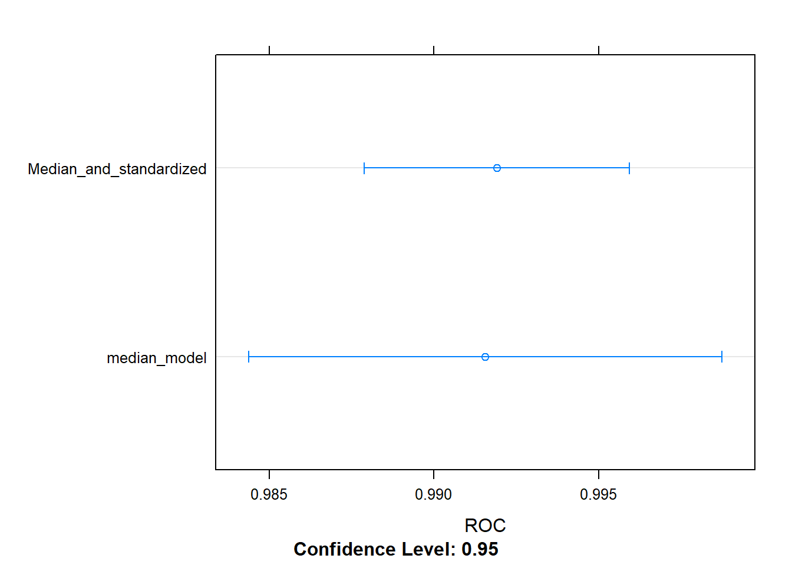
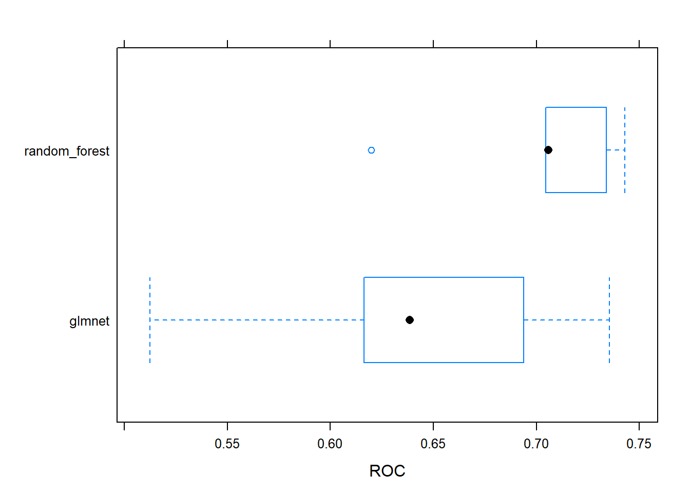
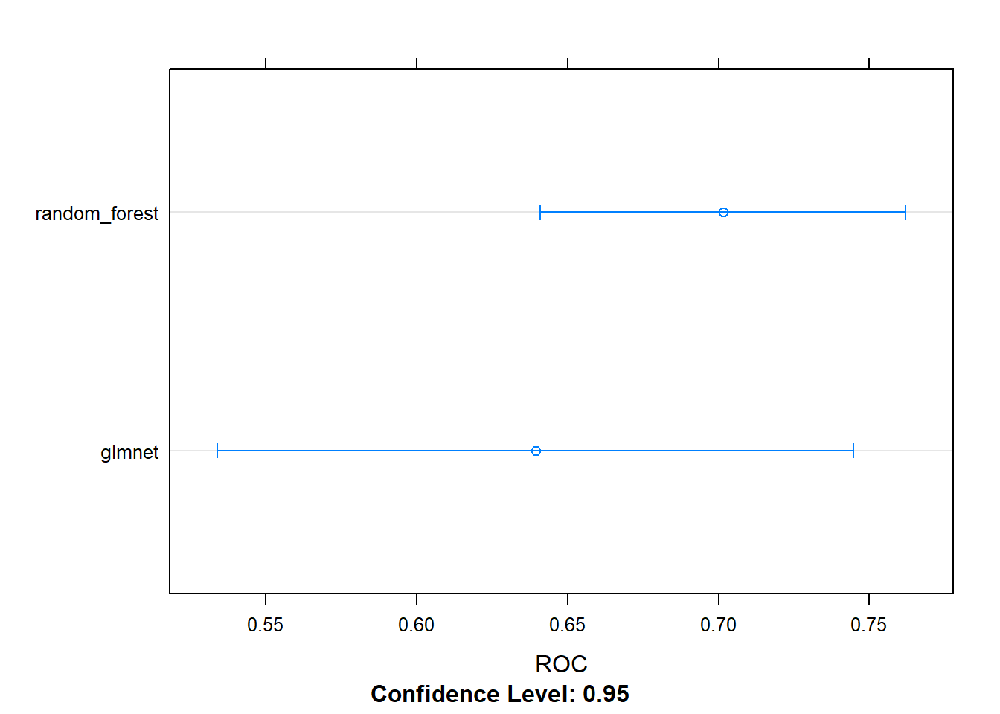
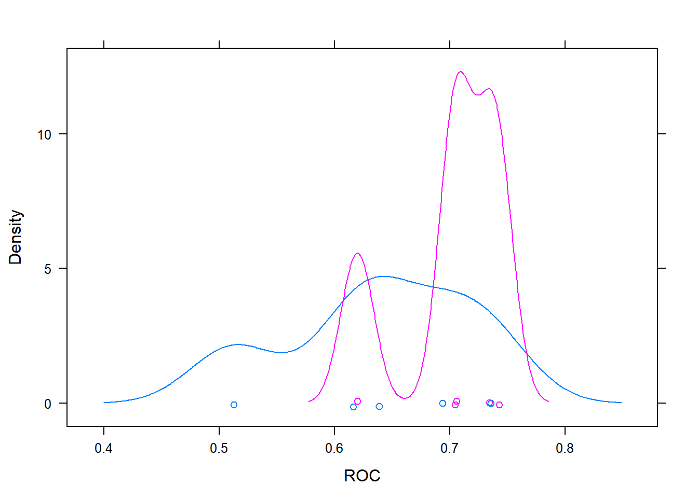

# Machine Learning Toolbox
***
Notes taken during/inspired by the DataCamp course 'Machine Learning Toolbox' by Zachary Deane-Mayer and Max Kuhn.

**_Course Handouts_**

* [Part 1 - Regression models: fitting them and evaluating their performance](./files/MLToolbox/ch1-pdf-slides.pdf)
* [Part 2 - Classification models: fitting them and evaluating their performance] () 
* [Part 3 - Tuning model parameters to improve performance] () 
* [Part 4 - Preprocessing your data] ()
* [Part 5 - Selecting models: a case study in churn prediction] ()

**_Other useful links_**

* [Max Kuhn: Applied Predictive Modeling NYC Talk](https://www.youtube.com/watch?v=dB-JHhEJvQA)
* [Data Chat - Interview With Max Kuhn](https://www.youtube.com/watch?v=YVMlyOh_eyk)
* [The caret package website](https://topepo.github.io/caret/)
* [Bagging graphical explanation](https://www.youtube.com/watch?v=2Mg8QD0F1dQ)
* [Boosting graphical explanation](https://www.youtube.com/watch?v=GM3CDQfQ4sw)
* [Gradient Boosting in Practice: a deep dive into xgboost](https://www.youtube.com/watch?v=s3VmuVPfu0s)

## Regression models: fitting them and evaluating their performance

CAret has been developed by Max for over 10 years.  It automates supervised machine learning (aka predictive modelling) is ML when you have a target variable or something specific you want to predict like species and churn, these could be classification or regression.  We then use metrics to evaluate how accuratley our models predict on new data.  

For linear regression we will use RMSE as our evaluation metric.  Typically this is done on our training (in-sample) data, however this can be too optomistic and lead to over-fitting.  It is better to calculate this out-of-sample using caret.

Next we will calculate in-sample RMSE for the diamonds dataset from ggplot2.


```r
# Load the data
diamonds <- ggplot2::diamonds

# Fit lm model: model
model <- lm(price ~ ., diamonds)

# Predict on full data: p
p <- predict(model, diamonds)

# Compute errors: error
error <- p - diamonds$price

# Calculate in-sample RMSE
sqrt(mean(error ^ 2))
```

```
## [1] 1129.843
```

The course focuses on predictive accuracy, that is to say does the model perform well When presented with new data.  The best way to answer this is to test the model on new data using test data.  This mimics the real world, where you do not actually know the outcome.  We simulate this with a test/train split.

One way you can take a train/test split of a dataset is to order the dataset randomly, then divide it into the two sets. This ensures that the training set and test set are both random samples and that any biases in the ordering of the dataset (e.g. if it had originally been ordered by price or size) are not retained in the samples we take for training and testing your models. You can think of this like shuffling a brand new deck of playing cards before dealing hands.


```r
# Set seed
set.seed(42)

# Shuffle row indices: rows
rows <- sample(nrow(diamonds))

# Randomly order data
diamonds <- diamonds[rows,]
```

Now that your dataset is randomly ordered, you can split the first 80% of it into a training set, and the last 20% into a test set. You can do this by choosing a split point approximately 80% of the way through your data.


```r
# Determine row to split on: split
split <- round(nrow(diamonds) * .80)

# Create train
train <- diamonds[1:split, ]

# Create test
test <- diamonds[(split + 1):nrow(diamonds), ]
```

Now that you have a randomly split training set and test set, you can use the lm() function as you did in the first exercise to fit a model to your training set, rather than the entire dataset. Recall that you can use the formula interface to the linear regression function to fit a model with a specified target variable using all other variables in the dataset as predictors:

> mod <- lm(y ~ ., training_data)

You can use the predict() function to make predictions from that model on new data. The new dataset must have all of the columns from the training data, but they can be in a different order with different values. Here, rather than re-predicting on the training set, you can predict on the test set, which you did not use for training the model. This will allow you to determine the out-of-sample error for the model in the next exercise:

> p <- predict(model, new_data)


```r
# Fit lm model on train: model
model <- lm(price ~ ., train)

# Predict on test: p
p <- predict(model,test)
```

Now that you have predictions on the test set, you can use these predictions to calculate an error metric (in this case RMSE) on the test set and see how the model performs out-of-sample, rather than in-sample as you did in the first exercise. You first do this by calculating the errors between the predicted diamond prices and the actual diamond prices by subtracting the predictions from the actual values.


```r
# Compute errors: error
error <- (p - test$price)

# Calculate RMSE
sqrt(mean(error^2))
```

```
## [1] 1136.596
```

### Cross-validation

Using a simple text:train split can be tricky, particularly if there are some outliers in one of the two datasets.  A better approach is to use multiple test sets and average out of sample error.  One way of achieving this is cross-validation where we use folds, 10 folds would mean we split our data in to ten sections with a single observation only occuring once.  Cross validation is only used to calculate error metrics (out of sample), we then start again using on the full data.  With 10 folds, we therefore have 11 models to fit - the 10 re-sampled models plus the final model.  An alterntive which is available in caret is the bootstrap, but in practice this yields similar results to cross-validation.

caret package makes this very easy to do:

> model <- train(y ~ ., my_data)

caret supports many types of cross-validation, and you can specify which type of cross-validation and the number of cross-validation folds with the trainControl() function, which you pass to the trControl argument in train():

> model <- train(
  y ~ ., my_data,
  method = "lm",
  trControl = trainControl(
    method = "cv", number = 10,
    verboseIter = TRUE
  )
)

It's important to note that you pass the method for modeling to the main train() function and the method for cross-validation to the trainControl() function.


```r
library(caret)
```

```
## Loading required package: lattice
```

```
## Loading required package: ggplot2
```

```
## 
## Attaching package: 'ggplot2'
```

```
## The following object is masked _by_ '.GlobalEnv':
## 
##     diamonds
```

```r
# Fit lm model using 10-fold CV: model
model <- train(
  price ~ ., diamonds,
  method = "lm",
  trControl = trainControl(
    method = "cv", number = 10,
    verboseIter = TRUE
  )
)
```

```
## + Fold01: intercept=TRUE 
## - Fold01: intercept=TRUE 
## + Fold02: intercept=TRUE 
## - Fold02: intercept=TRUE 
## + Fold03: intercept=TRUE 
## - Fold03: intercept=TRUE 
## + Fold04: intercept=TRUE 
## - Fold04: intercept=TRUE 
## + Fold05: intercept=TRUE 
## - Fold05: intercept=TRUE 
## + Fold06: intercept=TRUE 
## - Fold06: intercept=TRUE 
## + Fold07: intercept=TRUE 
## - Fold07: intercept=TRUE 
## + Fold08: intercept=TRUE 
## - Fold08: intercept=TRUE 
## + Fold09: intercept=TRUE 
## - Fold09: intercept=TRUE 
## + Fold10: intercept=TRUE 
## - Fold10: intercept=TRUE 
## Aggregating results
## Fitting final model on full training set
```

```r
# Print model to console
print(model)
```

```
## Linear Regression 
## 
## 53940 samples
##     9 predictor
## 
## No pre-processing
## Resampling: Cross-Validated (10 fold) 
## Summary of sample sizes: 48547, 48546, 48546, 48545, 48545, 48545, ... 
## Resampling results:
## 
##   RMSE      Rsquared   MAE     
##   1130.658  0.9197492  740.4646
## 
## Tuning parameter 'intercept' was held constant at a value of TRUE
```

Next we use a different dataset - Boston house prices - then use a 5 fold cross validation in the trainControl.


```r
Boston <- MASS::Boston

# Fit lm model using 5-fold CV: model
model <- train(
  medv ~ ., Boston,
  method = "lm",
  trControl = trainControl(
    method = "cv", number = 5,
    verboseIter = TRUE
  )
)
```

```
## + Fold1: intercept=TRUE 
## - Fold1: intercept=TRUE 
## + Fold2: intercept=TRUE 
## - Fold2: intercept=TRUE 
## + Fold3: intercept=TRUE 
## - Fold3: intercept=TRUE 
## + Fold4: intercept=TRUE 
## - Fold4: intercept=TRUE 
## + Fold5: intercept=TRUE 
## - Fold5: intercept=TRUE 
## Aggregating results
## Fitting final model on full training set
```

```r
# Print model to console
print(model)
```

```
## Linear Regression 
## 
## 506 samples
##  13 predictor
## 
## No pre-processing
## Resampling: Cross-Validated (5 fold) 
## Summary of sample sizes: 405, 403, 405, 406, 405 
## Resampling results:
## 
##   RMSE      Rsquared   MAE     
##   4.794707  0.7290369  3.372915
## 
## Tuning parameter 'intercept' was held constant at a value of TRUE
```

You can do more than just one iteration of cross-validation. Repeated cross-validation gives you a better estimate of the test-set error. You can also repeat the entire cross-validation procedure. This takes longer, but gives you many more out-of-sample datasets to look at and much more precise assessments of how well the model performs.

One of the awesome things about the train() function in caret is how easy it is to run very different models or methods of cross-validation just by tweaking a few simple arguments to the function call. For example, you could repeat your entire cross-validation procedure 5 times for greater confidence in your estimates of the model's out-of-sample accuracy


```r
# Fit lm model using 5 x 5-fold CV: model
model <- train(
  medv ~ ., Boston,
  method = "lm",
  trControl = trainControl(
    method = "cv", number = 5,
    repeats = 5, verboseIter = TRUE
  )
)
```

```
## Warning: `repeats` has no meaning for this resampling method.
```

```
## + Fold1: intercept=TRUE 
## - Fold1: intercept=TRUE 
## + Fold2: intercept=TRUE 
## - Fold2: intercept=TRUE 
## + Fold3: intercept=TRUE 
## - Fold3: intercept=TRUE 
## + Fold4: intercept=TRUE 
## - Fold4: intercept=TRUE 
## + Fold5: intercept=TRUE 
## - Fold5: intercept=TRUE 
## Aggregating results
## Fitting final model on full training set
```

```r
# Print model to console
print(model)
```

```
## Linear Regression 
## 
## 506 samples
##  13 predictor
## 
## No pre-processing
## Resampling: Cross-Validated (5 fold) 
## Summary of sample sizes: 405, 405, 404, 405, 405 
## Resampling results:
## 
##   RMSE      Rsquared   MAE     
##   4.875484  0.7316537  3.425015
## 
## Tuning parameter 'intercept' was held constant at a value of TRUE
```

Finally, the model you fit with the train() function has the exact same predict() interface as the linear regression models you fit earlier in this chapter.

After fitting a model with train(), you can simply call predict() with new data, e.g:


```r
# Predict on full Boston dataset and display just the first 20 items
head (predict (model, Boston), n = 20)
```

```
##        1        2        3        4        5        6        7        8 
## 30.00384 25.02556 30.56760 28.60704 27.94352 25.25628 23.00181 19.53599 
##        9       10       11       12       13       14       15       16 
## 11.52364 18.92026 18.99950 21.58680 20.90652 19.55290 19.28348 19.29748 
##       17       18       19       20 
## 20.52751 16.91140 16.17801 18.40614
```

## Classification models: fitting them and evaluating their performance

In classification models you are trying to predict a categorical target e.g. whether a customer is satisfied or not.  It it still a form of supervised learning and we can use a train/test split to evaluate performance.  In this sectgion we will use the Sonar dataset which contains charecteristics of a sonar signal for objects that are either rocks or mines.  

The variables explain some part of the signal, then the class of either Rock or Mine - the data below shows the first 7 variables and the class, for a random sample of 10 rows.  As the dataset is very small, we use a 40% test split.


```r
library(mlbench)
data(Sonar)
Sonar[sample(1:nrow(Sonar), 10, replace=FALSE), c(1:7, 61)]
```

```
##         V1     V2     V3     V4     V5     V6     V7 Class
## 3   0.0262 0.0582 0.1099 0.1083 0.0974 0.2280 0.2431     R
## 31  0.0240 0.0218 0.0324 0.0569 0.0330 0.0513 0.0897     R
## 131 0.0443 0.0446 0.0235 0.1008 0.2252 0.2611 0.2061     M
## 77  0.0239 0.0189 0.0466 0.0440 0.0657 0.0742 0.1380     R
## 118 0.0228 0.0106 0.0130 0.0842 0.1117 0.1506 0.1776     M
## 46  0.0408 0.0653 0.0397 0.0604 0.0496 0.1817 0.1178     R
## 47  0.0308 0.0339 0.0202 0.0889 0.1570 0.1750 0.0920     R
## 130 0.1371 0.1226 0.1385 0.1484 0.1776 0.1428 0.1773     M
## 26  0.0201 0.0026 0.0138 0.0062 0.0133 0.0151 0.0541     R
## 86  0.0365 0.1632 0.1636 0.1421 0.1130 0.1306 0.2112     R
```

TO mkae our 60/40 split we do the following.


```r
# Shuffle row indices: rows
rows <- sample(nrow(Sonar))

# Randomly order data: Sonar
Sonar <- Sonar[rows, ]

# Identify row to split on: split
split <- round(nrow(Sonar) * 0.6)

# Create train
train <- Sonar[1:split, ]

# Create test
test <- Sonar[(split + 1):nrow(Sonar), ]
```

Now you can fit a logistic regression model to your training set using the glm() function. glm() is a more advanced version of lm() that allows for more varied types of regression models, aside from plain vanilla ordinary least squares regression.

Don't worry about warnings like glm.fit: algorithm did not converge or glm.fit: fitted probabilities numerically 0 or 1 occurred. These are common on smaller datasets and usually don't cause any issues. They typically mean your dataset is perfectly seperable, which can cause problems for the math behind the model, but R's glm() function is almost always robust enough to handle this case with no problems.


```r
# Fit glm model: model
model <- glm(formula = Class ~ ., family = "binomial", data = train)
```

```
## Warning: glm.fit: algorithm did not converge
```

```
## Warning: glm.fit: fitted probabilities numerically 0 or 1 occurred
```

```r
# Predict on test: p
p <- predict(model, test, type = "response")
```

### Confusion Matrix

A confusion Matrix is a table of the predicted results vs the actual results.  It is called a Confusion Matrix as it explains how confused the model is between the two classes and highlights instances where one class is confused for the other.  The items on the main diagonal are the cases where the model is correct. 

<div class="figure">

<p class="caption">(\#fig:Confusion Matrix)Confusion Matrix</p>
</div>

You could make such a contingency table with the table() function in base R, but confusionMatrix() in caret yields a lot of useful ancillary statistics in addition to the base rates in the table. 


```r
# Calculate class probabilities: p_class
p_class <- ifelse(p > .5, "M", "R")

# Create confusion matrix
confusionMatrix(p_class, test$Class)
```

```
## Confusion Matrix and Statistics
## 
##           Reference
## Prediction  M  R
##          M 12 24
##          R 32 15
##                                          
##                Accuracy : 0.3253         
##                  95% CI : (0.2265, 0.437)
##     No Information Rate : 0.5301         
##     P-Value [Acc > NIR] : 0.9999         
##                                          
##                   Kappa : -0.3387        
##  Mcnemar's Test P-Value : 0.3496         
##                                          
##             Sensitivity : 0.2727         
##             Specificity : 0.3846         
##          Pos Pred Value : 0.3333         
##          Neg Pred Value : 0.3191         
##              Prevalence : 0.5301         
##          Detection Rate : 0.1446         
##    Detection Prevalence : 0.4337         
##       Balanced Accuracy : 0.3287         
##                                          
##        'Positive' Class : M              
## 
```

We see that the No Information rate is around 52%, that is just predicting the dominant class all the time, mines.  Our accuracy so far is below this which suggests that using a dummy model that always predicts mines is more accurate than the current model.  The other values such as sensitivity and specificity give more elements of the confusion matrix:

* Specificity - true negative rate  
* Sensitivity - true positive rate

Setting our threshold rate - currently 50% - is an exercise in deciding what is more important and depends on the cost-benefit analysis of the problem at hand.  Do we want to flag more non-mines as mines, or do we want to be more accurate in our prediction but potentially miss some mines?

Now what happens if we apply a 90% threshold to our model?


```r
# Apply threshold of 0.9: p_class
p_class <- ifelse(p > .9, "M", "R")

# Create confusion matrix
confusionMatrix(p_class, test$Class)
```

```
## Confusion Matrix and Statistics
## 
##           Reference
## Prediction  M  R
##          M 12 24
##          R 32 15
##                                          
##                Accuracy : 0.3253         
##                  95% CI : (0.2265, 0.437)
##     No Information Rate : 0.5301         
##     P-Value [Acc > NIR] : 0.9999         
##                                          
##                   Kappa : -0.3387        
##  Mcnemar's Test P-Value : 0.3496         
##                                          
##             Sensitivity : 0.2727         
##             Specificity : 0.3846         
##          Pos Pred Value : 0.3333         
##          Neg Pred Value : 0.3191         
##              Prevalence : 0.5301         
##          Detection Rate : 0.1446         
##    Detection Prevalence : 0.4337         
##       Balanced Accuracy : 0.3287         
##                                          
##        'Positive' Class : M              
## 
```
Or at 10%


```r
# Apply threshold of 0.10: p_class
p_class <- ifelse(p > .1, "M", "R")

# Create confusion matrix
confusionMatrix(p_class, test$Class)
```

```
## Confusion Matrix and Statistics
## 
##           Reference
## Prediction  M  R
##          M 13 24
##          R 31 15
##                                           
##                Accuracy : 0.3373          
##                  95% CI : (0.2372, 0.4495)
##     No Information Rate : 0.5301          
##     P-Value [Acc > NIR] : 0.9999          
##                                           
##                   Kappa : -0.3167         
##  Mcnemar's Test P-Value : 0.4185          
##                                           
##             Sensitivity : 0.2955          
##             Specificity : 0.3846          
##          Pos Pred Value : 0.3514          
##          Neg Pred Value : 0.3261          
##              Prevalence : 0.5301          
##          Detection Rate : 0.1566          
##    Detection Prevalence : 0.4458          
##       Balanced Accuracy : 0.3400          
##                                           
##        'Positive' Class : M               
## 
```

### The ROC Curve

Rather than manually calculating the true positive and true negative rate for many hundreds of different models - at carying classification cut offs as we previously did - we can plot a ROC (Receiver Operator Charecteristic) curve automatically for every possible threshold.  Originally the ROC curve was designed to look at the trade off with different thresholds when trying to differentiate between radar signals of flocks of birds vs planes.

The ROC curve plots the false positive rate (X Axis) vs the true positive rate (Y axis) with each point representing a different threshold.

There are a number of different ways of calculating ROC curves, one we will use here is the caTools package and calculates the AUC or Area under the curve.


```r
library(caTools)

# Predict on test: p
p <- predict(model, test, type = "response")

# Make ROC curve
colAUC(p, test$Class, plotROC = TRUE)
```


```
##              [,1]
## M vs. R 0.6564685
```

Whne looking at the ROC curve, a line close to the diagonal would be considered bad as it is following something not far off random predictions.  Perfection seperation would produce a box, with a single point at 1, 0 or the top left hand corner which would be a 100% true positive rate and a 0% false positive rate.

The AUC for the 'perfect' model is 1.  For the random model it is 0.5.  The AUC statistics is a single number accuracy measure, it summarises the performance of the model across all possible classification thresholds.  Most models are in the 0.5 to 1 range, some bad models can be in the 0.4 range.  We can think of them as an exam grade e.g.

* A = 0.9  
* B = 0.8  
* C = 0.7  
* ...  
* F = 0.5  

0.8 or above is good, some models in the 0.7 range are useful.  The caret package will calculate the AUC for us.

You can use the trainControl() function in caret to use AUC (instead of acccuracy), to tune the parameters of your models. The twoClassSummary() convenience function allows you to do this easily.

When using twoClassSummary(), be sure to always include the argument classProbs = TRUE or your model will throw an error. You cannot calculate AUC with just class predictions. You need to have class probabilities as well.


```r
# Create trainControl object: myControl
myControl <- trainControl(
  method = "cv",
  number = 10,
  summaryFunction = twoClassSummary,
  classProbs = TRUE, # IMPORTANT!
  verboseIter = TRUE
)
```

Now that you have a custom trainControl object, it's easy to fit caret models that use AUC rather than accuracy to tune and evaluate the model. You can just pass your custom trainControl object to the train() function via the trControl argument, e.g.:

> train(<standard arguments here>, trControl = myControl)

This syntax gives you a convenient way to store a lot of custom modeling parameters and then use them across multiple different calls to train()


```r
# Train glm with custom trainControl: model
model <- train(Class ~ ., data = Sonar, 
                 method = "glm", 
                 trControl = myControl)
```

```
## Warning in train.default(x, y, weights = w, ...): The metric "Accuracy" was
## not in the result set. ROC will be used instead.
```

```
## + Fold01: parameter=none
```

```
## Warning: glm.fit: algorithm did not converge
```

```
## Warning: glm.fit: fitted probabilities numerically 0 or 1 occurred
```

```
## - Fold01: parameter=none 
## + Fold02: parameter=none
```

```
## Warning: glm.fit: algorithm did not converge

## Warning: glm.fit: fitted probabilities numerically 0 or 1 occurred
```

```
## - Fold02: parameter=none 
## + Fold03: parameter=none
```

```
## Warning: glm.fit: algorithm did not converge

## Warning: glm.fit: fitted probabilities numerically 0 or 1 occurred
```

```
## - Fold03: parameter=none 
## + Fold04: parameter=none
```

```
## Warning: glm.fit: algorithm did not converge

## Warning: glm.fit: fitted probabilities numerically 0 or 1 occurred
```

```
## - Fold04: parameter=none 
## + Fold05: parameter=none
```

```
## Warning: glm.fit: algorithm did not converge

## Warning: glm.fit: fitted probabilities numerically 0 or 1 occurred
```

```
## - Fold05: parameter=none 
## + Fold06: parameter=none
```

```
## Warning: glm.fit: algorithm did not converge

## Warning: glm.fit: fitted probabilities numerically 0 or 1 occurred
```

```
## - Fold06: parameter=none 
## + Fold07: parameter=none
```

```
## Warning: glm.fit: algorithm did not converge

## Warning: glm.fit: fitted probabilities numerically 0 or 1 occurred
```

```
## - Fold07: parameter=none 
## + Fold08: parameter=none
```

```
## Warning: glm.fit: algorithm did not converge

## Warning: glm.fit: fitted probabilities numerically 0 or 1 occurred
```

```
## - Fold08: parameter=none 
## + Fold09: parameter=none
```

```
## Warning: glm.fit: algorithm did not converge

## Warning: glm.fit: fitted probabilities numerically 0 or 1 occurred
```

```
## - Fold09: parameter=none 
## + Fold10: parameter=none
```

```
## Warning: glm.fit: algorithm did not converge

## Warning: glm.fit: fitted probabilities numerically 0 or 1 occurred
```

```
## - Fold10: parameter=none 
## Aggregating results
## Fitting final model on full training set
```

```
## Warning: glm.fit: algorithm did not converge

## Warning: glm.fit: fitted probabilities numerically 0 or 1 occurred
```

```r
# Print model to console
model
```

```
## Generalized Linear Model 
## 
## 208 samples
##  60 predictor
##   2 classes: 'M', 'R' 
## 
## No pre-processing
## Resampling: Cross-Validated (10 fold) 
## Summary of sample sizes: 187, 187, 187, 187, 187, 188, ... 
## Resampling results:
## 
##   ROC        Sens       Spec     
##   0.7539899  0.7295455  0.7522222
```

### Tuning model parameters to improve performance

Next we will look at random forests as these are robust against over-fitting.  They can yield accurate, non-linear models without much additional work.  However, unlinke linear models they have so called hyperparameters to tune and they have to be manually specified by the data scientist as inputs in to the model.  These parameters can vary from dataset to dataset, the defaults can be ok, but often need adjusting.  

With random forests we fit a different tree to each bootstrap sample of the data, called bagging - we can think of this as draw a random 'bag' of observations, at random with replacement, from the original TRAIN dataset many times - to which we think fit a tree on this subset of data.  This effectivly creates multiple train/test splits on the TRAIN data and trains a different model, so we end up with an ensemble of different models.  

Note - boosting is similar to bagging, in that we take a random 'bag' of data and fit a model.  However we fit the models iteratively with boosting, with subsequent models fitted to those observations which were not previously fitted as well.  When we draw another sample or bag, we weight the probability of observation selection based on how well the previous model fitted those observations, if they were poorly fitted, the new model is more likely to sample those and therefore more likely to accuratley predict them.  We then re-inputt all the TRAIN data to our two models and see which observations were then, based on this two model ensemble, not predicted as well.  When then try to build a new model in which these previously under-predicted observations are better predicted, then build the ensemble again and iterate as neccessary.

Random forests take bagging a step further, by randomly sampling the columns (variables) at each split and helps to yield more accurate models.  It does this to try and de-correlate the errors in different bootstrap samples i.e. different models.  You make errors everywhere, but they have different origins/models.

Bagging can therefore be run in parallel, since each bag or draw is independent of the others.  In Boosting, this is not possible, since subsequent draws are dependent on previous draws/models.

ISR notes:

"While bagging can improve predictions for many regression methods, it is particularly useful for decision trees. To apply bagging to regression trees, we simply construct B regression trees using B bootstrapped training sets, and average the resulting predictions. These trees are grown deep, and are not pruned. Hence each individual tree has high variance, but low bias. Averaging these B trees reduces the variance. Bagging has been demonstrated to give impressive improvements in accuracy by combining together hundreds or even thousands of trees into a single procedure." (pg 317)

And

"Boosting does not involve bootstrap sampling; instead each  tree is fit on a modified version of the original data set...Unlike fitting a single large decision tree to the data, which amounts to fitting the data hard and potentially overfitting, the boosting approach instead learns slowly. Given the current model, we fit a decision tree to the residuals from the model. That is, we fit a tree using the current residuals, rather than the outcome Y , as the response. We then add this new decision tree into the fitted function in order to update the residuals. Each of these trees can be rather small, with just a few terminal nodes, determined by the parameter d in the algorithm."

So bagging tends to produce large (deep) trees with high variance, where as boosting produces shallow trees with high bias.

Fitting a random forest model is exactly the same as fitting a generalized linear regression model, as you did in the previous chapter. You simply change the method argument in the train function to be "ranger". The ranger package is a rewrite of R's classic randomForest package and fits models much faster, but gives almost exactly the same results. 


```r
# Load the wine data
wine <- readRDS("./files/MLToolbox/wine_100.rds")

# Fit random forest: model
model <- train(
  quality ~.,
  tuneLength = 1,
  data = wine, method = "ranger",
  trControl = trainControl(method = "cv", number = 5, verboseIter = TRUE)
)
```

```
## 
## Attaching package: 'dplyr'
```

```
## The following objects are masked from 'package:stats':
## 
##     filter, lag
```

```
## The following objects are masked from 'package:base':
## 
##     intersect, setdiff, setequal, union
```

```
## + Fold1: mtry=3, splitrule=variance 
## - Fold1: mtry=3, splitrule=variance 
## + Fold1: mtry=3, splitrule=extratrees 
## - Fold1: mtry=3, splitrule=extratrees 
## + Fold2: mtry=3, splitrule=variance 
## - Fold2: mtry=3, splitrule=variance 
## + Fold2: mtry=3, splitrule=extratrees 
## - Fold2: mtry=3, splitrule=extratrees 
## + Fold3: mtry=3, splitrule=variance 
## - Fold3: mtry=3, splitrule=variance 
## + Fold3: mtry=3, splitrule=extratrees 
## - Fold3: mtry=3, splitrule=extratrees 
## + Fold4: mtry=3, splitrule=variance 
## - Fold4: mtry=3, splitrule=variance 
## + Fold4: mtry=3, splitrule=extratrees 
## - Fold4: mtry=3, splitrule=extratrees 
## + Fold5: mtry=3, splitrule=variance 
## - Fold5: mtry=3, splitrule=variance 
## + Fold5: mtry=3, splitrule=extratrees 
## - Fold5: mtry=3, splitrule=extratrees 
## Aggregating results
## Selecting tuning parameters
## Fitting mtry = 3, splitrule = variance on full training set
```

```r
# Print model to console
model
```

```
## Random Forest 
## 
## 100 samples
##  12 predictor
## 
## No pre-processing
## Resampling: Cross-Validated (5 fold) 
## Summary of sample sizes: 81, 80, 80, 79, 80 
## Resampling results across tuning parameters:
## 
##   splitrule   RMSE       Rsquared   MAE      
##   variance    0.6579440  0.3157395  0.4978594
##   extratrees  0.6842383  0.2852057  0.5194518
## 
## Tuning parameter 'mtry' was held constant at a value of 3
## RMSE was used to select the optimal model using  the smallest value.
## The final values used for the model were mtry = 3 and splitrule = variance.
```

A difference between random forests and linear models is that random forests require tuning, this is done using "hyperparameters" and is done before fitting the model.  One such variable is _mtry_ which is the number of randomly selected variables used in each split.  It is not always possible to know which is better for your data in advance.  But caret can help to automate the selection of these parameters using something called _grid search_.  It will select the appropriate hyperparameters based on out-of-sample error.

Random forest models have a primary tuning parameter of mtry, which controls how many variables are exposed to the splitting search routine at each split. For example, suppose that a tree has a total of 10 splits and mtry = 2. This means that there are 10 samples of 2 predictors each time a split is evaluated.

We will use a larger tuning grid this time, but stick to the defaults provided by the train() function. We try a tuneLength of 3, rather than 1, to explore some more potential models, and plot the resulting model using the plot function.


```r
# Fit random forest: model
model <- train(
  quality ~.,
  tuneLength = 3,
  data = wine, method = "ranger",
  trControl = trainControl(method = "cv", number = 5, verboseIter = TRUE)
)
```

```
## + Fold1: mtry= 2, splitrule=variance 
## - Fold1: mtry= 2, splitrule=variance 
## + Fold1: mtry= 7, splitrule=variance 
## - Fold1: mtry= 7, splitrule=variance 
## + Fold1: mtry=12, splitrule=variance 
## - Fold1: mtry=12, splitrule=variance 
## + Fold1: mtry= 2, splitrule=extratrees 
## - Fold1: mtry= 2, splitrule=extratrees 
## + Fold1: mtry= 7, splitrule=extratrees 
## - Fold1: mtry= 7, splitrule=extratrees 
## + Fold1: mtry=12, splitrule=extratrees 
## - Fold1: mtry=12, splitrule=extratrees 
## + Fold2: mtry= 2, splitrule=variance 
## - Fold2: mtry= 2, splitrule=variance 
## + Fold2: mtry= 7, splitrule=variance 
## - Fold2: mtry= 7, splitrule=variance 
## + Fold2: mtry=12, splitrule=variance 
## - Fold2: mtry=12, splitrule=variance 
## + Fold2: mtry= 2, splitrule=extratrees 
## - Fold2: mtry= 2, splitrule=extratrees 
## + Fold2: mtry= 7, splitrule=extratrees 
## - Fold2: mtry= 7, splitrule=extratrees 
## + Fold2: mtry=12, splitrule=extratrees 
## - Fold2: mtry=12, splitrule=extratrees 
## + Fold3: mtry= 2, splitrule=variance 
## - Fold3: mtry= 2, splitrule=variance 
## + Fold3: mtry= 7, splitrule=variance 
## - Fold3: mtry= 7, splitrule=variance 
## + Fold3: mtry=12, splitrule=variance 
## - Fold3: mtry=12, splitrule=variance 
## + Fold3: mtry= 2, splitrule=extratrees 
## - Fold3: mtry= 2, splitrule=extratrees 
## + Fold3: mtry= 7, splitrule=extratrees 
## - Fold3: mtry= 7, splitrule=extratrees 
## + Fold3: mtry=12, splitrule=extratrees 
## - Fold3: mtry=12, splitrule=extratrees 
## + Fold4: mtry= 2, splitrule=variance 
## - Fold4: mtry= 2, splitrule=variance 
## + Fold4: mtry= 7, splitrule=variance 
## - Fold4: mtry= 7, splitrule=variance 
## + Fold4: mtry=12, splitrule=variance 
## - Fold4: mtry=12, splitrule=variance 
## + Fold4: mtry= 2, splitrule=extratrees 
## - Fold4: mtry= 2, splitrule=extratrees 
## + Fold4: mtry= 7, splitrule=extratrees 
## - Fold4: mtry= 7, splitrule=extratrees 
## + Fold4: mtry=12, splitrule=extratrees 
## - Fold4: mtry=12, splitrule=extratrees 
## + Fold5: mtry= 2, splitrule=variance 
## - Fold5: mtry= 2, splitrule=variance 
## + Fold5: mtry= 7, splitrule=variance 
## - Fold5: mtry= 7, splitrule=variance 
## + Fold5: mtry=12, splitrule=variance 
## - Fold5: mtry=12, splitrule=variance 
## + Fold5: mtry= 2, splitrule=extratrees 
## - Fold5: mtry= 2, splitrule=extratrees 
## + Fold5: mtry= 7, splitrule=extratrees 
## - Fold5: mtry= 7, splitrule=extratrees 
## + Fold5: mtry=12, splitrule=extratrees 
## - Fold5: mtry=12, splitrule=extratrees 
## Aggregating results
## Selecting tuning parameters
## Fitting mtry = 12, splitrule = variance on full training set
```

```r
# Print model to console
model
```

```
## Random Forest 
## 
## 100 samples
##  12 predictor
## 
## No pre-processing
## Resampling: Cross-Validated (5 fold) 
## Summary of sample sizes: 80, 80, 81, 80, 79 
## Resampling results across tuning parameters:
## 
##   mtry  splitrule   RMSE       Rsquared   MAE      
##    2    variance    0.6835887  0.2508610  0.5170790
##    2    extratrees  0.7138749  0.2113001  0.5376460
##    7    variance    0.6674687  0.2907502  0.5100175
##    7    extratrees  0.6980645  0.2258272  0.5296820
##   12    variance    0.6621775  0.2977265  0.5070150
##   12    extratrees  0.7014995  0.2111631  0.5355658
## 
## RMSE was used to select the optimal model using  the smallest value.
## The final values used for the model were mtry = 12 and splitrule
##  = variance.
```

```r
# Plot model
plot(model)
```


We can pass our own custom tuning grids as a data frame to the train control argument.  This is the most fleixble approach, however it can take a lot longer to train the model and can considerably increase run time.

You can provide any number of values for mtry, from 2 up to the number of columns in the dataset. In practice, there are diminishing returns for much larger values of mtry, so we will use a custom tuning grid that explores 2 simple models (mtry = 2 and mtry = 3) as well as one more complicated model (mtry = 7).


```r
# Add the tune grid options - note ranger requires a . prior to tuning parameters, other models/packages may not: 
tgrid <- expand.grid(
  .mtry = c(2, 3, 7),
  .splitrule = "extratrees"
)

# Fit random forest: model
model <- train(
  quality ~.,
  tuneGrid = tgrid,
  data = wine, method = "ranger",
  trControl = trainControl(method = "cv", number = 5, verboseIter = TRUE)
)
```

```
## + Fold1: mtry=2, splitrule=extratrees 
## - Fold1: mtry=2, splitrule=extratrees 
## + Fold1: mtry=3, splitrule=extratrees 
## - Fold1: mtry=3, splitrule=extratrees 
## + Fold1: mtry=7, splitrule=extratrees 
## - Fold1: mtry=7, splitrule=extratrees 
## + Fold2: mtry=2, splitrule=extratrees 
## - Fold2: mtry=2, splitrule=extratrees 
## + Fold2: mtry=3, splitrule=extratrees 
## - Fold2: mtry=3, splitrule=extratrees 
## + Fold2: mtry=7, splitrule=extratrees 
## - Fold2: mtry=7, splitrule=extratrees 
## + Fold3: mtry=2, splitrule=extratrees 
## - Fold3: mtry=2, splitrule=extratrees 
## + Fold3: mtry=3, splitrule=extratrees 
## - Fold3: mtry=3, splitrule=extratrees 
## + Fold3: mtry=7, splitrule=extratrees 
## - Fold3: mtry=7, splitrule=extratrees 
## + Fold4: mtry=2, splitrule=extratrees 
## - Fold4: mtry=2, splitrule=extratrees 
## + Fold4: mtry=3, splitrule=extratrees 
## - Fold4: mtry=3, splitrule=extratrees 
## + Fold4: mtry=7, splitrule=extratrees 
## - Fold4: mtry=7, splitrule=extratrees 
## + Fold5: mtry=2, splitrule=extratrees 
## - Fold5: mtry=2, splitrule=extratrees 
## + Fold5: mtry=3, splitrule=extratrees 
## - Fold5: mtry=3, splitrule=extratrees 
## + Fold5: mtry=7, splitrule=extratrees 
## - Fold5: mtry=7, splitrule=extratrees 
## Aggregating results
## Selecting tuning parameters
## Fitting mtry = 7, splitrule = extratrees on full training set
```

```r
# Print model to console
model
```

```
## Random Forest 
## 
## 100 samples
##  12 predictor
## 
## No pre-processing
## Resampling: Cross-Validated (5 fold) 
## Summary of sample sizes: 80, 80, 80, 79, 81 
## Resampling results across tuning parameters:
## 
##   mtry  RMSE       Rsquared   MAE      
##   2     0.7159368  0.2351616  0.5258831
##   3     0.7174871  0.2189432  0.5313928
##   7     0.7034861  0.2462823  0.5210960
## 
## Tuning parameter 'splitrule' was held constant at a value of extratrees
## RMSE was used to select the optimal model using  the smallest value.
## The final values used for the model were mtry = 7 and splitrule
##  = extratrees.
```

```r
# Plot model
plot(model)
```


### Introducing glmnet

This is similar to GLM models but has built in model selection.  It linear models better deal with collinearity, which is correlation amungst the predictors in a model and can help reduce overfitting for models with small data.  There are two main forms - lasso and ridge regression.  Both of these methods shrink the coefficents towards zero and can also be useful for very large datasets also.  

* Lasso - penalises non-zero coefficients (l1 norm)
* Ridge - penalises absolute magnitude coefficients (l2 norm)

The amount that we penalise the coefficients depends on our tuning parameter.  We can use cross-validation to help in the selection of the tuning parameter.  At very high values of the tuning parameter (lambda), we penalise the indivdual variables so much they effectively have a value of zero.  At very low levels, we penalise the variables so little that they approach their linear (least squared) equivalents. In both instances, we try to end up with parsimonous models.  We can fit lasso and ridge together using glmnet using the alpha paramater - 1 is pure lasso, 0 is pure ridge.

The dataset used comes has nearly as many columns as rows.  This is a simulated dataset based on the "don't overfit" competition on Kaggle a number of years ago.  Classification problems are a little more complicated than regression problems because you have to provide a custom summaryFunction to the train() function to use the AUC metric to rank your models. Start by making a custom trainControl. Be sure to set classProbs = TRUE, otherwise the twoClassSummary for summaryFunction will break.


```r
# Create custom trainControl: myControl
myControl <- trainControl(
  method = "cv", number = 10,
  summaryFunction = twoClassSummary,
  classProbs = TRUE, # IMPORTANT!
  verboseIter = TRUE
)
```

glmnet is capable of fitting two different kinds of penalized models, controlled by the alpha parameter:

Ridge regression (or alpha = 0)
Lasso regression (or alpha = 1)

We now fit a glmnet model to the "don't overfit" dataset using the defaults provided by the caret package.


```r
overfit <- read.csv("./files/MLToolbox/overfit.csv")

# Fit glmnet model: model
model <- train(
  y ~., overfit,
  method = "glmnet",
  trControl = myControl
)
```

```
## Warning in train.default(x, y, weights = w, ...): The metric "Accuracy" was
## not in the result set. ROC will be used instead.
```

```
## Warning: package 'glmnet' was built under R version 3.4.4
```

```
## Loading required package: Matrix
```

```
## Loading required package: foreach
```

```
## Loaded glmnet 2.0-13
```

```
## + Fold01: alpha=0.10, lambda=0.01013 
## - Fold01: alpha=0.10, lambda=0.01013 
## + Fold01: alpha=0.55, lambda=0.01013 
## - Fold01: alpha=0.55, lambda=0.01013 
## + Fold01: alpha=1.00, lambda=0.01013 
## - Fold01: alpha=1.00, lambda=0.01013 
## + Fold02: alpha=0.10, lambda=0.01013 
## - Fold02: alpha=0.10, lambda=0.01013 
## + Fold02: alpha=0.55, lambda=0.01013 
## - Fold02: alpha=0.55, lambda=0.01013 
## + Fold02: alpha=1.00, lambda=0.01013 
## - Fold02: alpha=1.00, lambda=0.01013 
## + Fold03: alpha=0.10, lambda=0.01013 
## - Fold03: alpha=0.10, lambda=0.01013 
## + Fold03: alpha=0.55, lambda=0.01013 
## - Fold03: alpha=0.55, lambda=0.01013 
## + Fold03: alpha=1.00, lambda=0.01013 
## - Fold03: alpha=1.00, lambda=0.01013 
## + Fold04: alpha=0.10, lambda=0.01013 
## - Fold04: alpha=0.10, lambda=0.01013 
## + Fold04: alpha=0.55, lambda=0.01013 
## - Fold04: alpha=0.55, lambda=0.01013 
## + Fold04: alpha=1.00, lambda=0.01013 
## - Fold04: alpha=1.00, lambda=0.01013 
## + Fold05: alpha=0.10, lambda=0.01013 
## - Fold05: alpha=0.10, lambda=0.01013 
## + Fold05: alpha=0.55, lambda=0.01013 
## - Fold05: alpha=0.55, lambda=0.01013 
## + Fold05: alpha=1.00, lambda=0.01013 
## - Fold05: alpha=1.00, lambda=0.01013 
## + Fold06: alpha=0.10, lambda=0.01013 
## - Fold06: alpha=0.10, lambda=0.01013 
## + Fold06: alpha=0.55, lambda=0.01013 
## - Fold06: alpha=0.55, lambda=0.01013 
## + Fold06: alpha=1.00, lambda=0.01013 
## - Fold06: alpha=1.00, lambda=0.01013 
## + Fold07: alpha=0.10, lambda=0.01013 
## - Fold07: alpha=0.10, lambda=0.01013 
## + Fold07: alpha=0.55, lambda=0.01013 
## - Fold07: alpha=0.55, lambda=0.01013 
## + Fold07: alpha=1.00, lambda=0.01013 
## - Fold07: alpha=1.00, lambda=0.01013 
## + Fold08: alpha=0.10, lambda=0.01013 
## - Fold08: alpha=0.10, lambda=0.01013 
## + Fold08: alpha=0.55, lambda=0.01013 
## - Fold08: alpha=0.55, lambda=0.01013 
## + Fold08: alpha=1.00, lambda=0.01013 
## - Fold08: alpha=1.00, lambda=0.01013 
## + Fold09: alpha=0.10, lambda=0.01013 
## - Fold09: alpha=0.10, lambda=0.01013 
## + Fold09: alpha=0.55, lambda=0.01013 
## - Fold09: alpha=0.55, lambda=0.01013 
## + Fold09: alpha=1.00, lambda=0.01013 
## - Fold09: alpha=1.00, lambda=0.01013 
## + Fold10: alpha=0.10, lambda=0.01013 
## - Fold10: alpha=0.10, lambda=0.01013 
## + Fold10: alpha=0.55, lambda=0.01013 
## - Fold10: alpha=0.55, lambda=0.01013 
## + Fold10: alpha=1.00, lambda=0.01013 
## - Fold10: alpha=1.00, lambda=0.01013 
## Aggregating results
## Selecting tuning parameters
## Fitting alpha = 1, lambda = 0.0101 on full training set
```

```r
# Print model to console
model
```

```
## glmnet 
## 
## 250 samples
## 200 predictors
##   2 classes: 'class1', 'class2' 
## 
## No pre-processing
## Resampling: Cross-Validated (10 fold) 
## Summary of sample sizes: 225, 225, 225, 224, 224, 226, ... 
## Resampling results across tuning parameters:
## 
##   alpha  lambda        ROC        Sens  Spec     
##   0.10   0.0001012745  0.4420290  0     0.9699275
##   0.10   0.0010127448  0.4462862  0     0.9784420
##   0.10   0.0101274483  0.4461051  0     0.9913043
##   0.55   0.0001012745  0.4247283  0     0.9572464
##   0.55   0.0010127448  0.4223732  0     0.9701087
##   0.55   0.0101274483  0.4367754  0     0.9869565
##   1.00   0.0001012745  0.3647645  0     0.9438406
##   1.00   0.0010127448  0.3645833  0     0.9655797
##   1.00   0.0101274483  0.4499094  0     0.9869565
## 
## ROC was used to select the optimal model using  the largest value.
## The final values used for the model were alpha = 1 and lambda = 0.01012745.
```

```r
# Print maximum ROC statistic
max(model[["results"]])
```

```
## [1] 1
```

glmnet model have two tuning paramets, alpha (ridge to lasso) and lambda (size of the penalty). However for a single alpha value, glmnet will fit all values of lambda simultaneously.  We are fitting a number of different models in effect, then see which fits the best.  We could try for instance two values of alpha - 0 and 1 - then have a wide range of lambdas which we can fit using the seqeunce function.  

We use a custom tuning grid as the default tuning grid is very small and there are many more potential glmnet models we may want to explore.

As previously mentioned, the glmnet model actually fits many models at once (one of the great things about the package). You can exploit this by passing a large number of lambda values, which control the amount of penalization in the model. train() is smart enough to only fit one model per alpha value and pass all of the lambda values at once for simultaneous fitting.

A good tuning grid for glmnet models is:

> expand.grid(alpha = 0:1,
  lambda = seq(0.0001, 1, length = 100))

This grid explores a large number of lambda values (100, in fact), from a very small one to a very large one. (You could increase the maximum lambda to 10, but in this exercise 1 is a good upper bound.)

If you want to explore fewer models, you can use a shorter lambda sequence. For example, lambda = seq(0.0001, 1, length = 10) would fit 10 models per value of alpha.

You also look at the two forms of penalized models with this tuneGrid: ridge regression and lasso regression. alpha = 0 is pure ridge regression, and alpha = 1 is pure lasso regression. You can fit a mixture of the two models (i.e. an elastic net) using an alpha between 0 and 1. For example, alpha = .05 would be 95% ridge regression and 5% lasso regression.

In this problem you'll just explore the 2 extremes - pure ridge and pure lasso regression - for the purpose of illustrating their differences.


```r
# Train glmnet with custom trainControl and tuning: model
model <- train(
  y ~., overfit,
  tuneGrid = expand.grid(alpha = 0:1,
  lambda = seq(0.0001, 1, length = 20)),
  method = "glmnet",
  trControl = myControl
)
```

```
## Warning in train.default(x, y, weights = w, ...): The metric "Accuracy" was
## not in the result set. ROC will be used instead.
```

```
## + Fold01: alpha=0, lambda=1 
## - Fold01: alpha=0, lambda=1 
## + Fold01: alpha=1, lambda=1 
## - Fold01: alpha=1, lambda=1 
## + Fold02: alpha=0, lambda=1 
## - Fold02: alpha=0, lambda=1 
## + Fold02: alpha=1, lambda=1 
## - Fold02: alpha=1, lambda=1 
## + Fold03: alpha=0, lambda=1 
## - Fold03: alpha=0, lambda=1 
## + Fold03: alpha=1, lambda=1 
## - Fold03: alpha=1, lambda=1 
## + Fold04: alpha=0, lambda=1 
## - Fold04: alpha=0, lambda=1 
## + Fold04: alpha=1, lambda=1 
## - Fold04: alpha=1, lambda=1 
## + Fold05: alpha=0, lambda=1 
## - Fold05: alpha=0, lambda=1 
## + Fold05: alpha=1, lambda=1 
## - Fold05: alpha=1, lambda=1 
## + Fold06: alpha=0, lambda=1 
## - Fold06: alpha=0, lambda=1 
## + Fold06: alpha=1, lambda=1 
## - Fold06: alpha=1, lambda=1 
## + Fold07: alpha=0, lambda=1 
## - Fold07: alpha=0, lambda=1 
## + Fold07: alpha=1, lambda=1 
## - Fold07: alpha=1, lambda=1 
## + Fold08: alpha=0, lambda=1 
## - Fold08: alpha=0, lambda=1 
## + Fold08: alpha=1, lambda=1 
## - Fold08: alpha=1, lambda=1 
## + Fold09: alpha=0, lambda=1 
## - Fold09: alpha=0, lambda=1 
## + Fold09: alpha=1, lambda=1 
## - Fold09: alpha=1, lambda=1 
## + Fold10: alpha=0, lambda=1 
## - Fold10: alpha=0, lambda=1 
## + Fold10: alpha=1, lambda=1 
## - Fold10: alpha=1, lambda=1 
## Aggregating results
## Selecting tuning parameters
## Fitting alpha = 1, lambda = 0.0527 on full training set
```

```r
# Print model to console
model
```

```
## glmnet 
## 
## 250 samples
## 200 predictors
##   2 classes: 'class1', 'class2' 
## 
## No pre-processing
## Resampling: Cross-Validated (10 fold) 
## Summary of sample sizes: 224, 226, 226, 225, 225, 225, ... 
## Resampling results across tuning parameters:
## 
##   alpha  lambda      ROC        Sens  Spec     
##   0      0.00010000  0.3849638  0.00  0.9699275
##   0      0.05272632  0.4043478  0.00  1.0000000
##   0      0.10535263  0.4024457  0.00  1.0000000
##   0      0.15797895  0.4002717  0.00  1.0000000
##   0      0.21060526  0.4133152  0.00  1.0000000
##   0      0.26323158  0.4133152  0.00  1.0000000
##   0      0.31585789  0.4133152  0.00  1.0000000
##   0      0.36848421  0.4133152  0.00  1.0000000
##   0      0.42111053  0.4154891  0.00  1.0000000
##   0      0.47373684  0.4196558  0.00  1.0000000
##   0      0.52636316  0.4217391  0.00  1.0000000
##   0      0.57898947  0.4217391  0.00  1.0000000
##   0      0.63161579  0.4217391  0.00  1.0000000
##   0      0.68424211  0.4217391  0.00  1.0000000
##   0      0.73686842  0.4217391  0.00  1.0000000
##   0      0.78949474  0.4196558  0.00  1.0000000
##   0      0.84212105  0.4174819  0.00  1.0000000
##   0      0.89474737  0.4153986  0.00  1.0000000
##   0      0.94737368  0.4153986  0.00  1.0000000
##   0      1.00000000  0.4153986  0.00  1.0000000
##   1      0.00010000  0.3384058  0.05  0.9018116
##   1      0.05272632  0.5086957  0.00  1.0000000
##   1      0.10535263  0.5000000  0.00  1.0000000
##   1      0.15797895  0.5000000  0.00  1.0000000
##   1      0.21060526  0.5000000  0.00  1.0000000
##   1      0.26323158  0.5000000  0.00  1.0000000
##   1      0.31585789  0.5000000  0.00  1.0000000
##   1      0.36848421  0.5000000  0.00  1.0000000
##   1      0.42111053  0.5000000  0.00  1.0000000
##   1      0.47373684  0.5000000  0.00  1.0000000
##   1      0.52636316  0.5000000  0.00  1.0000000
##   1      0.57898947  0.5000000  0.00  1.0000000
##   1      0.63161579  0.5000000  0.00  1.0000000
##   1      0.68424211  0.5000000  0.00  1.0000000
##   1      0.73686842  0.5000000  0.00  1.0000000
##   1      0.78949474  0.5000000  0.00  1.0000000
##   1      0.84212105  0.5000000  0.00  1.0000000
##   1      0.89474737  0.5000000  0.00  1.0000000
##   1      0.94737368  0.5000000  0.00  1.0000000
##   1      1.00000000  0.5000000  0.00  1.0000000
## 
## ROC was used to select the optimal model using  the largest value.
## The final values used for the model were alpha = 1 and lambda = 0.05272632.
```

```r
# Print maximum ROC statistic
max(model[["results"]][["ROC"]])
```

```
## [1] 0.5086957
```

## Preprocessing your data

Real world data has missing values and often models don't know what to missing data.  Models can exclude cases where values are missing and it can lead to bias.  A better approach is to use median imputation.

In this section we use a version of the Wisconsin Breast Cancer dataset. This dataset presents a classic binary classification problem: 50% of the samples are benign, 50% are malignant, and the challenge is to identify which are which.

This dataset is interesting because many of the predictors contain missing values and most rows of the dataset have at least one missing value. This presents a modeling challenge, because most machine learning algorithms cannot handle missing values out of the box. For example, your first instinct might be to fit a logistic regression model to this data, but prior to doing this you need a strategy for handling the NAs.

Fortunately, the train() function in caret contains an argument called preProcess, which allows you to specify that median imputation should be used to fill in the missing values. In previous chapters, you created models with the train() function using formulas such as y ~ .. An alternative way is to specify the x and y arguments to train(), where x is an object with samples in rows and features in columns and y is a numeric or factor vector containing the outcomes. Said differently, x is a matrix or data frame that contains the whole dataset you'd use for the data argument to the lm() call, for example, but excludes the response variable column; y is a vector that contains just the response variable column.

For this exercise, the argument x to train() is loaded in your workspace as breast_cancer_x and y as breast_cancer_y.


```r
# Load the breast cancer data - loads two datasets x to train as breast_cancer_x and y as breast_cancer_y.
load("./files/MLToolbox/BreastCancer.RData")

# Apply median imputation: model
model <- train(
  x = breast_cancer_x, y = breast_cancer_y,
  method = "glm",
  trControl = myControl,
  preProcess = "medianImpute"
)
```

```
## Warning in train.default(x = breast_cancer_x, y = breast_cancer_y, method =
## "glm", : The metric "Accuracy" was not in the result set. ROC will be used
## instead.
```

```
## + Fold01: parameter=none 
## - Fold01: parameter=none 
## + Fold02: parameter=none 
## - Fold02: parameter=none 
## + Fold03: parameter=none 
## - Fold03: parameter=none 
## + Fold04: parameter=none 
## - Fold04: parameter=none 
## + Fold05: parameter=none 
## - Fold05: parameter=none 
## + Fold06: parameter=none 
## - Fold06: parameter=none 
## + Fold07: parameter=none 
## - Fold07: parameter=none 
## + Fold08: parameter=none 
## - Fold08: parameter=none 
## + Fold09: parameter=none 
## - Fold09: parameter=none 
## + Fold10: parameter=none 
## - Fold10: parameter=none 
## Aggregating results
## Fitting final model on full training set
```

```r
# Print model to console
model
```

```
## Generalized Linear Model 
## 
## 699 samples
##   9 predictor
##   2 classes: 'benign', 'malignant' 
## 
## Pre-processing: median imputation (9) 
## Resampling: Cross-Validated (10 fold) 
## Summary of sample sizes: 630, 630, 629, 629, 629, 629, ... 
## Resampling results:
## 
##   ROC        Sens       Spec     
##   0.9915576  0.9694203  0.9376667
```

There are some problems with median imputation, particularly if there is systematic bias and the data is missing not at random.  In effect this means if there is a pattern in missing values, median imputation can miss this.  For instance, we often find that higher income individuals are less likely to report their household income in survey data.  Note that tree based models tend to be more robust to missing not at random case. An alternative to median imputation is knn imputation, it imputes based on "similar" non missing rows based on some defined variables which we define.  KNN is not always better than median imputation, so it is worthwhile trying both knn and median imputation and keep the one which gives the most accurate model.

While this is a lot more complicated to implement in practice than simple median imputation, it is very easy to explore in caret using the preProcess argument to train(). You can simply use preProcess = "knnImpute" to change the method of imputation used prior to model fitting.


```r
library("RANN") # installed from dev verison on github

# Apply KNN imputation: model2
model2 <- train(
  x = breast_cancer_x, y = breast_cancer_y,
  method = "glm",
  trControl = myControl,
  preProcess = "knnImpute"
)
```

```
## Warning in train.default(x = breast_cancer_x, y = breast_cancer_y, method =
## "glm", : The metric "Accuracy" was not in the result set. ROC will be used
## instead.
```

```
## + Fold01: parameter=none 
## - Fold01: parameter=none 
## + Fold02: parameter=none 
## - Fold02: parameter=none 
## + Fold03: parameter=none 
## - Fold03: parameter=none 
## + Fold04: parameter=none 
## - Fold04: parameter=none 
## + Fold05: parameter=none 
## - Fold05: parameter=none 
## + Fold06: parameter=none 
## - Fold06: parameter=none 
## + Fold07: parameter=none 
## - Fold07: parameter=none 
## + Fold08: parameter=none 
## - Fold08: parameter=none 
## + Fold09: parameter=none 
## - Fold09: parameter=none 
## + Fold10: parameter=none 
## - Fold10: parameter=none 
## Aggregating results
## Fitting final model on full training set
```

```r
# Print model to console
model2
```

```
## Generalized Linear Model 
## 
## 699 samples
##   9 predictor
##   2 classes: 'benign', 'malignant' 
## 
## Pre-processing: nearest neighbor imputation (9), centered (9), scaled (9) 
## Resampling: Cross-Validated (10 fold) 
## Summary of sample sizes: 629, 628, 629, 629, 629, 630, ... 
## Resampling results:
## 
##   ROC        Sens       Spec     
##   0.9932061  0.9715459  0.9253333
```

All of the preprocessing steps in the train() function happen in the training set of each cross-validation fold, so the error metrics reported include the effects of the preprocessing.

This includes the imputation method used (e.g. knnImputate or medianImpute). This is useful because it allows you to compare different methods of imputation and choose the one that performs the best out-of-sample.

We can use resamples to get resampled results of the models, then use dotplot to look at the results.


```r
# Create a set of resampling results from the dataset for each model
resamples <- resamples(x = list(median_model = model, knn_model = model2))

# Plot the results
dotplot(resamples, metric = "ROC")
```


### Mutiple pre-processing steps

The preProcess command has mutiple options, and different options can be chained together e.g. medin imputation, centre and scale your data, then fit a GLM model.  One set of preprocessing functions that is particularly useful for fitting regression models is standardization: centering and scaling. You first center by subtracting the mean of each column from each value in that column, then you scale by dividing by the standard deviation.

Standardization transforms your data such that for each column, the mean is 0 and the standard deviation is 1. This makes it easier for regression models to find a good solution.

Note that the order of operations matters e.g. centre and scaling should happen after median imputation, PCA should happen after this.


```r
# Fit glm with median imputation: model1
model1 <- train(
  x = breast_cancer_x, y = breast_cancer_y,
  method = "glm",
  trControl = myControl,
  preProcess = "medianImpute"
)
```

```
## Warning in train.default(x = breast_cancer_x, y = breast_cancer_y, method =
## "glm", : The metric "Accuracy" was not in the result set. ROC will be used
## instead.
```

```
## + Fold01: parameter=none 
## - Fold01: parameter=none 
## + Fold02: parameter=none 
## - Fold02: parameter=none 
## + Fold03: parameter=none 
## - Fold03: parameter=none 
## + Fold04: parameter=none 
## - Fold04: parameter=none 
## + Fold05: parameter=none 
## - Fold05: parameter=none 
## + Fold06: parameter=none 
## - Fold06: parameter=none 
## + Fold07: parameter=none 
## - Fold07: parameter=none 
## + Fold08: parameter=none 
## - Fold08: parameter=none 
## + Fold09: parameter=none 
## - Fold09: parameter=none 
## + Fold10: parameter=none 
## - Fold10: parameter=none 
## Aggregating results
## Fitting final model on full training set
```

```r
# Print model1
model1
```

```
## Generalized Linear Model 
## 
## 699 samples
##   9 predictor
##   2 classes: 'benign', 'malignant' 
## 
## Pre-processing: median imputation (9) 
## Resampling: Cross-Validated (10 fold) 
## Summary of sample sizes: 630, 629, 629, 630, 629, 629, ... 
## Resampling results:
## 
##   ROC        Sens       Spec     
##   0.9904964  0.9695652  0.9418333
```

```r
# Fit glm with median imputation and standardization: model2
model2 <- train(
  x = breast_cancer_x, y = breast_cancer_y,
  method = "glm",
  trControl = myControl,
  preProcess = c("medianImpute", "center", "scale")
)
```

```
## Warning in train.default(x = breast_cancer_x, y = breast_cancer_y, method =
## "glm", : The metric "Accuracy" was not in the result set. ROC will be used
## instead.
```

```
## + Fold01: parameter=none 
## - Fold01: parameter=none 
## + Fold02: parameter=none 
## - Fold02: parameter=none 
## + Fold03: parameter=none 
## - Fold03: parameter=none 
## + Fold04: parameter=none 
## - Fold04: parameter=none 
## + Fold05: parameter=none 
## - Fold05: parameter=none 
## + Fold06: parameter=none 
## - Fold06: parameter=none 
## + Fold07: parameter=none 
## - Fold07: parameter=none 
## + Fold08: parameter=none 
## - Fold08: parameter=none 
## + Fold09: parameter=none 
## - Fold09: parameter=none 
## + Fold10: parameter=none 
## - Fold10: parameter=none 
## Aggregating results
## Fitting final model on full training set
```

```r
# Print model2
model2
```

```
## Generalized Linear Model 
## 
## 699 samples
##   9 predictor
##   2 classes: 'benign', 'malignant' 
## 
## Pre-processing: median imputation (9), centered (9), scaled (9) 
## Resampling: Cross-Validated (10 fold) 
## Summary of sample sizes: 629, 629, 630, 629, 629, 629, ... 
## Resampling results:
## 
##   ROC        Sens      Spec  
##   0.9919122  0.969372  0.9375
```

```r
# Create a set of resampling results from the dataset for each model
resamples <- resamples(x = list(median_model = model, Median_and_standardized = model2))

# Plot the results
dotplot(resamples, metric = "ROC")
```



### Handling low-Information Predictors

Some variables in our dataset may contain very little information e.g. variables that are constant or close to constant.  Constant models can cause problems, as a CV fold may end up with one when performing a split.  It can be hard to work out what has gone wrong with such a model, as the results are often meaningless, as the metrics can be missing.

To remove constant value columns, we can use the "zv" or zero variance option or "nzv" to remove the nearly constant columns in the preProcess step.  Removing such columns/variables reduces model-fitting time without reducing model accuracy.

caret contains a utility function called nearZeroVar() for removing such variables to save time during modeling.

nearZeroVar() takes in data x, then looks at the ratio of the most common value to the second most common value, freqCut, and the percentage of distinct values out of the number of total samples, uniqueCut. By default, caret uses freqCut = 19 and uniqueCut = 10, which is fairly conservative. I like to be a little more aggressive and use freqCut = 2 and uniqueCut = 20 when calling nearZeroVar().

We will use the blood-brain dataset. This is a biochemical dataset in which the task is to predict the following value for a set of biochemical compounds:

> log((concentration of compound in brain) /
       (concentration of compound in blood))

This gives a quantitative metric of the compound's ability to cross the blood-brain barrier, and is useful for understanding the biological properties of that barrier.

One interesting aspect of this dataset is that it contains many variables and many of these variables have extemely low variances. This means that there is very little information in these variables because they mostly consist of a single value (e.g. zero).


```r
# Load the blood brain dataset
load("./files/MLToolbox/BloodBrain.RData")

# Identify near zero variance predictors: remove_cols
remove_cols <- nearZeroVar(bloodbrain_x, names = TRUE, 
                           freqCut = 2, uniqueCut = 20)

# Get all column names from bloodbrain_x: all_cols
all_cols <- names(bloodbrain_x)

# Remove from data: bloodbrain_x_small
bloodbrain_x_small <- bloodbrain_x[ , setdiff(all_cols, remove_cols)]
```

Note you can either do this by hand, prior to modeling, using the nearZeroVar() function as shown above.  Or this can also be done using the preProcess argument equal to "nzv".  Doing it by hand using nerZeroVar() gives more fine grained control however.

Next we can can fit a glm model to it using the train() function. This model will run faster than using the full dataset and will yield very similar predictive accuracy.


```r
# Fit model on reduced data: model
model <- train(x = bloodbrain_x_small, y = bloodbrain_y, method = "glm")
```

```
## Warning in predict.lm(object, newdata, se.fit, scale = 1, type =
## ifelse(type == : prediction from a rank-deficient fit may be misleading

## Warning in predict.lm(object, newdata, se.fit, scale = 1, type =
## ifelse(type == : prediction from a rank-deficient fit may be misleading

## Warning in predict.lm(object, newdata, se.fit, scale = 1, type =
## ifelse(type == : prediction from a rank-deficient fit may be misleading

## Warning in predict.lm(object, newdata, se.fit, scale = 1, type =
## ifelse(type == : prediction from a rank-deficient fit may be misleading

## Warning in predict.lm(object, newdata, se.fit, scale = 1, type =
## ifelse(type == : prediction from a rank-deficient fit may be misleading

## Warning in predict.lm(object, newdata, se.fit, scale = 1, type =
## ifelse(type == : prediction from a rank-deficient fit may be misleading

## Warning in predict.lm(object, newdata, se.fit, scale = 1, type =
## ifelse(type == : prediction from a rank-deficient fit may be misleading

## Warning in predict.lm(object, newdata, se.fit, scale = 1, type =
## ifelse(type == : prediction from a rank-deficient fit may be misleading

## Warning in predict.lm(object, newdata, se.fit, scale = 1, type =
## ifelse(type == : prediction from a rank-deficient fit may be misleading

## Warning in predict.lm(object, newdata, se.fit, scale = 1, type =
## ifelse(type == : prediction from a rank-deficient fit may be misleading

## Warning in predict.lm(object, newdata, se.fit, scale = 1, type =
## ifelse(type == : prediction from a rank-deficient fit may be misleading

## Warning in predict.lm(object, newdata, se.fit, scale = 1, type =
## ifelse(type == : prediction from a rank-deficient fit may be misleading

## Warning in predict.lm(object, newdata, se.fit, scale = 1, type =
## ifelse(type == : prediction from a rank-deficient fit may be misleading

## Warning in predict.lm(object, newdata, se.fit, scale = 1, type =
## ifelse(type == : prediction from a rank-deficient fit may be misleading

## Warning in predict.lm(object, newdata, se.fit, scale = 1, type =
## ifelse(type == : prediction from a rank-deficient fit may be misleading

## Warning in predict.lm(object, newdata, se.fit, scale = 1, type =
## ifelse(type == : prediction from a rank-deficient fit may be misleading

## Warning in predict.lm(object, newdata, se.fit, scale = 1, type =
## ifelse(type == : prediction from a rank-deficient fit may be misleading

## Warning in predict.lm(object, newdata, se.fit, scale = 1, type =
## ifelse(type == : prediction from a rank-deficient fit may be misleading

## Warning in predict.lm(object, newdata, se.fit, scale = 1, type =
## ifelse(type == : prediction from a rank-deficient fit may be misleading

## Warning in predict.lm(object, newdata, se.fit, scale = 1, type =
## ifelse(type == : prediction from a rank-deficient fit may be misleading

## Warning in predict.lm(object, newdata, se.fit, scale = 1, type =
## ifelse(type == : prediction from a rank-deficient fit may be misleading

## Warning in predict.lm(object, newdata, se.fit, scale = 1, type =
## ifelse(type == : prediction from a rank-deficient fit may be misleading

## Warning in predict.lm(object, newdata, se.fit, scale = 1, type =
## ifelse(type == : prediction from a rank-deficient fit may be misleading

## Warning in predict.lm(object, newdata, se.fit, scale = 1, type =
## ifelse(type == : prediction from a rank-deficient fit may be misleading

## Warning in predict.lm(object, newdata, se.fit, scale = 1, type =
## ifelse(type == : prediction from a rank-deficient fit may be misleading
```

```r
# Print model to console
model
```

```
## Generalized Linear Model 
## 
## 208 samples
## 112 predictors
## 
## No pre-processing
## Resampling: Bootstrapped (25 reps) 
## Summary of sample sizes: 208, 208, 208, 208, 208, 208, ... 
## Resampling results:
## 
##   RMSE      Rsquared   MAE     
##   1.699781  0.1032369  1.142914
```

### Principle Components Analysis (PCA)

This can be used for pre-processing and combines low variance, correlated variables together.  They result in perpendicular predictors.

This is an alternative to removing low-variance predictors is to run PCA on your dataset. This is sometimes preferable because it does not throw out all of your data: many different low variance predictors may end up combined into one high variance PCA variable, which might have a positive impact on your model's accuracy.

This is an especially good trick for linear models: the pca option in the preProcess argument will center and scale your data, combine low variance variables, and ensure that all of your predictors are orthogonal. This creates an ideal dataset for linear regression modeling, and can often improve the accuracy of your models.


```r
# Fit glm model using PCA: model
model <- train(
  x = bloodbrain_x, y = bloodbrain_y,
  method = "glm", preProcess = "pca"
)

# Print model to console
model
```

```
## Generalized Linear Model 
## 
## 208 samples
## 132 predictors
## 
## Pre-processing: principal component signal extraction (132),
##  centered (132), scaled (132) 
## Resampling: Bootstrapped (25 reps) 
## Summary of sample sizes: 208, 208, 208, 208, 208, 208, ... 
## Resampling results:
## 
##   RMSE       Rsquared   MAE      
##   0.6021496  0.4360237  0.4553297
```

## Selecting models: a case study in churn prediction

In this section we will work with a more realistic dataset - customer churn in a telecoms company.  So we can compare different models, we are going to use the same settup for each model - same same number of train and test splits for instance.  To do this we can define a trainControl object which will specify which rows are used for modelling and which rows are used for hold outs.


```r
# Load the churn data 
load("./files/MLToolbox/Churn.RData")

# Create custom indices: myFolds
myFolds <- createFolds(churn_y, k = 5)

# Create reusable trainControl object: myControl
myControl <- trainControl(
  summaryFunction = twoClassSummary,
  classProbs = TRUE, # IMPORTANT!
  verboseIter = TRUE,
  savePredictions = TRUE,
  index = myFolds
)
```

We will first use the glmnet model.  Like linear models, this can be easily interpretable and can make a good starting point for modelling.  We can look at the outputs to understand key drivers of churn.  IT fits quickly and can provide very accurate models. glmnet models are therefore simple, fast and interpretable.


```r
# Fit glmnet model: model_glmnet
model_glmnet <- train(
  x = churn_x, y = churn_y,
  metric = "ROC",
  method = "glmnet",
  trControl = myControl
)
```

```
## + Fold1: alpha=0.10, lambda=0.01821
```

```
## Warning in lognet(x, is.sparse, ix, jx, y, weights, offset, alpha, nobs, :
## one multinomial or binomial class has fewer than 8 observations; dangerous
## ground
```

```
## - Fold1: alpha=0.10, lambda=0.01821 
## + Fold1: alpha=0.55, lambda=0.01821
```

```
## Warning in lognet(x, is.sparse, ix, jx, y, weights, offset, alpha, nobs, :
## one multinomial or binomial class has fewer than 8 observations; dangerous
## ground
```

```
## - Fold1: alpha=0.55, lambda=0.01821 
## + Fold1: alpha=1.00, lambda=0.01821
```

```
## Warning in lognet(x, is.sparse, ix, jx, y, weights, offset, alpha, nobs, :
## one multinomial or binomial class has fewer than 8 observations; dangerous
## ground
```

```
## - Fold1: alpha=1.00, lambda=0.01821 
## + Fold2: alpha=0.10, lambda=0.01821
```

```
## Warning in lognet(x, is.sparse, ix, jx, y, weights, offset, alpha, nobs, :
## one multinomial or binomial class has fewer than 8 observations; dangerous
## ground
```

```
## - Fold2: alpha=0.10, lambda=0.01821 
## + Fold2: alpha=0.55, lambda=0.01821
```

```
## Warning in lognet(x, is.sparse, ix, jx, y, weights, offset, alpha, nobs, :
## one multinomial or binomial class has fewer than 8 observations; dangerous
## ground
```

```
## - Fold2: alpha=0.55, lambda=0.01821 
## + Fold2: alpha=1.00, lambda=0.01821
```

```
## Warning in lognet(x, is.sparse, ix, jx, y, weights, offset, alpha, nobs, :
## one multinomial or binomial class has fewer than 8 observations; dangerous
## ground
```

```
## - Fold2: alpha=1.00, lambda=0.01821 
## + Fold3: alpha=0.10, lambda=0.01821
```

```
## Warning in lognet(x, is.sparse, ix, jx, y, weights, offset, alpha, nobs, :
## one multinomial or binomial class has fewer than 8 observations; dangerous
## ground
```

```
## - Fold3: alpha=0.10, lambda=0.01821 
## + Fold3: alpha=0.55, lambda=0.01821
```

```
## Warning in lognet(x, is.sparse, ix, jx, y, weights, offset, alpha, nobs, :
## one multinomial or binomial class has fewer than 8 observations; dangerous
## ground
```

```
## - Fold3: alpha=0.55, lambda=0.01821 
## + Fold3: alpha=1.00, lambda=0.01821
```

```
## Warning in lognet(x, is.sparse, ix, jx, y, weights, offset, alpha, nobs, :
## one multinomial or binomial class has fewer than 8 observations; dangerous
## ground
```

```
## - Fold3: alpha=1.00, lambda=0.01821 
## + Fold4: alpha=0.10, lambda=0.01821
```

```
## Warning in lognet(x, is.sparse, ix, jx, y, weights, offset, alpha, nobs, :
## one multinomial or binomial class has fewer than 8 observations; dangerous
## ground
```

```
## - Fold4: alpha=0.10, lambda=0.01821 
## + Fold4: alpha=0.55, lambda=0.01821
```

```
## Warning in lognet(x, is.sparse, ix, jx, y, weights, offset, alpha, nobs, :
## one multinomial or binomial class has fewer than 8 observations; dangerous
## ground
```

```
## - Fold4: alpha=0.55, lambda=0.01821 
## + Fold4: alpha=1.00, lambda=0.01821
```

```
## Warning in lognet(x, is.sparse, ix, jx, y, weights, offset, alpha, nobs, :
## one multinomial or binomial class has fewer than 8 observations; dangerous
## ground
```

```
## - Fold4: alpha=1.00, lambda=0.01821 
## + Fold5: alpha=0.10, lambda=0.01821
```

```
## Warning in lognet(x, is.sparse, ix, jx, y, weights, offset, alpha, nobs, :
## one multinomial or binomial class has fewer than 8 observations; dangerous
## ground
```

```
## - Fold5: alpha=0.10, lambda=0.01821 
## + Fold5: alpha=0.55, lambda=0.01821
```

```
## Warning in lognet(x, is.sparse, ix, jx, y, weights, offset, alpha, nobs, :
## one multinomial or binomial class has fewer than 8 observations; dangerous
## ground
```

```
## - Fold5: alpha=0.55, lambda=0.01821 
## + Fold5: alpha=1.00, lambda=0.01821
```

```
## Warning in lognet(x, is.sparse, ix, jx, y, weights, offset, alpha, nobs, :
## one multinomial or binomial class has fewer than 8 observations; dangerous
## ground
```

```
## - Fold5: alpha=1.00, lambda=0.01821 
## Aggregating results
## Selecting tuning parameters
## Fitting alpha = 1, lambda = 0.0182 on full training set
```

Next we are going try a random forest model, which can often be a useful second step after glmnet.  Random forests combines an ensemble of non-linear decision trees into a highly flexible (and usually quite accurate) model.  They are slower than glmnet and a bit more 'black box' compared to glmnet, but in some situations they can yield much more accurate parameters without much tuning.  They also require very little preprocesing.  They also capture threshold effects and interactions by default, both of which occur often in real world situations. 


```r
# Fit random forest: model_rf
model_rf <- train(
  x = churn_x, y = churn_y,
  metric = "ROC",
  method = "ranger",
  trControl = myControl
)
```

```
## + Fold1: mtry= 2, splitrule=gini 
## - Fold1: mtry= 2, splitrule=gini 
## + Fold1: mtry=36, splitrule=gini 
## - Fold1: mtry=36, splitrule=gini 
## + Fold1: mtry=70, splitrule=gini 
## - Fold1: mtry=70, splitrule=gini 
## + Fold1: mtry= 2, splitrule=extratrees 
## - Fold1: mtry= 2, splitrule=extratrees 
## + Fold1: mtry=36, splitrule=extratrees 
## - Fold1: mtry=36, splitrule=extratrees 
## + Fold1: mtry=70, splitrule=extratrees 
## - Fold1: mtry=70, splitrule=extratrees 
## + Fold2: mtry= 2, splitrule=gini 
## - Fold2: mtry= 2, splitrule=gini 
## + Fold2: mtry=36, splitrule=gini 
## - Fold2: mtry=36, splitrule=gini 
## + Fold2: mtry=70, splitrule=gini 
## - Fold2: mtry=70, splitrule=gini 
## + Fold2: mtry= 2, splitrule=extratrees 
## - Fold2: mtry= 2, splitrule=extratrees 
## + Fold2: mtry=36, splitrule=extratrees 
## - Fold2: mtry=36, splitrule=extratrees 
## + Fold2: mtry=70, splitrule=extratrees 
## - Fold2: mtry=70, splitrule=extratrees 
## + Fold3: mtry= 2, splitrule=gini 
## - Fold3: mtry= 2, splitrule=gini 
## + Fold3: mtry=36, splitrule=gini 
## - Fold3: mtry=36, splitrule=gini 
## + Fold3: mtry=70, splitrule=gini 
## - Fold3: mtry=70, splitrule=gini 
## + Fold3: mtry= 2, splitrule=extratrees 
## - Fold3: mtry= 2, splitrule=extratrees 
## + Fold3: mtry=36, splitrule=extratrees 
## - Fold3: mtry=36, splitrule=extratrees 
## + Fold3: mtry=70, splitrule=extratrees 
## - Fold3: mtry=70, splitrule=extratrees 
## + Fold4: mtry= 2, splitrule=gini 
## - Fold4: mtry= 2, splitrule=gini 
## + Fold4: mtry=36, splitrule=gini 
## - Fold4: mtry=36, splitrule=gini 
## + Fold4: mtry=70, splitrule=gini 
## - Fold4: mtry=70, splitrule=gini 
## + Fold4: mtry= 2, splitrule=extratrees 
## - Fold4: mtry= 2, splitrule=extratrees 
## + Fold4: mtry=36, splitrule=extratrees 
## - Fold4: mtry=36, splitrule=extratrees 
## + Fold4: mtry=70, splitrule=extratrees 
## - Fold4: mtry=70, splitrule=extratrees 
## + Fold5: mtry= 2, splitrule=gini 
## - Fold5: mtry= 2, splitrule=gini 
## + Fold5: mtry=36, splitrule=gini 
## - Fold5: mtry=36, splitrule=gini 
## + Fold5: mtry=70, splitrule=gini 
## - Fold5: mtry=70, splitrule=gini 
## + Fold5: mtry= 2, splitrule=extratrees 
## - Fold5: mtry= 2, splitrule=extratrees 
## + Fold5: mtry=36, splitrule=extratrees 
## - Fold5: mtry=36, splitrule=extratrees 
## + Fold5: mtry=70, splitrule=extratrees 
## - Fold5: mtry=70, splitrule=extratrees 
## Aggregating results
## Selecting tuning parameters
## Fitting mtry = 36, splitrule = extratrees on full training set
```

After fitting our models we have to determine which fits the data the best, ensuring they have been trained and tested on the same data.  We want to select the model with the highest AUC, but with as little variation (standard deviation) in AUC.  To do this, we use the resamples command from caret, provided they have the same training data and use the same trainControl object with preset cross-validation folds. resamples() takes as input a list of models and can be used to compare dozens of models at once. 


```r
# Create model_list
model_list <- list(glmnet = model_glmnet, random_forest = model_rf)

# Pass model_list to resamples(): resamples
resamples <- resamples(model_list)

# Summarize the results
summary(resamples)
```

```
## 
## Call:
## summary.resamples(object = resamples)
## 
## Models: glmnet, random_forest 
## Number of resamples: 5 
## 
## ROC 
##                    Min.   1st Qu.    Median      Mean   3rd Qu.      Max.
## glmnet        0.5125995 0.6162688 0.6386286 0.6393789 0.6938550 0.7355429
## random_forest 0.6198055 0.7046857 0.7057913 0.7014449 0.7340849 0.7428571
##               NA's
## glmnet           0
## random_forest    0
## 
## Sens 
##                    Min.   1st Qu.    Median      Mean   3rd Qu.      Max.
## glmnet        0.8742857 0.9137931 0.9367816 0.9392447 0.9828571 0.9885057
## random_forest 0.9828571 0.9885057 0.9885057 0.9919737 1.0000000 1.0000000
##               NA's
## glmnet           0
## random_forest    0
## 
## Spec 
##               Min. 1st Qu. Median       Mean    3rd Qu. Max. NA's
## glmnet           0       0   0.08 0.12707692 0.11538462 0.44    0
## random_forest    0       0   0.00 0.02369231 0.03846154 0.08    0
```

```r
# Boxplot of ROC for the models
bwplot(resamples, metric = "ROC")
```



Resamples provides a lot of functions for comparing models, one of them is the boxplot (bwplot) shown above.  Or a dot plot as shown below, which is similar to the box plot but in a simpler and can be used whcn comparing many models.  We can also get a full density plot of the results using kernel density scores, which can be useful for looking at outliers in particular folds.  We can also use a scatter plot for each resample (fold) which highlights which model had the most accurate prediction for each fold (random forest had them for every fold in this plot, shown below).  


```r
# Dotplot of ROC for the models
dotplot(resamples, metric = "ROC")
```



```r
# Density plot of ROC for the models
densityplot(resamples, metric = "ROC")
```



```r
# Scatterplot of ROC for the models
xyplot(resamples, metric = "ROC")
```


