---
output:
  pdf_document: default
  html_document: default
---
# Supervised Learning In R Regression
***
Notes taken during/inspired by the DataCamp course 'Supervised Learning In R Classification' by Nina Zumel and John Mount.

**_Course Handouts_**

* [Part 1 - What is Regression?](./files/SLinRRegression/chapter1.pdf)
* [Part 2 - Training and Evaluating Regression Models] (./files/SLinRRegression/chapter2.pdf) 
* [Part 3 - Issues to Consider] (./files/SLinRRegression/chapter3.pdf) 
* [Part 4 - Dealing with Non-Linear Responses] (./files/SLinRRegression/chapter4.pdf)
* [Part 5 - Tree-Based Methods] (./files/SLinRRegression/chapter5.pdf)

**_Other useful links_**

* [The Basics of Encoding Categorical Data for Predictive Models](http://appliedpredictivemodeling.com/blog/2013/10/23/the-basics-of-encoding-categorical-data-for-predictive-models)

## What is Regression?

In this course we are interested in predicting numerical outcomes (rather than discreet) from a set of input variables.  Classification on the other hand is the task of making discreet predictions.  WE can break down the modelling process in to two camps:

* Scientific mindset - we try to understand causal mechanisms 
* Engineering mindset - we try to accuratley predict

Machine Learning is more in line with the Engineering mindset.

In the first task, the goal is to predict the rate of female unemployment from the observed rate of male unemployment. The outcome is female_unemployment, and the input is male_unemployment.


```r
# Load the unemployment data
unemployment <- readRDS("./files/SLinRRegression/unemployment.rds")

# unemployment is loaded in the workspace
summary(unemployment)
```

```
##  male_unemployment female_unemployment
##  Min.   :2.900     Min.   :4.000      
##  1st Qu.:4.900     1st Qu.:4.400      
##  Median :6.000     Median :5.200      
##  Mean   :5.954     Mean   :5.569      
##  3rd Qu.:6.700     3rd Qu.:6.100      
##  Max.   :9.800     Max.   :7.900
```

```r
# Define a formula to express female_unemployment as a function of male_unemployment
fmla <- as.formula("female_unemployment ~ male_unemployment")

# Print it
fmla
```

```
## female_unemployment ~ male_unemployment
```

```r
# Use the formula to fit a model: unemployment_model
unemployment_model <- lm(formula = fmla, data = unemployment)

# Print it
unemployment_model
```

```
## 
## Call:
## lm(formula = fmla, data = unemployment)
## 
## Coefficients:
##       (Intercept)  male_unemployment  
##            1.4341             0.6945
```

We can see the relationship is positive - female unemployment increases as male unemployment does.  We can then use some diagnostics on the model.  There are different ways and packages to achieve this.


```r
# Print unemployment_model
unemployment_model
```

```
## 
## Call:
## lm(formula = fmla, data = unemployment)
## 
## Coefficients:
##       (Intercept)  male_unemployment  
##            1.4341             0.6945
```

```r
# Call summary() on unemployment_model to get more details
summary(unemployment_model)
```

```
## 
## Call:
## lm(formula = fmla, data = unemployment)
## 
## Residuals:
##      Min       1Q   Median       3Q      Max 
## -0.77621 -0.34050 -0.09004  0.27911  1.31254 
## 
## Coefficients:
##                   Estimate Std. Error t value Pr(>|t|)    
## (Intercept)        1.43411    0.60340   2.377   0.0367 *  
## male_unemployment  0.69453    0.09767   7.111 1.97e-05 ***
## ---
## Signif. codes:  0 '***' 0.001 '**' 0.01 '*' 0.05 '.' 0.1 ' ' 1
## 
## Residual standard error: 0.5803 on 11 degrees of freedom
## Multiple R-squared:  0.8213,	Adjusted R-squared:  0.8051 
## F-statistic: 50.56 on 1 and 11 DF,  p-value: 1.966e-05
```

```r
# Call glance() on unemployment_model to see the details in a tidier form
broom::glance(unemployment_model)
```

```
##   r.squared adj.r.squared     sigma statistic      p.value df    logLik
## 1 0.8213157     0.8050716 0.5802596  50.56108 1.965985e-05  2 -10.28471
##        AIC      BIC deviance df.residual
## 1 26.56943 28.26428 3.703714          11
```

```r
# Call wrapFTest() on unemployment_model to see the most relevant details
sigr::wrapFTest(unemployment_model)
```

```
## [1] "F Test summary: (R2=0.821, F(1,11)=50.6, p=2e-05)."
```

In the next section we use the unemployment model unemployment_model to make predictions from the unemployment data, and compare predicted female unemployment rates to the actual observed female unemployment rates on the training data, unemployment. You will also use your model to predict on the new data in newrates.


```r
newrates <- data.frame(male_unemployment = 5)

# Predict female unemployment in the unemployment data set
unemployment$prediction <-  predict(unemployment_model, unemployment)

# load the ggplot2 package
library(ggplot2)

# Make a plot to compare predictions to actual (prediction on x axis). 
ggplot(unemployment, aes(x = prediction, y = female_unemployment)) + 
  geom_point() +
  geom_abline(color = "blue")
```

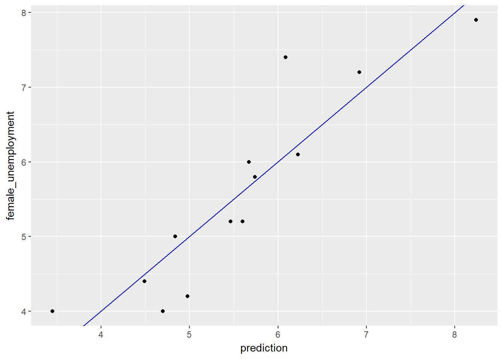

```r
# Predict female unemployment rate when male unemployment is 5%
pred <- predict(unemployment_model, newrates)
# Print it
pred
```

```
##        1 
## 4.906757
```

Next we will look at a model of blood pressure as a function of age and weight.


```r
# Load the blood data
bloodpressure <- readRDS("./files/SLinRRegression/bloodpressure.rds")

# bloodpressure is in the workspace
summary(bloodpressure)
```

```
##  blood_pressure       age            weight   
##  Min.   :128.0   Min.   :46.00   Min.   :167  
##  1st Qu.:140.0   1st Qu.:56.50   1st Qu.:186  
##  Median :153.0   Median :64.00   Median :194  
##  Mean   :150.1   Mean   :62.45   Mean   :195  
##  3rd Qu.:160.5   3rd Qu.:69.50   3rd Qu.:209  
##  Max.   :168.0   Max.   :74.00   Max.   :220
```

```r
# Create the formula and print it
fmla <- as.formula("blood_pressure ~ age + weight")
fmla
```

```
## blood_pressure ~ age + weight
```

```r
# Fit the model: bloodpressure_model
bloodpressure_model <- lm(fmla, bloodpressure)

# Print bloodpressure_model and call summary() 
bloodpressure_model
```

```
## 
## Call:
## lm(formula = fmla, data = bloodpressure)
## 
## Coefficients:
## (Intercept)          age       weight  
##     30.9941       0.8614       0.3349
```

```r
summary(bloodpressure_model)
```

```
## 
## Call:
## lm(formula = fmla, data = bloodpressure)
## 
## Residuals:
##     Min      1Q  Median      3Q     Max 
## -3.4640 -1.1949 -0.4078  1.8511  2.6981 
## 
## Coefficients:
##             Estimate Std. Error t value Pr(>|t|)   
## (Intercept)  30.9941    11.9438   2.595  0.03186 * 
## age           0.8614     0.2482   3.470  0.00844 **
## weight        0.3349     0.1307   2.563  0.03351 * 
## ---
## Signif. codes:  0 '***' 0.001 '**' 0.01 '*' 0.05 '.' 0.1 ' ' 1
## 
## Residual standard error: 2.318 on 8 degrees of freedom
## Multiple R-squared:  0.9768,	Adjusted R-squared:  0.9711 
## F-statistic: 168.8 on 2 and 8 DF,  p-value: 2.874e-07
```

Both variables are positive suggesting that increases in them also lead to increases in blood pressure.

Next we can use the model to make preditions.


```r
# predict blood pressure using bloodpressure_model :prediction
bloodpressure$prediction <- predict(bloodpressure_model, bloodpressure)

# plot the results
ggplot(bloodpressure, aes(x = prediction, y = blood_pressure)) + 
    geom_point() +
    geom_abline(color = "blue")
```


** Key Points **

* Linear models are easy to fit and can be less prone to overfitting.  
* They are also generally easier to understand
* However they cannot express complex relationships in the data
* In addition we can get collinearity with some variables e.g. weight increases with age

## Training and Evaluating Regression Models

A model with a good fit will have its points close to the line.  Models which don't fit well will have points which systemtically don't fit welland are all over the place. This may mean you are missing variables in your model.  A residual plot can help understand if there are any systematic errors, we are typically looking for a random cloud of residuals rather than anything which may resemble a trend.  We can also use a Gain Curve Plot


```r
summary(unemployment)
```

```
##  male_unemployment female_unemployment   prediction   
##  Min.   :2.900     Min.   :4.000       Min.   :3.448  
##  1st Qu.:4.900     1st Qu.:4.400       1st Qu.:4.837  
##  Median :6.000     Median :5.200       Median :5.601  
##  Mean   :5.954     Mean   :5.569       Mean   :5.569  
##  3rd Qu.:6.700     3rd Qu.:6.100       3rd Qu.:6.087  
##  Max.   :9.800     Max.   :7.900       Max.   :8.240
```

```r
# Make predictions from the model
unemployment$predictions <- predict(unemployment_model, unemployment)

# Plot predictions (on x-axis) versus the female_unemployment rates
ggplot(unemployment, aes(x = predictions, y = female_unemployment)) + 
  geom_point() + 
  geom_abline()
```

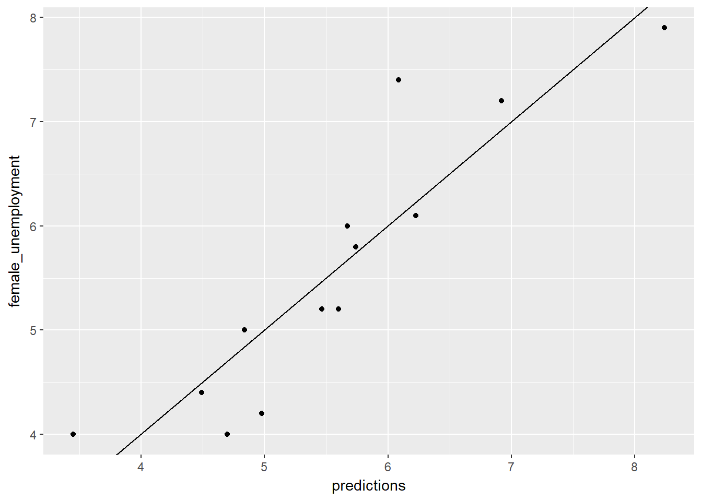

```r
# Calculate residuals
unemployment$residuals <- unemployment$female_unemployment - unemployment$predictions

# Predictions (on x-axis) versus the actuals with residuals
ggplot(unemployment, aes(x = predictions, y = female_unemployment)) + geom_point() +
  geom_pointrange(aes(ymin = 0, ymax = residuals)) + 
  geom_hline(yintercept = 0, linetype = 3) + 
  ggtitle("actuals vs. linear model prediction with residual")
```

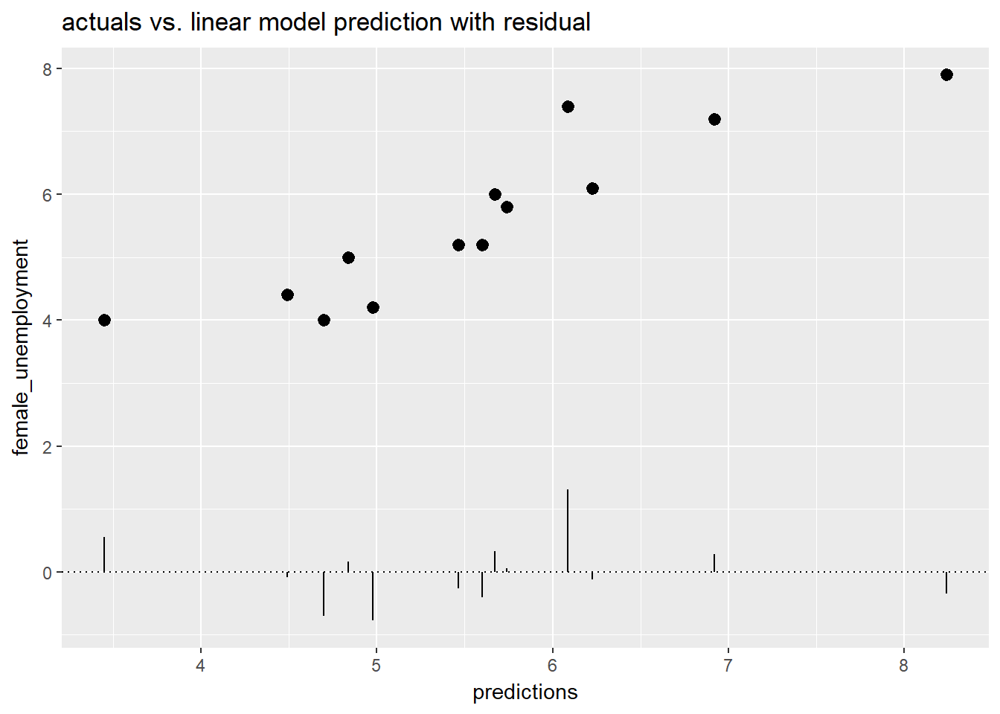

```r
# Fill in the blanks to plot predictions (on x-axis) versus the residuals
ggplot(unemployment, aes(x = predictions, y = residuals)) + 
  geom_pointrange(aes(ymin = 0, ymax = residuals)) + 
  geom_hline(yintercept = 0, linetype = 3) + 
  ggtitle("residuals vs. linear model prediction")
```


We can also plot a gain curve using the WVPlots package.  The syntax is:

> GainCurvePlot(frame, xvar, truthvar, title)

where

* frame is a data frame
* xvar and truthvar are strings naming the prediction and actual outcome columns of frame
* title is the title of the plot


```r
library(WVPlots)
```

```
## Warning: package 'WVPlots' was built under R version 3.4.4
```

```r
# Plot the Gain Curve
GainCurvePlot(unemployment, "predictions", "female_unemployment", "Unemployment model")
```

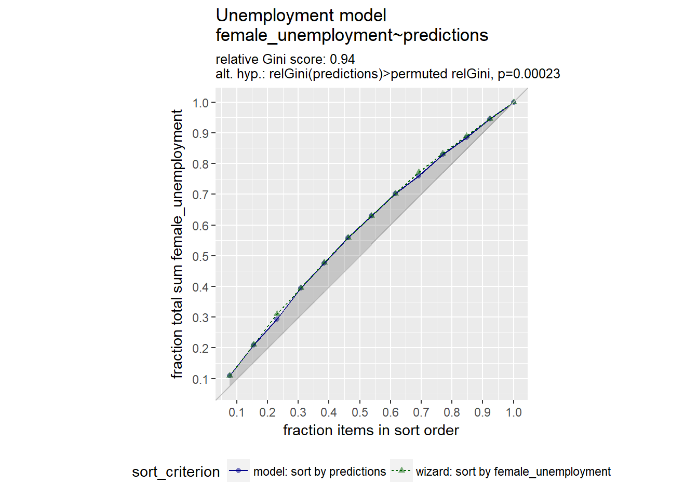

A relative gini coefficient close to one shows that the model correctly sorts high unemployment situations from lower ones.

Another way to evaluate our model is to use the RMSE. You want RMSE to be small. One heuristic is to compare the RMSE to the standard deviation of the outcome. With a good model, the RMSE should be smaller.


```r
# For convenience put the residuals in the variable res
res <- unemployment$residuals

# Calculate RMSE, assign it to the variable rmse and print it
(rmse <- sqrt(mean(res^2)))
```

```
## [1] 0.5337612
```

```r
# Calculate the standard deviation of female_unemployment and print it
(sd_unemployment <- sd(unemployment$female_unemployment))
```

```
## [1] 1.314271
```

```r
# Calculate it as a fraction < 1 is good
rmse / sd_unemployment
```

```
## [1] 0.4061273
```

An RMSE much smaller than the outcome's standard deviation suggests a model that predicts well.

Another way of evaluating a model is R squared. We can calculate this as the 1 - RSS / TSS RSS = Residual Sum of Squares TSS is Total Sum of Squares.

<div class="figure">
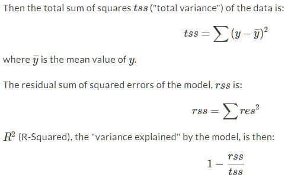
<p class="caption">(\#fig:R2)R Squared</p>
</div>

Most packages or regression functions come with built in R squared metrics, the summary will print it out or we can use the glance() function from broom.  Here we calculate them manually.


```r
# Calculate mean female_unemployment: fe_mean. Print it
(fe_mean <- mean(unemployment$female_unemployment))
```

```
## [1] 5.569231
```

```r
# Calculate total sum of squares: tss. Print it
(tss <- sum((unemployment$female_unemployment - fe_mean)^2))
```

```
## [1] 20.72769
```

```r
# Calculate residual sum of squares: rss. Print it
(rss <- sum((unemployment$residuals)^2))
```

```
## [1] 3.703714
```

```r
# Calculate R-squared: rsq. Print it. Is it a good fit?
(rsq <- 1 - (rss/tss))
```

```
## [1] 0.8213157
```

```r
# Get R-squared from glance. Print it
(rsq_glance <- broom::glance(unemployment_model)$r.squared)
```

```
## [1] 0.8213157
```

Correlation or rho shows the strength of the linear relationship between two variables.


```r
# Get the correlation between the prediction and true outcome: rho and print it
(rho <- cor(unemployment$predictions, unemployment$female_unemployment))
```

```
## [1] 0.9062647
```

```r
rho
```

```
## [1] 0.9062647
```

```r
# Square rho: rho2 and print it
(rho2 <- rho ^ 2)
```

```
## [1] 0.8213157
```

```r
# Get R-squared from glance and print it
(rsq_glance <- broom::glance(unemployment_model)$r.squared)
```

```
## [1] 0.8213157
```

So far we have only looked at how well our data fits the observed variables, without new data.  A better way of evaluating our model is to split out data in to a training and test set of data, then see how well the model predicts to the test data, having built the model on the train data.  WE want our RMSE on the test data to be similar to the RMSE on the train data, if it is much lower than we may have overfitted our model.  If the number of observations is too small to do a split, we can use cross validation to acheive a similar result. 

In the following code we will split mpg into a training set mpg_train (75% of the data) and a test set mpg_test (25% of the data). One way to do this is to generate a column of uniform random numbers between 0 and 1, using the function runif().  There other ways, such as sample (see Supervised LEarning In R - Classification notes, do search for 0.75).  

If using run if, we do:

* Generate a vector of uniform random numbers: gp = runif(N).
* dframe[gp < X,] will be about the right size.
* dframe[gp >= X,] will be the complement.


```r
# Load the mpg data
mpg <- ggplot2::mpg

# take a look at the data
summary(mpg)
```

```
##  manufacturer          model               displ            year     
##  Length:234         Length:234         Min.   :1.600   Min.   :1999  
##  Class :character   Class :character   1st Qu.:2.400   1st Qu.:1999  
##  Mode  :character   Mode  :character   Median :3.300   Median :2004  
##                                        Mean   :3.472   Mean   :2004  
##                                        3rd Qu.:4.600   3rd Qu.:2008  
##                                        Max.   :7.000   Max.   :2008  
##       cyl           trans               drv                 cty       
##  Min.   :4.000   Length:234         Length:234         Min.   : 9.00  
##  1st Qu.:4.000   Class :character   Class :character   1st Qu.:14.00  
##  Median :6.000   Mode  :character   Mode  :character   Median :17.00  
##  Mean   :5.889                                         Mean   :16.86  
##  3rd Qu.:8.000                                         3rd Qu.:19.00  
##  Max.   :8.000                                         Max.   :35.00  
##       hwy             fl               class          
##  Min.   :12.00   Length:234         Length:234        
##  1st Qu.:18.00   Class :character   Class :character  
##  Median :24.00   Mode  :character   Mode  :character  
##  Mean   :23.44                                        
##  3rd Qu.:27.00                                        
##  Max.   :44.00
```

```r
dim(mpg)
```

```
## [1] 234  11
```

```r
# Use nrow to get the number of rows in mpg (N) and print it
(N <- nrow(mpg))
```

```
## [1] 234
```

```r
N
```

```
## [1] 234
```

```r
# Calculate how many rows 75% of N should be and print it
# Hint: use round() to get an integer
(target <- round(N * 0.75))
```

```
## [1] 176
```

```r
target
```

```
## [1] 176
```

```r
# Create the vector of N uniform random variables: gp
gp <- runif(N)

# Use gp to create the training set: mpg_train (75% of data) and mpg_test (25% of data)
mpg_train <- mpg[gp < 0.75, ]
mpg_test <- mpg[gp >= 0.75, ]

# Use nrow() to examine mpg_train and mpg_test
nrow(mpg_train)
```

```
## [1] 178
```

```r
nrow(mpg_test)
```

```
## [1] 56
```

It is likely our target number of rows will slightly different than what is sampled, but they should be close enough.

Next we use these datasets to create models for prediction.


```r
# mpg_train is in the workspace
summary(mpg_train)
```

```
##  manufacturer          model               displ            year     
##  Length:178         Length:178         Min.   :1.600   Min.   :1999  
##  Class :character   Class :character   1st Qu.:2.400   1st Qu.:1999  
##  Mode  :character   Mode  :character   Median :3.300   Median :1999  
##                                        Mean   :3.467   Mean   :2003  
##                                        3rd Qu.:4.600   3rd Qu.:2008  
##                                        Max.   :7.000   Max.   :2008  
##       cyl           trans               drv                 cty       
##  Min.   :4.000   Length:178         Length:178         Min.   : 9.00  
##  1st Qu.:4.000   Class :character   Class :character   1st Qu.:14.00  
##  Median :6.000   Mode  :character   Mode  :character   Median :17.00  
##  Mean   :5.904                                         Mean   :17.02  
##  3rd Qu.:8.000                                         3rd Qu.:19.00  
##  Max.   :8.000                                         Max.   :35.00  
##       hwy             fl               class          
##  Min.   :12.00   Length:178         Length:178        
##  1st Qu.:18.00   Class :character   Class :character  
##  Median :25.00   Mode  :character   Mode  :character  
##  Mean   :23.58                                        
##  3rd Qu.:27.00                                        
##  Max.   :44.00
```

```r
# Create a formula to express cty as a function of hwy: fmla and print it.
(fmla <- as.formula("cty ~ hwy"))
```

```
## cty ~ hwy
```

```r
# Now use lm() to build a model mpg_model from mpg_train that predicts cty from hwy 
mpg_model <- lm(fmla, data = mpg_train)

# Use summary() to examine the model
summary(mpg_model)
```

```
## 
## Call:
## lm(formula = fmla, data = mpg_train)
## 
## Residuals:
##     Min      1Q  Median      3Q     Max 
## -2.9957 -0.6870 -0.0077  0.6216  4.4733 
## 
## Coefficients:
##             Estimate Std. Error t value Pr(>|t|)    
## (Intercept)  0.71118    0.39277   1.811   0.0719 .  
## hwy          0.69138    0.01615  42.813   <2e-16 ***
## ---
## Signif. codes:  0 '***' 0.001 '**' 0.01 '*' 0.05 '.' 0.1 ' ' 1
## 
## Residual standard error: 1.281 on 176 degrees of freedom
## Multiple R-squared:  0.9124,	Adjusted R-squared:  0.9119 
## F-statistic:  1833 on 1 and 176 DF,  p-value: < 2.2e-16
```

Next we will test the model mpg_model on the test data, mpg_test.  We will use two functions rather than calculate the rmse and r_squared manually:

* Metrics::rmse(predcol, ycol)
* tsensembler::r_squared(r_squared(y, y_hat)


```r
# predict cty from hwy for the training set
mpg_train$pred <- predict(mpg_model, mpg_train)

# predict cty from hwy for the test set
mpg_test$pred <- predict(mpg_model, mpg_test)

# Evaluate the rmse on both training and test data and print them
(rmse_train <- Metrics::rmse(mpg_train$pred, mpg_train$cty))
```

```
## [1] 1.273458
```

```r
(rmse_test <-  Metrics::rmse(mpg_test$pred, mpg_test$cty))
```

```
## [1] 1.169409
```

```r
# Evaluate the r-squared on both training and test data.and print them
(rsq_train <- tsensembler::r_squared(mpg_train$pred, mpg_train$cty))
```

```
## [1] 0.9039807
```

```r
(rsq_test <- tsensembler::r_squared(mpg_test$pred, mpg_test$cty))
```

```
## [1] 0.9181344
```

```r
# Plot the predictions (on the x-axis) against the outcome (cty) on the test data
ggplot(mpg_test, aes(x = pred, y = cty)) + 
  geom_point() + 
  geom_abline()
```

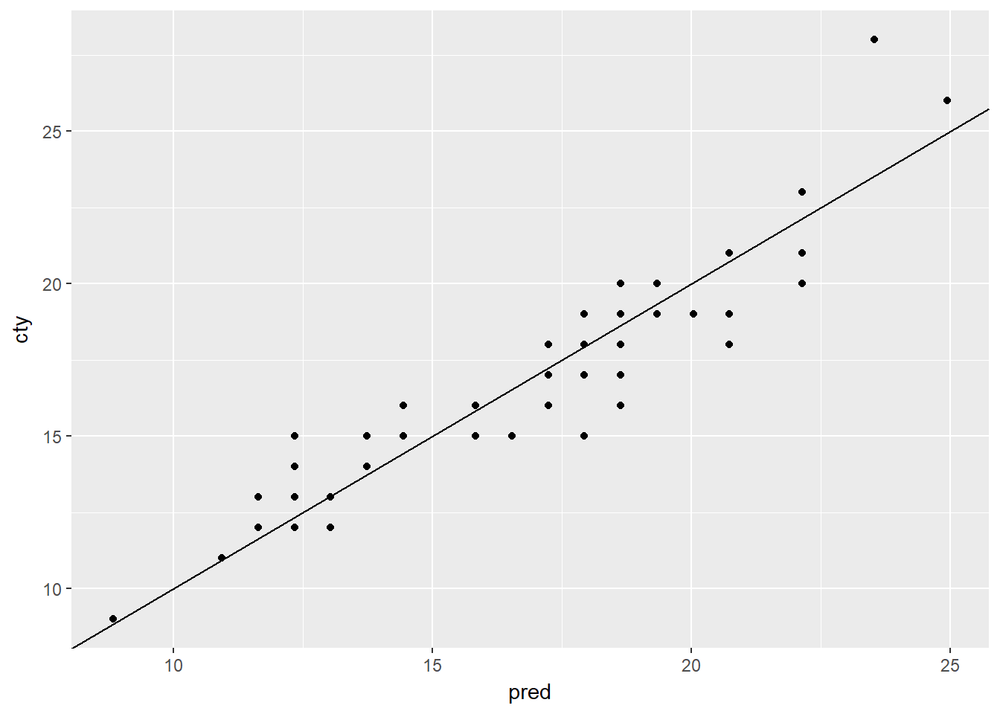

There are a number of ways to create cross fold validation - the caret package being one of the most flexible.  Here we use the vtreat package and KWayCrossValidation().  We first create our CV plan.


```r
# Load the package vtreat
library(vtreat)

# Get the number of rows in mpg
nRows <- nrow(mpg)

# Implement the 5-fold cross-fold plan with vtreat
splitPlan <- kWayCrossValidation(nRows = nRows, nSplits = 5, dframe = NULL, y = NULL)

# Examine the split plan
str(splitPlan)
```

```
## List of 5
##  $ :List of 2
##   ..$ train: int [1:188] 2 3 4 5 6 7 8 9 10 11 ...
##   ..$ app  : int [1:46] 122 151 47 103 75 82 25 174 200 46 ...
##  $ :List of 2
##   ..$ train: int [1:187] 1 2 3 4 6 7 8 10 11 12 ...
##   ..$ app  : int [1:47] 115 18 171 192 209 147 57 88 208 129 ...
##  $ :List of 2
##   ..$ train: int [1:187] 1 2 3 4 5 6 7 8 9 10 ...
##   ..$ app  : int [1:47] 164 61 187 11 55 211 125 191 60 127 ...
##  $ :List of 2
##   ..$ train: int [1:187] 1 2 3 5 7 8 9 10 11 12 ...
##   ..$ app  : int [1:47] 58 213 160 157 56 114 14 198 188 31 ...
##  $ :List of 2
##   ..$ train: int [1:187] 1 4 5 6 9 11 12 13 14 15 ...
##   ..$ app  : int [1:47] 2 69 42 74 154 8 205 40 33 101 ...
##  - attr(*, "splitmethod")= chr "kwaycross"
```

Next we iterate through our training plan, creating a new model for each split or fold.


```r
# mpg is in the workspace
summary(mpg)
```

```
##  manufacturer          model               displ            year     
##  Length:234         Length:234         Min.   :1.600   Min.   :1999  
##  Class :character   Class :character   1st Qu.:2.400   1st Qu.:1999  
##  Mode  :character   Mode  :character   Median :3.300   Median :2004  
##                                        Mean   :3.472   Mean   :2004  
##                                        3rd Qu.:4.600   3rd Qu.:2008  
##                                        Max.   :7.000   Max.   :2008  
##       cyl           trans               drv                 cty       
##  Min.   :4.000   Length:234         Length:234         Min.   : 9.00  
##  1st Qu.:4.000   Class :character   Class :character   1st Qu.:14.00  
##  Median :6.000   Mode  :character   Mode  :character   Median :17.00  
##  Mean   :5.889                                         Mean   :16.86  
##  3rd Qu.:8.000                                         3rd Qu.:19.00  
##  Max.   :8.000                                         Max.   :35.00  
##       hwy             fl               class          
##  Min.   :12.00   Length:234         Length:234        
##  1st Qu.:18.00   Class :character   Class :character  
##  Median :24.00   Mode  :character   Mode  :character  
##  Mean   :23.44                                        
##  3rd Qu.:27.00                                        
##  Max.   :44.00
```

```r
# splitPlan is in the workspace
str(splitPlan)
```

```
## List of 5
##  $ :List of 2
##   ..$ train: int [1:188] 2 3 4 5 6 7 8 9 10 11 ...
##   ..$ app  : int [1:46] 122 151 47 103 75 82 25 174 200 46 ...
##  $ :List of 2
##   ..$ train: int [1:187] 1 2 3 4 6 7 8 10 11 12 ...
##   ..$ app  : int [1:47] 115 18 171 192 209 147 57 88 208 129 ...
##  $ :List of 2
##   ..$ train: int [1:187] 1 2 3 4 5 6 7 8 9 10 ...
##   ..$ app  : int [1:47] 164 61 187 11 55 211 125 191 60 127 ...
##  $ :List of 2
##   ..$ train: int [1:187] 1 2 3 5 7 8 9 10 11 12 ...
##   ..$ app  : int [1:47] 58 213 160 157 56 114 14 198 188 31 ...
##  $ :List of 2
##   ..$ train: int [1:187] 1 4 5 6 9 11 12 13 14 15 ...
##   ..$ app  : int [1:47] 2 69 42 74 154 8 205 40 33 101 ...
##  - attr(*, "splitmethod")= chr "kwaycross"
```

```r
# Run the 5-fold cross validation plan from splitPlan
k <- 5 # Number of folds
mpg$pred.cv <- 0 
for(i in 1:k) {
  split <- splitPlan[[i]]
  model <- lm(cty ~ hwy, data = mpg[split$train,])
  mpg$pred.cv[split$app] <- predict(model, newdata = mpg[split$app,])
}

# Predict from a full model
mpg$pred <- predict(lm(cty ~ hwy, data = mpg))

# Get the rmse of the full model's predictions
Metrics::rmse(mpg$pred, mpg$cty)
```

```
## [1] 1.247045
```

```r
# Get the rmse of the cross-validation predictions
Metrics::rmse(mpg$pred.cv, mpg$cty)
```

```
## [1] 1.266766
```

This has now calculated the models out of sample error using cross validation.  CV validates the modelling process, not whether the model is a good one or not.  Here we we the full model RMSE is very similar to the CV RMSE suggesting we are not over fitting the data. 

## Issues to Consider

When using categorical variables, n - 1 variables are created and coded as dummy vars (0 or 1), one one variable is left out as the reference model.  This is usually referred to as dummy variable creation or one hot encoding.  So our model then compares how the presence of one variable (one categorical var or response) affects the outcome, ceteris parabus, against the baseline cateogrical variable or response. This is best done where the number of variables is quite small, to avoid overfitting.

Some functions/models do this one hot or dummy variable creation automatically 'under the hood' whereas others need more pre-procesing prior to modelling. For some approaches (tree models) we can leave them as nominal e.g. 1,2 and 3.  BUT this won't work where the data/calculations are geometric, such as linear regression (geometric), PCA and some clustering methods (eigen space calculations).  More information is available in [The Basics of Encoding Categorical Data for Predictive Models](http://appliedpredictivemodeling.com/blog/2013/10/23/the-basics-of-encoding-categorical-data-for-predictive-models)


```r
# Load the data from Sleuth and modify for the purposes of demostration
library(Sleuth3)
```

```
## Warning: package 'Sleuth3' was built under R version 3.4.3
```

```r
flowers <- print(case0901)
```

```
##    Flowers Time Intensity
## 1     62.3    1       150
## 2     77.4    1       150
## 3     55.3    1       300
## 4     54.2    1       300
## 5     49.6    1       450
## 6     61.9    1       450
## 7     39.4    1       600
## 8     45.7    1       600
## 9     31.3    1       750
## 10    44.9    1       750
## 11    36.8    1       900
## 12    41.9    1       900
## 13    77.8    2       150
## 14    75.6    2       150
## 15    69.1    2       300
## 16    78.0    2       300
## 17    57.0    2       450
## 18    71.1    2       450
## 19    62.9    2       600
## 20    52.2    2       600
## 21    60.3    2       750
## 22    45.6    2       750
## 23    52.6    2       900
## 24    44.4    2       900
```

```r
flowers$Time[flowers$Time==1] <- "Late"
flowers$Time[flowers$Time==2] <- "Early"

# Call str on flowers to see the types of each column
str(flowers)
```

```
## 'data.frame':	24 obs. of  3 variables:
##  $ Flowers  : num  62.3 77.4 55.3 54.2 49.6 61.9 39.4 45.7 31.3 44.9 ...
##  $ Time     : chr  "Late" "Late" "Late" "Late" ...
##  $ Intensity: int  150 150 300 300 450 450 600 600 750 750 ...
```

```r
# Use unique() to see how many possible values Time takes
unique(flowers$Time)
```

```
## [1] "Late"  "Early"
```

```r
# Build a formula to express Flowers as a function of Intensity and Time: fmla. Print it
(fmla <- as.formula("Flowers ~ Intensity + Time"))
```

```
## Flowers ~ Intensity + Time
```

```r
# Use fmla and model.matrix to see how the data is represented for modeling
mmat <- model.matrix(fmla, flowers)

# Examine the first 20 lines of flowers
head(flowers, n = 20)
```

```
##    Flowers  Time Intensity
## 1     62.3  Late       150
## 2     77.4  Late       150
## 3     55.3  Late       300
## 4     54.2  Late       300
## 5     49.6  Late       450
## 6     61.9  Late       450
## 7     39.4  Late       600
## 8     45.7  Late       600
## 9     31.3  Late       750
## 10    44.9  Late       750
## 11    36.8  Late       900
## 12    41.9  Late       900
## 13    77.8 Early       150
## 14    75.6 Early       150
## 15    69.1 Early       300
## 16    78.0 Early       300
## 17    57.0 Early       450
## 18    71.1 Early       450
## 19    62.9 Early       600
## 20    52.2 Early       600
```

```r
# Examine the first 20 lines of mmat
head(mmat, n = 20)
```

```
##    (Intercept) Intensity TimeLate
## 1            1       150        1
## 2            1       150        1
## 3            1       300        1
## 4            1       300        1
## 5            1       450        1
## 6            1       450        1
## 7            1       600        1
## 8            1       600        1
## 9            1       750        1
## 10           1       750        1
## 11           1       900        1
## 12           1       900        1
## 13           1       150        0
## 14           1       150        0
## 15           1       300        0
## 16           1       300        0
## 17           1       450        0
## 18           1       450        0
## 19           1       600        0
## 20           1       600        0
```

Next we will fit a linear model to the flowers data, to predict Flowers as a function of Time and Intensity.


```r
# flowers in is the workspace
str(flowers)
```

```
## 'data.frame':	24 obs. of  3 variables:
##  $ Flowers  : num  62.3 77.4 55.3 54.2 49.6 61.9 39.4 45.7 31.3 44.9 ...
##  $ Time     : chr  "Late" "Late" "Late" "Late" ...
##  $ Intensity: int  150 150 300 300 450 450 600 600 750 750 ...
```

```r
# fmla is in the workspace
fmla
```

```
## Flowers ~ Intensity + Time
```

```r
# Fit a model to predict Flowers from Intensity and Time : flower_model
flower_model <- lm(fmla, data = flowers)

# Use summary on mmat to remind yourself of its structure
summary(mmat)
```

```
##   (Intercept)   Intensity      TimeLate  
##  Min.   :1    Min.   :150   Min.   :0.0  
##  1st Qu.:1    1st Qu.:300   1st Qu.:0.0  
##  Median :1    Median :525   Median :0.5  
##  Mean   :1    Mean   :525   Mean   :0.5  
##  3rd Qu.:1    3rd Qu.:750   3rd Qu.:1.0  
##  Max.   :1    Max.   :900   Max.   :1.0
```

```r
# Use summary to examine flower_model 
summary(flower_model)
```

```
## 
## Call:
## lm(formula = fmla, data = flowers)
## 
## Residuals:
##    Min     1Q Median     3Q    Max 
## -9.652 -4.139 -1.558  5.632 12.165 
## 
## Coefficients:
##               Estimate Std. Error t value Pr(>|t|)    
## (Intercept)  83.464167   3.273772  25.495  < 2e-16 ***
## Intensity    -0.040471   0.005132  -7.886 1.04e-07 ***
## TimeLate    -12.158333   2.629557  -4.624 0.000146 ***
## ---
## Signif. codes:  0 '***' 0.001 '**' 0.01 '*' 0.05 '.' 0.1 ' ' 1
## 
## Residual standard error: 6.441 on 21 degrees of freedom
## Multiple R-squared:  0.7992,	Adjusted R-squared:   0.78 
## F-statistic: 41.78 on 2 and 21 DF,  p-value: 4.786e-08
```

```r
# Predict the number of flowers on each plant
flowers$predictions <- predict(flower_model, data = flowers)

# Plot predictions vs actual flowers (predictions on x-axis)
ggplot(flowers, aes(x = predictions, y = Flowers)) + 
  geom_point() +
  geom_abline(color = "blue") 
```


### Interactions

In linear models we assume that the variables affect the model linearly and additively.  But sometimes this is not the case - with interactions variables, wehn combinded together, can be more than the sum of their parts. If for instance, the effect one one variable is dependent on the level of some other variable, we say their is an interaction.  The simultaneous effect on the outcome variable is no longer additive.  If we want to model this in R we have different options

* Interaction - Colon(:) e.g. y ~ a:b
* Main effects and interaction - Asterisk(*) e.g. y ~ a * b which is the same as y ~ a + b + a:b
* The product of two variables - I function (I) e.g. y ~ I(a*b)

In the following code shows how to use interactions to model the effect of gender and gastric activity on alcohol metabolism.

The data frame alcohol has columns:

* Metabol: the alcohol metabolism rate
* Gastric: the rate of gastric alcohol dehydrogenase activity
* Sex: the sex of the drinker (Male or Female)


```r
# Create the formula with main effects only
(fmla_add <- as.formula("Metabol ~ Gastric + Sex") )

# Create the formula with interactions
(fmla_interaction <- as.formula("Metabol ~ Gastric:Sex + Gastric") )

# Fit the main effects only model
model_add <- lm(fmla_add, data = alcohol)

# Fit the interaction model
model_interaction <- lm(fmla_interaction, data = alcohol)

# Call summary on both models and compare
summary(model_add)
summary(model_interaction)
```

The following code compares the performance of the interaction model previously fit to the performance of a main-effects only model. Because this data set is small, we use cross-validation to simulate making predictions on out-of-sample data.


```r
# Create the splitting plan for 3-fold cross validation
set.seed(34245)  # set the seed for reproducibility
splitPlan <- kWayCrossValidation(nrow(alcohol), nSplits = 3, dframe = NULL, y = NULL)

# Sample code: Get cross-val predictions for main-effects only model
alcohol$pred_add <- 0  # initialize the prediction vector
for(i in 1:3) {
  split <- splitPlan[[i]]
  model_add <- lm(fmla_add, data = alcohol[split$train, ])
  alcohol$pred_add[split$app] <- predict(model_add, newdata = alcohol[split$app, ])
}

# Get the cross-val predictions for the model with interactions
alcohol$pred_interaction <- 0 # initialize the prediction vector
for(i in 1:3) {
  split <- splitPlan[[i]]
  model_interaction <- lm(fmla_interaction, data = alcohol[split$train, ])
  alcohol$pred_interaction[split$app] <- predict(model_interaction, newdata = alcohol[split$app, ])
}

# Get RMSE using gather from dplyr
alcohol %>% 
  gather(key = modeltype, value = pred, pred_add, pred_interaction) %>%
  mutate(residuals = Metabol - pred) %>%      
  group_by(modeltype) %>%
  summarize(rmse = sqrt(mean(residuals^2)))
```

### Transforming the response before modeling

Sometimes better models are achieved by transforming the output rather than predicting the output directly.  We often want to log transform monetary values like income.  This can be achied using log(y) or specify the same function within a model itself, predict using that model, then transform the data back to it's original format i.e not transformed e.g. 

1. model <- lm(log(y) ~ x, data = train)  
2. logpred <- predict(model, data = test)
3. pred <- exp(logpred)  

As the error is relative to the size of the outcome, we should use the root mean squared relative error to compare two models with one not being log transformed and one being log transformed.  We do this by dividing the mean error / variable in quetion (log or non-log).

The next code section uses some toy data to demostrate how we make calculations for relative error.


```r
# Load the demostration data
fdata <- read.csv("./files/SLinRRegression/fdata.csv")
str(fdata)
```

```
## 'data.frame':	100 obs. of  3 variables:
##  $ y    : num  9.15 1.9 -3.86 2.39 1.54 ...
##  $ pred : num  6.43 3.47 1.59 3.76 9.51 ...
##  $ label: Factor w/ 2 levels "large purchases",..: 2 2 2 2 2 2 2 2 2 2 ...
```

```r
library(dplyr)
```

```
## 
## Attaching package: 'dplyr'
```

```
## The following objects are masked from 'package:stats':
## 
##     filter, lag
```

```
## The following objects are masked from 'package:base':
## 
##     intersect, setdiff, setequal, union
```

```r
# fdata is in the workspace
summary(fdata)
```

```
##        y                 pred                      label   
##  Min.   :  -5.894   Min.   :   1.072   large purchases:50  
##  1st Qu.:   5.407   1st Qu.:   6.373   small purchases:50  
##  Median :  57.374   Median :  55.693                       
##  Mean   : 306.204   Mean   : 305.905                       
##  3rd Qu.: 550.903   3rd Qu.: 547.886                       
##  Max.   :1101.619   Max.   :1098.896
```

```r
# Examine the data: generate the summaries for the groups large and small:
fdata %>% 
    group_by(label) %>%     # group by small/large purchases
    summarize(min  = min(y),   # min of y
              mean = mean(y),   # mean of y
              max  = max(y))   # max of y
```

```
## # A tibble: 2 x 4
##             label       min       mean        max
##            <fctr>     <dbl>      <dbl>      <dbl>
## 1 large purchases 96.119814 605.928673 1101.61864
## 2 small purchases -5.893499   6.478254   18.62829
```

```r
# Fill in the blanks to add error columns
fdata2 <- fdata %>% 
         group_by(label) %>%       # group by label
           mutate(residual = pred - y,  # Residual
                  relerr   = residual / y)  # Relative error

# Compare the rmse and rmse.rel of the large and small groups:
fdata2 %>% 
  group_by(label) %>% 
  summarize(rmse     = sqrt(mean(residual^2)),   # RMSE
            rmse.rel = sqrt(mean(relerr^2)))   # Root mean squared relative error
```

```
## # A tibble: 2 x 3
##             label     rmse   rmse.rel
##            <fctr>    <dbl>      <dbl>
## 1 large purchases 5.544439 0.01473322
## 2 small purchases 4.014969 1.24965673
```

```r
# Plot the predictions for both groups of purchases
ggplot(fdata2, aes(x = pred, y = y, color = label)) + 
  geom_point() + 
  geom_abline() + 
  facet_wrap(~ label, ncol = 1, scales = "free") + 
  ggtitle("Outcome vs prediction")
```


From this example how a model with larger RMSE might still be better as can be observed using the chart, if relative errors are more important than absolute errors as the relative error is much smaller for large purchases using the table.

The follwoing code uses data loaded which records subjects' incomes in 2005, as well as the results of several aptitude tests taken by the subjects in 1981. The data is split into training and test sets. The code demostrates building a model of log(income) from the inputs, and then convert log(income) back into income.

When you transform the output before modeling, you have to 'reverse transform' the resulting predictions after applying the model.  


```r
# Load the unemployment data
load("./files/SLinRRegression/Income.RData")

# Examine Income2005 in the training set
summary(incometrain$Income2005)
```

```
##    Min. 1st Qu.  Median    Mean 3rd Qu.    Max. 
##      63   23000   39000   49894   61500  703637
```

```r
# Write the formula for log income as a function of the tests and print it
(fmla.log <- as.formula("log(Income2005) ~  Arith + Word + Parag + Math + AFQT"))
```

```
## log(Income2005) ~ Arith + Word + Parag + Math + AFQT
```

```r
# Fit the linear model
model.log <-  lm(fmla.log, data = incometrain)

# Make predictions on income_test
incometest$logpred <- predict(model.log, incometest)
summary(incometest$logpred)
```

```
##    Min. 1st Qu.  Median    Mean 3rd Qu.    Max. 
##   9.766  10.133  10.423  10.419  10.705  11.006
```

```r
# Convert the predictions to monetary units
incometest$pred.income <- exp(incometest$logpred)
summary(incometest$pred.income)
```

```
##    Min. 1st Qu.  Median    Mean 3rd Qu.    Max. 
##   17432   25167   33615   35363   44566   60217
```

```r
#  Plot predicted income (x axis) vs income
ggplot(incometest, aes(x = pred.income, y = Income2005)) + 
  geom_point() + 
  geom_abline(color = "blue")
```

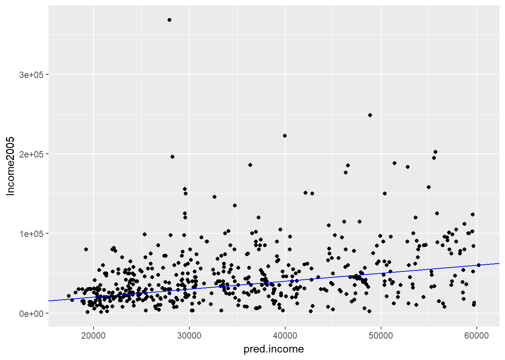

Next we show that log-transforming a monetary output before modeling improves mean relative error (but increases RMSE) compared to modeling the monetary output directly. We compare two models, the log transmormed model from before to an absolute (i.e. not transformed) model called model.abs.  


```r
library(tidyr) # for gather commands

# Write our model formula
(fmla.abs <- as.formula("Income2005 ~ Arith + Word + Parag + Math + AFQT"))

# Build the model
model.abs <- lm(formula = fmla.abs, data = incometrain)

# Add predictions to the test set
income_test <- incometest %>%
  dplyr::mutate(pred.absmodel = predict(model.abs, incometest),        # predictions from model.abs
         pred.logmodel = exp(predict(model.log, incometest)))          # predictions from model.log

# Gather the predictions and calculate residuals and relative error
income_long <- incometest %>% 
  tidyr::gather(key = modeltype, value = pred, pred.absmodel, pred.logmodel) %>%
  dplyr::mutate(residual = pred - Income2005,   # residuals
         relerr   = residual / Income2005)   # relative error

# Calculate RMSE and relative RMSE and compare
income_long %>% 
  group_by(modeltype) %>%      # group by modeltype
  summarize(rmse     = sqrt(mean(residual^2)),    # RMSE
            rmse.rel = sqrt(mean(relerr^2)))    # Root mean squared relative error
```

Modeling log(income) can reduce the relative error of the fit, at the cost of increased RMSE. Which tradeoff to make depends on the goals of the project.

### Transforming Input variables

So far we've looked at transforming the output variables, but there are instance where we might want to transform the input variables.  Usually, this is because you have some domain knowledge about the subject which suggests this is the case.  You often want to transform monetary values as we say before.  We might also want to create power relationships in our variables.  If we do this and we don't know which power is best, based on domain knowledge, we might try various powers then see which yields the lowest prediction error and out of sample/CV error.

In the next section of code we will build a model to predict price from a measure of the house's size (surface area). 

Because ^ is also a symbol to express interactions, we use the function I() to treat the expression x^2 “as is”: that is, as the square of x rather than the interaction of x with itself.


```r
# Load the house price data
houseprice <- readRDS("./files/SLinRRegression/houseprice.rds")

# explore the data
summary(houseprice)
```

```
##       size           price      
##  Min.   : 44.0   Min.   : 42.0  
##  1st Qu.: 73.5   1st Qu.:164.5  
##  Median : 91.0   Median :203.5  
##  Mean   : 94.3   Mean   :249.2  
##  3rd Qu.:118.5   3rd Qu.:287.8  
##  Max.   :150.0   Max.   :573.0
```

```r
# Create the formula for price as a function of squared size
(fmla_sqr <- as.formula("price ~ I(size^2)"))
```

```
## price ~ I(size^2)
```

```r
# Fit a model of price as a function of squared size (use fmla_sqr)
model_sqr <- lm(fmla_sqr, data = houseprice)

# Fit a model of price as a linear function of size
model_lin <- lm(price ~ size, data = houseprice)

# Make predictions and compare
houseprice %>% 
    dplyr::mutate(pred_lin = predict(model_lin),       # predictions from linear model
           pred_sqr = predict(model_sqr)) %>%   # predictions from quadratic model 
    tidyr::gather(key = modeltype, value = pred, pred_lin, pred_sqr) %>% # gather the predictions
    ggplot2::ggplot(aes(x = size)) + 
       geom_point(aes(y = price)) +                   # actual prices
       geom_line(aes(y = pred, color = modeltype)) + # the predictions
       scale_color_brewer(palette = "Dark2")
```

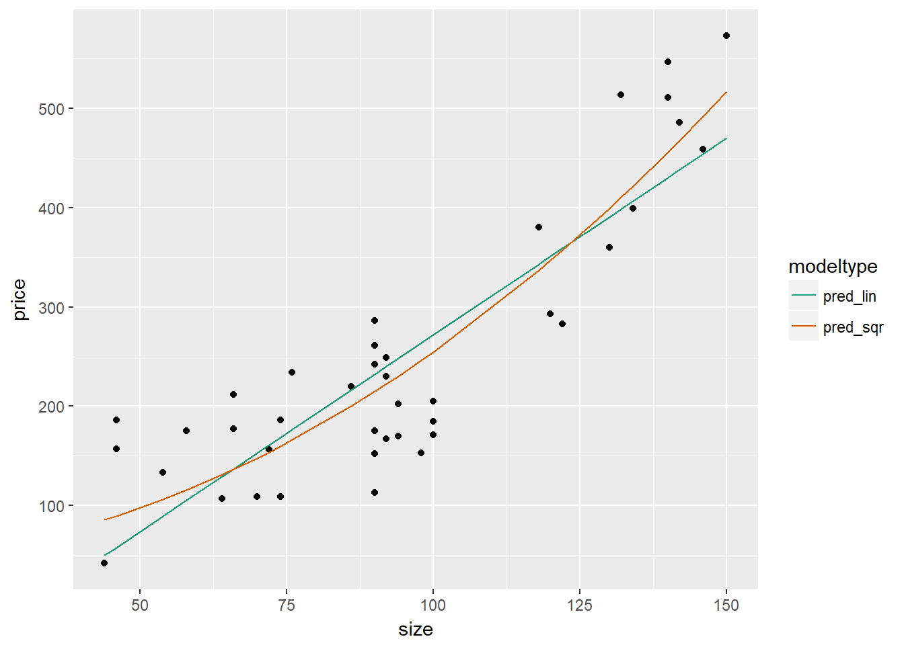

As it appears that the quadratic model better fits the house price data, we will next confirm whether this is the case when using out of sample data.  As the data is small, we will use cross-validation.  We will also compare the results from a linear model.


```r
# houseprice is in the workspace
summary(houseprice)
```

```
##       size           price      
##  Min.   : 44.0   Min.   : 42.0  
##  1st Qu.: 73.5   1st Qu.:164.5  
##  Median : 91.0   Median :203.5  
##  Mean   : 94.3   Mean   :249.2  
##  3rd Qu.:118.5   3rd Qu.:287.8  
##  Max.   :150.0   Max.   :573.0
```

```r
# fmla_sqr is in the workspace
fmla_sqr
```

```
## price ~ I(size^2)
```

```r
# Create a splitting plan for 3-fold cross validation
set.seed(34245)  # set the seed for reproducibility
splitPlan <- kWayCrossValidation(nRows = nrow(houseprice), nSplits = 3, dframe = NULL, y = NULL)

# Sample code: get cross-val predictions for price ~ size
houseprice$pred_lin <- 0  # initialize the prediction vector
for(i in 1:3) {
  split <- splitPlan[[i]]
  model_lin <- lm(price ~ size, data = houseprice[split$train,])
  houseprice$pred_lin[split$app] <- predict(model_lin, newdata = houseprice[split$app,])
}

# Get cross-val predictions for price as a function of size^2 (use fmla_sqr)
houseprice$pred_sqr <- 0 # initialize the prediction vector
for(i in 1:3) {
  split <- splitPlan[[i]]
  model_sqr <- lm(fmla_sqr, data = houseprice[split$train, ])
  houseprice$pred_sqr[split$app] <- predict(model_sqr, newdata = houseprice[split$app, ])
}

# Gather the predictions and calculate the residuals
houseprice_long <- houseprice %>%
  tidyr::gather(key = modeltype, value = pred, pred_lin, pred_sqr) %>%
  mutate(residuals = pred - price)

# Compare the cross-validated RMSE for the two models
houseprice_long %>% 
  group_by(modeltype) %>% # group by modeltype
  summarize(rmse = sqrt(mean(residuals^2)))
```

```
## # A tibble: 2 x 2
##   modeltype     rmse
##       <chr>    <dbl>
## 1  pred_lin 74.29993
## 2  pred_sqr 63.69409
```

## Dealing with Non-Linear Responses

First we will look at predicting the probability that an event occurs, based on a binary response yes/no.  To do this we will use a logistic regression, so that the probabilities are in the 0 to 1 range.  This builds a log-odds model which is simply a log transformed ratio that the probability occurs to the probability that it does not - 

* for the model we have - glm(formula, data, family = binomial) 
* for the prediction we have - predict(model, newdata = test, type = "response")

When assessing accuracy we can use a deviance calculation (pseudo R squared) or a chi-squared test.  We can also use a Gain Curve or ROC curce.

We will estimate the probability that a sparrow survives a severe winter storm, based on physical characteristics of the sparrow. The dataset sparrow is loaded into your workspace. The outcome to be predicted is status.


```r
# Load the sparrow data
sparrow <- readRDS("./files/SLinRRegression/sparrow.rds")

# Take a look at the data
head(sparrow) 
```

```
##     status   age total_length wingspan weight beak_head humerus femur
## 1 Survived adult          154      241   24.5      31.2    0.69  0.67
## 2 Survived adult          160      252   26.9      30.8    0.74  0.71
## 3 Survived adult          155      243   26.9      30.6    0.73  0.70
## 4 Survived adult          154      245   24.3      31.7    0.74  0.69
## 5 Survived adult          156      247   24.1      31.5    0.71  0.71
## 6 Survived adult          161      253   26.5      31.8    0.78  0.74
##   legbone skull sternum
## 1    1.02  0.59    0.83
## 2    1.18  0.60    0.84
## 3    1.15  0.60    0.85
## 4    1.15  0.58    0.84
## 5    1.13  0.57    0.82
## 6    1.14  0.61    0.89
```

```r
# sparrow is in the workspace
summary(sparrow)
```

```
##       status       age             total_length      wingspan    
##  Perished:36   Length:87          Min.   :153.0   Min.   :236.0  
##  Survived:51   Class :character   1st Qu.:158.0   1st Qu.:245.0  
##                Mode  :character   Median :160.0   Median :247.0  
##                                   Mean   :160.4   Mean   :247.5  
##                                   3rd Qu.:162.5   3rd Qu.:251.0  
##                                   Max.   :167.0   Max.   :256.0  
##      weight       beak_head        humerus           femur       
##  Min.   :23.2   Min.   :29.80   Min.   :0.6600   Min.   :0.6500  
##  1st Qu.:24.7   1st Qu.:31.40   1st Qu.:0.7250   1st Qu.:0.7000  
##  Median :25.8   Median :31.70   Median :0.7400   Median :0.7100  
##  Mean   :25.8   Mean   :31.64   Mean   :0.7353   Mean   :0.7134  
##  3rd Qu.:26.7   3rd Qu.:32.10   3rd Qu.:0.7500   3rd Qu.:0.7300  
##  Max.   :31.0   Max.   :33.00   Max.   :0.7800   Max.   :0.7600  
##     legbone          skull           sternum      
##  Min.   :1.010   Min.   :0.5600   Min.   :0.7700  
##  1st Qu.:1.110   1st Qu.:0.5900   1st Qu.:0.8300  
##  Median :1.130   Median :0.6000   Median :0.8500  
##  Mean   :1.131   Mean   :0.6032   Mean   :0.8511  
##  3rd Qu.:1.160   3rd Qu.:0.6100   3rd Qu.:0.8800  
##  Max.   :1.230   Max.   :0.6400   Max.   :0.9300
```

```r
# Create the survived column
sparrow$survived <- sparrow$status == "Survived"

# Create the formula
(fmla <- as.formula("survived ~ total_length + weight + humerus"))
```

```
## survived ~ total_length + weight + humerus
```

```r
# Fit the logistic regression model
sparrow_model <- glm(fmla, data = sparrow, family = binomial)

# Call summary
summary(sparrow_model)
```

```
## 
## Call:
## glm(formula = fmla, family = binomial, data = sparrow)
## 
## Deviance Residuals: 
##     Min       1Q   Median       3Q      Max  
## -2.1117  -0.6026   0.2871   0.6577   1.7082  
## 
## Coefficients:
##              Estimate Std. Error z value Pr(>|z|)    
## (Intercept)   46.8813    16.9631   2.764 0.005715 ** 
## total_length  -0.5435     0.1409  -3.858 0.000115 ***
## weight        -0.5689     0.2771  -2.053 0.040060 *  
## humerus       75.4610    19.1586   3.939 8.19e-05 ***
## ---
## Signif. codes:  0 '***' 0.001 '**' 0.01 '*' 0.05 '.' 0.1 ' ' 1
## 
## (Dispersion parameter for binomial family taken to be 1)
## 
##     Null deviance: 118.008  on 86  degrees of freedom
## Residual deviance:  75.094  on 83  degrees of freedom
## AIC: 83.094
## 
## Number of Fisher Scoring iterations: 5
```

```r
# Call glance
(perf <- broom::glance(sparrow_model))
```

```
##   null.deviance df.null    logLik      AIC      BIC deviance df.residual
## 1      118.0084      86 -37.54718 83.09436 92.95799 75.09436          83
```

```r
# Calculate pseudo-R-squared
(pseudoR2 <- (1 - (perf$deviance / perf$null.deviance)))
```

```
## [1] 0.3636526
```

So our pseudo R squared so far is quite low at 0.36.  Next we will predict with the model and show a gain curve.  The gain curve show be as close to the ideal (the 'wizzard curve' or green line) as we can get.


```r
# sparrow is in the workspace
summary(sparrow)
```

```
##       status       age             total_length      wingspan    
##  Perished:36   Length:87          Min.   :153.0   Min.   :236.0  
##  Survived:51   Class :character   1st Qu.:158.0   1st Qu.:245.0  
##                Mode  :character   Median :160.0   Median :247.0  
##                                   Mean   :160.4   Mean   :247.5  
##                                   3rd Qu.:162.5   3rd Qu.:251.0  
##                                   Max.   :167.0   Max.   :256.0  
##      weight       beak_head        humerus           femur       
##  Min.   :23.2   Min.   :29.80   Min.   :0.6600   Min.   :0.6500  
##  1st Qu.:24.7   1st Qu.:31.40   1st Qu.:0.7250   1st Qu.:0.7000  
##  Median :25.8   Median :31.70   Median :0.7400   Median :0.7100  
##  Mean   :25.8   Mean   :31.64   Mean   :0.7353   Mean   :0.7134  
##  3rd Qu.:26.7   3rd Qu.:32.10   3rd Qu.:0.7500   3rd Qu.:0.7300  
##  Max.   :31.0   Max.   :33.00   Max.   :0.7800   Max.   :0.7600  
##     legbone          skull           sternum        survived      
##  Min.   :1.010   Min.   :0.5600   Min.   :0.7700   Mode :logical  
##  1st Qu.:1.110   1st Qu.:0.5900   1st Qu.:0.8300   FALSE:36       
##  Median :1.130   Median :0.6000   Median :0.8500   TRUE :51       
##  Mean   :1.131   Mean   :0.6032   Mean   :0.8511                  
##  3rd Qu.:1.160   3rd Qu.:0.6100   3rd Qu.:0.8800                  
##  Max.   :1.230   Max.   :0.6400   Max.   :0.9300
```

```r
# sparrow_model is in the workspace
summary(sparrow_model)
```

```
## 
## Call:
## glm(formula = fmla, family = binomial, data = sparrow)
## 
## Deviance Residuals: 
##     Min       1Q   Median       3Q      Max  
## -2.1117  -0.6026   0.2871   0.6577   1.7082  
## 
## Coefficients:
##              Estimate Std. Error z value Pr(>|z|)    
## (Intercept)   46.8813    16.9631   2.764 0.005715 ** 
## total_length  -0.5435     0.1409  -3.858 0.000115 ***
## weight        -0.5689     0.2771  -2.053 0.040060 *  
## humerus       75.4610    19.1586   3.939 8.19e-05 ***
## ---
## Signif. codes:  0 '***' 0.001 '**' 0.01 '*' 0.05 '.' 0.1 ' ' 1
## 
## (Dispersion parameter for binomial family taken to be 1)
## 
##     Null deviance: 118.008  on 86  degrees of freedom
## Residual deviance:  75.094  on 83  degrees of freedom
## AIC: 83.094
## 
## Number of Fisher Scoring iterations: 5
```

```r
# Make predictions
sparrow$pred <- predict(sparrow_model, type = "response")

# Look at gain curve
GainCurvePlot(sparrow, "pred", "survived", "sparrow survival model")
```


From the gain curve that the model follows the wizard curve for about the first 30% of the data, identifying about 45% of the surviving sparrows with only a few false positives.

### Count data with poisson and quasipoisson regression

Predicting counts is a non linear problem because counts are restricted to being non negative and integers.  To predict counts we do poisson or quasipoisson regression.  It is a generalised linear model (GLM) in so much as it assumes the inputs are additive and linear with respect to the log of the outcome, we use family = "poisson" or "quasipoisson". We can use such models for things like predicting the number of website hits, the actual predict model we not predict an integer, but a rate per day.  In poisson regression it is assumed the mean = variance, if this is not the case, we should use quasipoisson.  More technically we could say that the event we are counting is Poisson distributed: the average count per unit is the same variance of the count, the same meaning that the mean and the variance should be of a similar order of magnitude.  When the variance is much larger than the mean, the Poisson assumption doesn't apply and we should use quasipoisson.  

NOTE: If the counts we are trying to predict are very large, regular regression may be appropriate method also.

In this exercise we will build a model to predict the number of bikes rented in an hour as a function of the weather, the type of day (holiday, working day, or weekend), and the time of day. You will train the model on data from the month of July.

The data frame has the columns:

* cnt: the number of bikes rented in that hour (the outcome)  
* hr: the hour of the day (0-23, as a factor)  
* holiday: TRUE/FALSE  
* workingday: TRUE if neither a holiday nor a weekend, else FALSE  
* weathersit: categorical, "Clear to partly cloudy"/"Light Precipitation"/"Misty"  
* temp: normalized temperature in Celsius  
* atemp: normalized "feeling" temperature in Celsius  
* hum: normalized humidity  
* windspeed: normalized windspeed  
* instant: the time index -- number of hours since beginning of data set (not a variable)  
* mnth and yr: month and year indices (not variables)  

We fit a quasipoisson model as the mean and variance are quite different, as calculated below.  As with a logistic model, you hope for a pseudo-R2 near to 1.


```r
# Load the bikes data
load("./files/SLinRRegression/Bikes.RData")
outcome <- "cnt"
vars <- names(bikesJuly)[1:8]

str(bikesJuly)
```

```
## 'data.frame':	744 obs. of  12 variables:
##  $ hr        : Factor w/ 24 levels "0","1","2","3",..: 1 2 3 4 5 6 7 8 9 10 ...
##  $ holiday   : logi  FALSE FALSE FALSE FALSE FALSE FALSE ...
##  $ workingday: logi  FALSE FALSE FALSE FALSE FALSE FALSE ...
##  $ weathersit: chr  "Clear to partly cloudy" "Clear to partly cloudy" "Clear to partly cloudy" "Clear to partly cloudy" ...
##  $ temp      : num  0.76 0.74 0.72 0.72 0.7 0.68 0.7 0.74 0.78 0.82 ...
##  $ atemp     : num  0.727 0.697 0.697 0.712 0.667 ...
##  $ hum       : num  0.66 0.7 0.74 0.84 0.79 0.79 0.79 0.7 0.62 0.56 ...
##  $ windspeed : num  0 0.1343 0.0896 0.1343 0.194 ...
##  $ cnt       : int  149 93 90 33 4 10 27 50 142 219 ...
##  $ instant   : int  13004 13005 13006 13007 13008 13009 13010 13011 13012 13013 ...
##  $ mnth      : int  7 7 7 7 7 7 7 7 7 7 ...
##  $ yr        : int  1 1 1 1 1 1 1 1 1 1 ...
```

```r
# The outcome column
outcome 
```

```
## [1] "cnt"
```

```r
# The inputs to use
vars 
```

```
## [1] "hr"         "holiday"    "workingday" "weathersit" "temp"      
## [6] "atemp"      "hum"        "windspeed"
```

```r
# Create the formula string for bikes rented as a function of the inputs
(fmla <- paste(outcome, "~", paste(vars, collapse = " + ")))
```

```
## [1] "cnt ~ hr + holiday + workingday + weathersit + temp + atemp + hum + windspeed"
```

```r
# Calculate the mean and variance of the outcome
(mean_bikes <- mean(bikesJuly$cnt))
```

```
## [1] 273.6653
```

```r
(var_bikes <- var(bikesJuly$cnt))
```

```
## [1] 45863.84
```

```r
# Fit the model
bike_model <- glm(fmla, data = bikesJuly, family = quasipoisson)

# Call glance
(perf <- broom::glance(bike_model))
```

```
##   null.deviance df.null logLik AIC BIC deviance df.residual
## 1      133364.9     743     NA  NA  NA  28774.9         712
```

```r
# Calculate pseudo-R-squared
(pseudoR2 <- (1 - (perf$deviance / perf$null.deviance)))
```

```
## [1] 0.7842393
```

Next we will use the model you built in the previous exercise to make predictions for the month of August. The data set bikesAugust has the same columns as bikesJuly.  You must specify type = "response" with predict() when predicting counts from a glm poisson or quasipoisson model.


```r
# bike_model is in the workspace
summary(bike_model)
```

```
## 
## Call:
## glm(formula = fmla, family = quasipoisson, data = bikesJuly)
## 
## Deviance Residuals: 
##      Min        1Q    Median        3Q       Max  
## -21.6117   -4.3121   -0.7223    3.5507   16.5079  
## 
## Coefficients:
##                                Estimate Std. Error t value Pr(>|t|)    
## (Intercept)                    5.934986   0.439027  13.519  < 2e-16 ***
## hr1                           -0.580055   0.193354  -3.000 0.002794 ** 
## hr2                           -0.892314   0.215452  -4.142 3.86e-05 ***
## hr3                           -1.662342   0.290658  -5.719 1.58e-08 ***
## hr4                           -2.350204   0.393560  -5.972 3.71e-09 ***
## hr5                           -1.084289   0.230130  -4.712 2.96e-06 ***
## hr6                            0.211945   0.156476   1.354 0.176012    
## hr7                            1.211135   0.132332   9.152  < 2e-16 ***
## hr8                            1.648361   0.127177  12.961  < 2e-16 ***
## hr9                            1.155669   0.133927   8.629  < 2e-16 ***
## hr10                           0.993913   0.137096   7.250 1.09e-12 ***
## hr11                           1.116547   0.136300   8.192 1.19e-15 ***
## hr12                           1.282685   0.134769   9.518  < 2e-16 ***
## hr13                           1.273010   0.135872   9.369  < 2e-16 ***
## hr14                           1.237721   0.136386   9.075  < 2e-16 ***
## hr15                           1.260647   0.136144   9.260  < 2e-16 ***
## hr16                           1.515893   0.132727  11.421  < 2e-16 ***
## hr17                           1.948404   0.128080  15.212  < 2e-16 ***
## hr18                           1.893915   0.127812  14.818  < 2e-16 ***
## hr19                           1.669277   0.128471  12.993  < 2e-16 ***
## hr20                           1.420732   0.131004  10.845  < 2e-16 ***
## hr21                           1.146763   0.134042   8.555  < 2e-16 ***
## hr22                           0.856182   0.138982   6.160 1.21e-09 ***
## hr23                           0.479197   0.148051   3.237 0.001265 ** 
## holidayTRUE                    0.201598   0.079039   2.551 0.010961 *  
## workingdayTRUE                 0.116798   0.033510   3.485 0.000521 ***
## weathersitLight Precipitation -0.214801   0.072699  -2.955 0.003233 ** 
## weathersitMisty               -0.010757   0.038600  -0.279 0.780572    
## temp                          -3.246001   1.148270  -2.827 0.004833 ** 
## atemp                          2.042314   0.953772   2.141 0.032589 *  
## hum                           -0.748557   0.236015  -3.172 0.001581 ** 
## windspeed                      0.003277   0.148814   0.022 0.982439    
## ---
## Signif. codes:  0 '***' 0.001 '**' 0.01 '*' 0.05 '.' 0.1 ' ' 1
## 
## (Dispersion parameter for quasipoisson family taken to be 38.98949)
## 
##     Null deviance: 133365  on 743  degrees of freedom
## Residual deviance:  28775  on 712  degrees of freedom
## AIC: NA
## 
## Number of Fisher Scoring iterations: 5
```

```r
# Make predictions on August data
bikesAugust$pred  <- predict(bike_model, type = "response", newdata = bikesAugust)

# Calculate the RMSE
bikesAugust %>% 
  mutate(residual = pred - cnt) %>%
  summarize(rmse  = sqrt(mean(residual^2)))
```

```
##       rmse
## 1 112.5815
```

```r
# Plot predictions vs cnt (pred on x-axis)
ggplot(bikesAugust, aes(x = pred, y = cnt)) +
  geom_point() + 
  geom_abline(color = "darkblue")
```


As the bike rental data is time series data, you might be interested in how the model performs as a function of time. Next we will compare the predictions and actual rentals on an hourly basis, for the first 14 days of August.

To create the plot we use the function tidyr::gather() to consolidate the predicted and actual values from bikesAugust in a single column.


```r
library(tidyr)

# Plot predictions and cnt by date/time
Quasipoissonmodel <- bikesAugust %>% 
  # set start to 0, convert unit to days
  mutate(instant = (instant - min(instant))/24) %>%  
  # gather cnt and pred into a value column
  gather(key = valuetype, value = value, cnt, pred) %>%
  filter(instant < 14) %>% # restric to first 14 days
  # plot value by instant
  ggplot(aes(x = instant, y = value, color = valuetype, linetype = valuetype)) + 
  geom_point() + 
  geom_line() + 
  scale_x_continuous("Day", breaks = 0:14, labels = 0:14) + 
  scale_color_brewer(palette = "Dark2") + 
  ggtitle("Predicted August bike rentals, Quasipoisson model")
Quasipoissonmodel
```

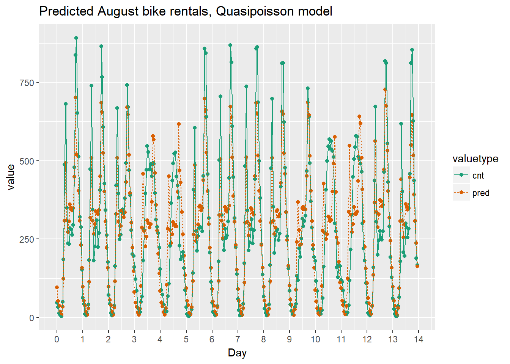

Using the chart it appears that this model mostly identifies the slow and busy hours of the day, although it often underestimates peak demand.

### Generalised Additive Model (GAM)

GAM can be used to automatically learn input variable transformations.  In GAM, it depends on unknown smoothed functions of the input variables.  A GAM learns what best fits the data e.g. quadratic, cubic and so on.  We use the mgcv package for GAM models, which has similar functions at the GLM models we saw previously, including a family variable where gaussian (default) is used for regular regression, binomial for probabilities and poisson/quasipoisson for counts.  GAMS are prone to overfitting, so are best used on large sets of data.  If we want to model the data as a non-linear relationship we use the s notation e.g. anx ~ s(hassles) - this is best done with 10 or more unique values, since a spline function is fitted, so not good for categorical data. 

NOTE: GAM is useful for when you don't have the domain knowledge to determine the best model type so is used as a proxy of the 'best model' in the absence of this knowledge.

If you do have categorical variables, you can still use them in GAM, but you don't specify the s function for those, e.g. if diet and sex are categorical, but age and BMI are continous, we would have:

> Wtloss ~ Diet + Sex + s(Age) + s(BMI)

Next we will model the average leaf weight on a soybean plant as a function of time (after planting). As you will see, the soybean plant doesn't grow at a steady rate, but rather has a "growth spurt" that eventually tapers off. Hence, leaf weight is not well described by a linear model.


```r
# Load the Soybean data
load("./files/SLinRRegression/Soybean.RData")

# soybean_train is in the workspace
summary(soybean_train)
```

```
##       Plot     Variety   Year          Time           weight       
##  1988F6 : 10   F:161   1988:124   Min.   :14.00   Min.   : 0.0290  
##  1988F7 :  9   P:169   1989:102   1st Qu.:27.00   1st Qu.: 0.6663  
##  1988P1 :  9           1990:104   Median :42.00   Median : 3.5233  
##  1988P8 :  9                      Mean   :43.56   Mean   : 6.1645  
##  1988P2 :  9                      3rd Qu.:56.00   3rd Qu.:10.3808  
##  1988F3 :  8                      Max.   :84.00   Max.   :27.3700  
##  (Other):276
```

```r
# Plot weight vs Time (Time on x axis)
ggplot(soybean_train, aes(x = Time, y = weight)) + 
  geom_point()
```

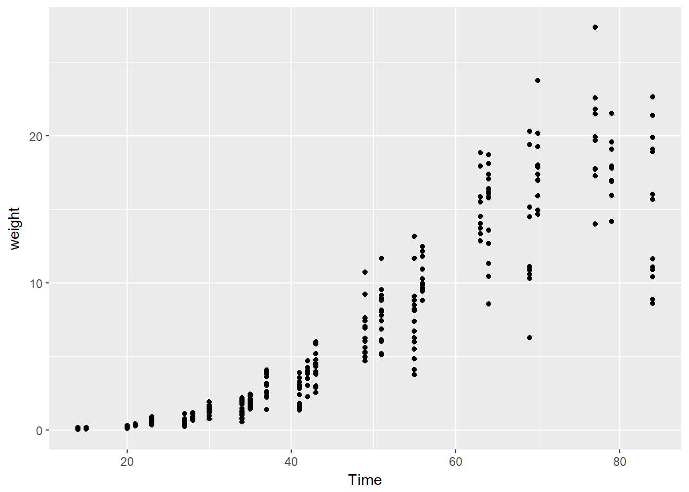

```r
# Load the package mgcv
library(mgcv)
```

```
## Loading required package: nlme
```

```
## 
## Attaching package: 'nlme'
```

```
## The following object is masked from 'package:dplyr':
## 
##     collapse
```

```
## This is mgcv 1.8-20. For overview type 'help("mgcv-package")'.
```

```r
# Create the gam/non-linear formula 
(fmla.gam <- as.formula("weight ~ s(Time)"))
```

```
## weight ~ s(Time)
```

```r
# Create the linear formula 
(fmla.lin <- as.formula("weight ~ Time"))
```

```
## weight ~ Time
```

```r
# Fit the GAM Model
model.gam <- gam(fmla.gam, family = gaussian, data = soybean_train)

# Create the linear formula 
model.lin <- lm(formula = fmla.lin, data = soybean_train)

# Call summary() on model.lin and look for R-squared
summary(model.lin)
```

```
## 
## Call:
## lm(formula = fmla.lin, data = soybean_train)
## 
## Residuals:
##     Min      1Q  Median      3Q     Max 
## -9.3933 -1.7100 -0.3909  1.9056 11.4381 
## 
## Coefficients:
##              Estimate Std. Error t value Pr(>|t|)    
## (Intercept) -6.559283   0.358527  -18.30   <2e-16 ***
## Time         0.292094   0.007444   39.24   <2e-16 ***
## ---
## Signif. codes:  0 '***' 0.001 '**' 0.01 '*' 0.05 '.' 0.1 ' ' 1
## 
## Residual standard error: 2.778 on 328 degrees of freedom
## Multiple R-squared:  0.8244,	Adjusted R-squared:  0.8238 
## F-statistic:  1540 on 1 and 328 DF,  p-value: < 2.2e-16
```

```r
# Call summary() on model.gam and look for R-squared
summary(model.gam)
```

```
## 
## Family: gaussian 
## Link function: identity 
## 
## Formula:
## weight ~ s(Time)
## 
## Parametric coefficients:
##             Estimate Std. Error t value Pr(>|t|)    
## (Intercept)   6.1645     0.1143   53.93   <2e-16 ***
## ---
## Signif. codes:  0 '***' 0.001 '**' 0.01 '*' 0.05 '.' 0.1 ' ' 1
## 
## Approximate significance of smooth terms:
##           edf Ref.df     F p-value    
## s(Time) 8.495   8.93 338.2  <2e-16 ***
## ---
## Signif. codes:  0 '***' 0.001 '**' 0.01 '*' 0.05 '.' 0.1 ' ' 1
## 
## R-sq.(adj) =  0.902   Deviance explained = 90.4%
## GCV = 4.4395  Scale est. = 4.3117    n = 330
```

```r
# Call plot() on model.gam
plot(model.gam)
```

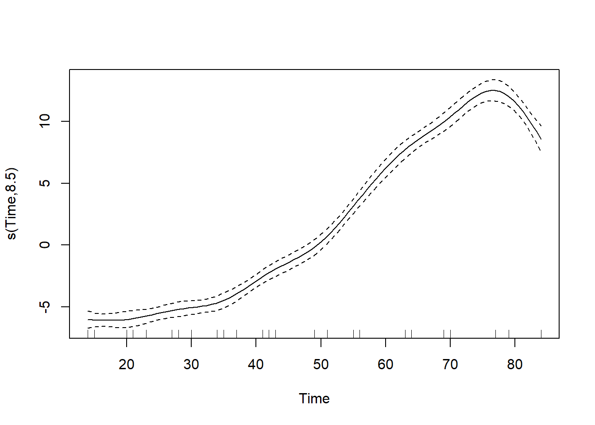

So we see that the non-linear GAM model fits the data better, with a higher R squared measurement than the linear model.

Next we will predict with both the linear and gam model.  As GAM models return a matrix for predictions, we use as.numeric to convert the output.


```r
# soybean_test is in the workspace
summary(soybean_test)
```

```
##       Plot    Variety   Year         Time           weight       
##  1988F8 : 4   F:43    1988:32   Min.   :14.00   Min.   : 0.0380  
##  1988P7 : 4   P:39    1989:26   1st Qu.:23.00   1st Qu.: 0.4248  
##  1989F8 : 4           1990:24   Median :41.00   Median : 3.0025  
##  1990F8 : 4                     Mean   :44.09   Mean   : 7.1576  
##  1988F4 : 3                     3rd Qu.:69.00   3rd Qu.:15.0113  
##  1988F2 : 3                     Max.   :84.00   Max.   :30.2717  
##  (Other):60
```

```r
# Get predictions from linear model
soybean_test$pred.lin <- predict(model.lin, newdata = soybean_test)

# Get predictions from gam model
soybean_test$pred.gam <- as.numeric(predict(model.gam, newdata = soybean_test))

# Gather the predictions into a "long" dataset
soybean_long <- soybean_test %>%
  gather(key = modeltype, value = pred, pred.lin, pred.gam)

# Calculate the rmse
soybean_long %>%
  mutate(residual = weight - pred) %>%     # residuals
  group_by(modeltype) %>%                  # group by modeltype
  summarize(rmse = sqrt(mean(residual^2))) # calculate the RMSE
```

```
## # A tibble: 2 x 2
##   modeltype     rmse
##       <chr>    <dbl>
## 1  pred.gam 2.286451
## 2  pred.lin 3.190995
```

```r
# Compare the predictions against actual weights on the test data
soybean_long %>%
  ggplot(aes(x = Time)) +                          # the column for the x axis
  geom_point(aes(y = weight)) +                    # the y-column for the scatterplot
  geom_point(aes(y = pred, color = modeltype)) +   # the y-column for the point-and-line plot
  geom_line(aes(y = pred, color = modeltype, linetype = modeltype)) + # the y-column for the point-and-line plot
  scale_color_brewer(palette = "Dark2")
```


Oberving the plot we can see that the GAM learns the non-linear growth function of the soybean plants, including the fact that weight is never negative, whereas the linear model intercepts below 0 i.e. a negative size.

## Tree-Based Methods

Tree based models can be used for both regression and classification models.  Decision Trees say 'if a AND b AND c THEN y'.  We can therefore model non-linear models and multiplicative relationships - what is the affect of this AND that when combined together.  

We can use RMSE as a measure of accuracy of the model.  The challenge with tree models is that they are interested in the model space as a whole, splitting this in to regions.  Trees can have difficulting fitting linear relationships, so linear models can be better for linear relationships.  Trees also have difficulty with variables that change quickly and continously. 

We can adjust the tree depth, but there is a risk of overfitting (too deep/complex) or underfitting (too shallow/coarse).

An ensemble model can be built combining different trees or indeed different models together, which will usually have the outcome of being better than a sinlge tree and less prone to overfitting, but at the loss of interpretability.  Two such examples of ensemble models are random forests and gradient boosted trees.

### Random Forests

One example of an ensemble approach is a random forest, building multiple trees from the training data.  We build slightly different trees each time to add diversity to the model, by averaging the results of multiple models together to reduce the degree of overfitting.  To build a random forest we perform the following

1. Draw bootstrapped sample from training data
2. For each sample grow a tree
    * At each node, pick best variable to split on (from a random
    subset of all variables)
    * Continue until tree is grown
3. To score a datum, evaluate it with all the trees and average the results.

We can use the ranger package to fit random forests.  If the outcome is numeric, ranger will automatically do regression rather than classification.  The default is for 500 trees, a reccommended minimum is 200.  The value respect.unordered.factors will handle categorical values, set it to "order" if using cateogrical values, which will convert the values to numeric values.

The measures of accuracy are R squared and OOB (Out of Bag or out of sample performance).  You should still evaluate the model further using test data.

In this exercise you will again build a model to predict the number of bikes rented in an hour as a function of the weather, the type of day (holiday, working day, or weekend), and the time of day. You will train the model on data from the month of July.

You will use the ranger package to fit the random forest model. For this exercise, the key arguments to the ranger() call are:

* formula
* data
* num.trees: the number of trees in the forest.
* respect.unordered.factors : Specifies how to treat unordered factor variables. We recommend setting this to "order" for regression.
* seed: because this is a random algorithm, you will set the seed to get reproducible results
Since there are a lot of input variables, for convenience we will specify the outcome and the inputs in the variables outcome and vars, and use paste() to assemble a string representing the model formula.


```r
# bikesJuly is in the workspace
str(bikesJuly)
```

```
## 'data.frame':	744 obs. of  12 variables:
##  $ hr        : Factor w/ 24 levels "0","1","2","3",..: 1 2 3 4 5 6 7 8 9 10 ...
##  $ holiday   : logi  FALSE FALSE FALSE FALSE FALSE FALSE ...
##  $ workingday: logi  FALSE FALSE FALSE FALSE FALSE FALSE ...
##  $ weathersit: chr  "Clear to partly cloudy" "Clear to partly cloudy" "Clear to partly cloudy" "Clear to partly cloudy" ...
##  $ temp      : num  0.76 0.74 0.72 0.72 0.7 0.68 0.7 0.74 0.78 0.82 ...
##  $ atemp     : num  0.727 0.697 0.697 0.712 0.667 ...
##  $ hum       : num  0.66 0.7 0.74 0.84 0.79 0.79 0.79 0.7 0.62 0.56 ...
##  $ windspeed : num  0 0.1343 0.0896 0.1343 0.194 ...
##  $ cnt       : int  149 93 90 33 4 10 27 50 142 219 ...
##  $ instant   : int  13004 13005 13006 13007 13008 13009 13010 13011 13012 13013 ...
##  $ mnth      : int  7 7 7 7 7 7 7 7 7 7 ...
##  $ yr        : int  1 1 1 1 1 1 1 1 1 1 ...
```

```r
# Random seed to reproduce results
seed <- 423563

# The outcome column
(outcome <- "cnt")
```

```
## [1] "cnt"
```

```r
# The input variables
(vars <- c("hr", "holiday", "workingday", "weathersit", "temp", "atemp", "hum", "windspeed"))
```

```
## [1] "hr"         "holiday"    "workingday" "weathersit" "temp"      
## [6] "atemp"      "hum"        "windspeed"
```

```r
# Create the formula string for bikes rented as a function of the inputs
(fmla <- paste("cnt", "~", paste(vars, collapse = " + ")))
```

```
## [1] "cnt ~ hr + holiday + workingday + weathersit + temp + atemp + hum + windspeed"
```

```r
# Load the package ranger
library(ranger)

# Fit and print the random forest model
(bike_model_rf <- ranger(fmla, # formula 
                         bikesJuly, # data
                         num.trees = 500, 
                         respect.unordered.factors = "order", 
                         seed = seed))
```

```
## Ranger result
## 
## Call:
##  ranger(fmla, bikesJuly, num.trees = 500, respect.unordered.factors = "order",      seed = seed) 
## 
## Type:                             Regression 
## Number of trees:                  500 
## Sample size:                      744 
## Number of independent variables:  8 
## Mtry:                             2 
## Target node size:                 5 
## Variable importance mode:         none 
## OOB prediction error (MSE):       8230.568 
## R squared (OOB):                  0.8205434
```

Here we see the R squared is very high - around 82%.

Next we will use the model that you fit in the previous exercise to predict bike rentals for the month of August.

The predict() function for a ranger model produces a list. One of the elements of this list is predictions, a vector of predicted values. You can access predictions with the $ notation for accessing named elements of a list:

* predict(model, data)$predictions


```r
# bikesAugust is in the workspace
str(bikesAugust)
```

```
## 'data.frame':	744 obs. of  13 variables:
##  $ hr        : Factor w/ 24 levels "0","1","2","3",..: 1 2 3 4 5 6 7 8 9 10 ...
##  $ holiday   : logi  FALSE FALSE FALSE FALSE FALSE FALSE ...
##  $ workingday: logi  TRUE TRUE TRUE TRUE TRUE TRUE ...
##  $ weathersit: chr  "Clear to partly cloudy" "Clear to partly cloudy" "Clear to partly cloudy" "Clear to partly cloudy" ...
##  $ temp      : num  0.68 0.66 0.64 0.64 0.64 0.64 0.64 0.64 0.66 0.68 ...
##  $ atemp     : num  0.636 0.606 0.576 0.576 0.591 ...
##  $ hum       : num  0.79 0.83 0.83 0.83 0.78 0.78 0.78 0.83 0.78 0.74 ...
##  $ windspeed : num  0.1642 0.0896 0.1045 0.1045 0.1343 ...
##  $ cnt       : int  47 33 13 7 4 49 185 487 681 350 ...
##  $ instant   : int  13748 13749 13750 13751 13752 13753 13754 13755 13756 13757 ...
##  $ mnth      : int  8 8 8 8 8 8 8 8 8 8 ...
##  $ yr        : int  1 1 1 1 1 1 1 1 1 1 ...
##  $ pred      : num  94.96 51.74 37.98 17.58 9.36 ...
```

```r
# bike_model_rf is in the workspace
bike_model_rf
```

```
## Ranger result
## 
## Call:
##  ranger(fmla, bikesJuly, num.trees = 500, respect.unordered.factors = "order",      seed = seed) 
## 
## Type:                             Regression 
## Number of trees:                  500 
## Sample size:                      744 
## Number of independent variables:  8 
## Mtry:                             2 
## Target node size:                 5 
## Variable importance mode:         none 
## OOB prediction error (MSE):       8230.568 
## R squared (OOB):                  0.8205434
```

```r
# Make predictions on the August data
bikesAugust$pred <- predict(bike_model_rf, bikesAugust)$predictions

# Calculate the RMSE of the predictions
bikesAugust %>% 
  mutate(residual = cnt - pred)  %>% # calculate the residual
  summarize(rmse  = sqrt(mean(residual^2)))      # calculate rmse
```

```
##       rmse
## 1 97.18347
```

```r
# Plot actual outcome vs predictions (predictions on x-axis)
ggplot(bikesAugust, aes(x = pred, y = cnt)) + 
  geom_point() + 
  geom_abline()
```


This random forest model outperforms the poisson count model on the same data; it is discovering more complex non-linear or non-additive relationships in the data.

Next we will visualize the random forest model's August predictions as a function of time. We can compare the corresponding plot from the quasipoisson model that we built previously.

Recall that the quasipoisson model mostly identified the pattern of slow and busy hours in the day, but it somewhat underestimated peak demands. You would like to see how the random forest model compares.


```r
Quasipoissonmodel
```


```r
# Plot predictions and cnt by date/time
randomforest_plot <- bikesAugust %>% 
  mutate(instant = (instant - min(instant))/24) %>%  # set start to 0, convert unit to days
  gather(key = valuetype, value = value, cnt, pred) %>%
  filter(instant < 14) %>% # first two weeks
  ggplot(aes(x = instant, y = value, color = valuetype, linetype = valuetype)) + 
  geom_point() + 
  geom_line() + 
  scale_x_continuous("Day", breaks = 0:14, labels = 0:14) + 
  scale_color_brewer(palette = "Dark2") + 
  ggtitle("Predicted August bike rentals, Random Forest plot")
randomforest_plot
```


The random forest model captured the day-to-day variations in peak demand better than the quasipoisson model, but it still underestmates peak demand, and also overestimates minimum demand. So there is still room for improvement.

### One-hot encoding

For modelling purposes, we need to convert categorical variables to indicator variables.  Some R packages do this automatically, but some non-native R packages, such as the xgboost package does not, as it is a non-R package (it's C with a R api).  So, these categorical variables need to be converted to numeric ones.  We can use the vtreat package.

* DesignTreatmentsZ() to design a treatment plan from the training data, then
* prepare() to created "clean" data
  * all numerical
  * no missing values
  * use prepare() with treatment plan for all future data
  
In this exercise you will use vtreat to one-hot-encode a categorical variable on a small example. vtreat creates a treatment plan to transform categorical variables into indicator variables (coded "lev"), and to clean bad values out of numerical variables (coded "clean").

To design a treatment plan use the function designTreatmentsZ() e.g.

> treatplan <- designTreatmentsZ(data, varlist)

data: the original training data frame
varlist: a vector of input variables to be treated (as strings).
designTreatmentsZ() returns a list with an element scoreFrame: a data frame that includes the names and types of the new variables:

> scoreFrame <- treatplan %>% 
            magrittr::use_series(scoreFrame) %>% 
            select(varName, origName, code)
            
varName: the name of the new treated variable
origName: the name of the original variable that the treated variable comes from
code: the type of the new variable.
"clean": a numerical variable with no NAs or NaNs
"lev": an indicator variable for a specific level of the original categorical variable.

(magrittr::use_series() is an alias for $ that you can use in pipes.)

For these exercises, we want varName where code is either "clean" or "lev":

> newvarlist <- scoreFrame %>% 
             filter(code %in% c("clean", "lev") %>%
             magrittr::use_series(varName)

To transform the data set into all numerical and one-hot-encoded variables, use prepare():

> data.treat <- prepare(treatplan, data, varRestrictions = newvarlist)

treatplan: the treatment plan
data: the data frame to be treated
varRestrictions: the variables desired in the treated data


```r
# Create the dataframe for cleaning
color <- c("b", "r", "r", "r", "r", "b", "r", "g", "b", "b")
size <- c(13, 11, 15, 14, 13, 11, 9, 12, 7, 12)
popularity <- c(1.0785088, 1.3956245, 0.9217988, 1.2025453, 1.0838662, 0.8043527, 1.1035440, 0.8746332, 0.6947058, 0.8832502)
dframe <- cbind(color, size, popularity)
dframe <- as.data.frame((dframe))

# dframe is in the workspace
dframe
```

```
##    color size popularity
## 1      b   13  1.0785088
## 2      r   11  1.3956245
## 3      r   15  0.9217988
## 4      r   14  1.2025453
## 5      r   13  1.0838662
## 6      b   11  0.8043527
## 7      r    9   1.103544
## 8      g   12  0.8746332
## 9      b    7  0.6947058
## 10     b   12  0.8832502
```

```r
# Create and print a vector of variable names
(vars <- c("color", "size"))
```

```
## [1] "color" "size"
```

```r
# Load the package vtreat
library(vtreat)

# Create the treatment plan
treatplan <- designTreatmentsZ(dframe, vars)
```

```
## [1] "designing treatments Wed Apr 25 04:31:23 2018"
## [1] "designing treatments Wed Apr 25 04:31:23 2018"
## [1] " have level statistics Wed Apr 25 04:31:23 2018"
## [1] "design var color Wed Apr 25 04:31:23 2018"
## [1] "design var size Wed Apr 25 04:31:23 2018"
## [1] " scoring treatments Wed Apr 25 04:31:23 2018"
## [1] "have treatment plan Wed Apr 25 04:31:23 2018"
```

```r
# Examine the scoreFrame
(scoreFrame <- treatplan %>%
    magrittr::use_series(scoreFrame) %>%
    select(varName, origName, code))
```

```
##          varName origName code
## 1  color_lev_x.b    color  lev
## 2  color_lev_x.g    color  lev
## 3  color_lev_x.r    color  lev
## 4     color_catP    color catP
## 5  size_lev_x.11     size  lev
## 6  size_lev_x.12     size  lev
## 7  size_lev_x.13     size  lev
## 8  size_lev_x.14     size  lev
## 9  size_lev_x.15     size  lev
## 10  size_lev_x.7     size  lev
## 11  size_lev_x.9     size  lev
## 12     size_catP     size catP
```

```r
# We only want the rows with codes "clean" or "lev"
(newvars <- scoreFrame %>%
    filter(code %in% c("clean", "lev")) %>%
    magrittr::use_series(varName))
```

```
##  [1] "color_lev_x.b" "color_lev_x.g" "color_lev_x.r" "size_lev_x.11"
##  [5] "size_lev_x.12" "size_lev_x.13" "size_lev_x.14" "size_lev_x.15"
##  [9] "size_lev_x.7"  "size_lev_x.9"
```

```r
# Create the treated training data
(dframe.treat <- prepare(treatplan, dframe, varRestriction = newvars))
```

```
##    color_lev_x.b color_lev_x.g color_lev_x.r size_lev_x.11 size_lev_x.12
## 1              1             0             0             0             0
## 2              0             0             1             1             0
## 3              0             0             1             0             0
## 4              0             0             1             0             0
## 5              0             0             1             0             0
## 6              1             0             0             1             0
## 7              0             0             1             0             0
## 8              0             1             0             0             1
## 9              1             0             0             0             0
## 10             1             0             0             0             1
##    size_lev_x.13 size_lev_x.14 size_lev_x.15 size_lev_x.7 size_lev_x.9
## 1              1             0             0            0            0
## 2              0             0             0            0            0
## 3              0             0             1            0            0
## 4              0             1             0            0            0
## 5              1             0             0            0            0
## 6              0             0             0            0            0
## 7              0             0             0            0            1
## 8              0             0             0            0            0
## 9              0             0             0            1            0
## 10             0             0             0            0            0
```

WE have have successfully one-hot-encoded categorical data. The new indicator variables have '_lev_' in their names, and the new cleaned continuous variables have '_clean' in their names. The treated data is all numerical, with no missing values, and is suitable for use with xgboost and other R modeling functions.


When a level of a categorical variable is rare, sometimes it will fail to show up in training data. If that rare level then appears in future data, downstream models may not know what to do with it. When such novel levels appear, using model.matrix or caret::dummyVars to one-hot-encode will not work correctly.

vtreat is a "safer" alternative to model.matrix for one-hot-encoding, because it can manage novel levels safely. vtreat also manages missing values in the data (both categorical and continuous).


```r
# Create the testframe for testing new vars
color <- c("g", "g", "y", "g", "g", "y", "b", "g", "g", "r")
size <- c(7, 8, 10, 12, 6, 8, 12, 12, 12, 8)
popularity <- c(0.9733920, 0.9122529, 1.4217153, 1.1905828, 0.9866464, 1.3697515, 1.0959387, 0.9161547, 1.0000460, 1.3137360)
testframe <- cbind(color, size, popularity)
testframe <- as.data.frame((dframe))

# treatplan is in the workspace
summary(treatplan)
```

```
##               Length Class           Mode     
## treatments    4      -none-          list     
## scoreFrame    8      data.frame      list     
## outcomename   1      -none-          character
## vtreatVersion 1      package_version list     
## outcomeType   1      -none-          character
## outcomeTarget 1      -none-          character
## meanY         1      -none-          logical  
## splitmethod   1      -none-          character
```

```r
# newvars is in the workspace
newvars
```

```
##  [1] "color_lev_x.b" "color_lev_x.g" "color_lev_x.r" "size_lev_x.11"
##  [5] "size_lev_x.12" "size_lev_x.13" "size_lev_x.14" "size_lev_x.15"
##  [9] "size_lev_x.7"  "size_lev_x.9"
```

```r
# Print dframe and testframe
dframe
```

```
##    color size popularity
## 1      b   13  1.0785088
## 2      r   11  1.3956245
## 3      r   15  0.9217988
## 4      r   14  1.2025453
## 5      r   13  1.0838662
## 6      b   11  0.8043527
## 7      r    9   1.103544
## 8      g   12  0.8746332
## 9      b    7  0.6947058
## 10     b   12  0.8832502
```

```r
testframe
```

```
##    color size popularity
## 1      b   13  1.0785088
## 2      r   11  1.3956245
## 3      r   15  0.9217988
## 4      r   14  1.2025453
## 5      r   13  1.0838662
## 6      b   11  0.8043527
## 7      r    9   1.103544
## 8      g   12  0.8746332
## 9      b    7  0.6947058
## 10     b   12  0.8832502
```

```r
# Use prepare() to one-hot-encode testframe
(testframe.treat <- prepare(treatplan, testframe, varRestriction = newvars))
```

```
##    color_lev_x.b color_lev_x.g color_lev_x.r size_lev_x.11 size_lev_x.12
## 1              1             0             0             0             0
## 2              0             0             1             1             0
## 3              0             0             1             0             0
## 4              0             0             1             0             0
## 5              0             0             1             0             0
## 6              1             0             0             1             0
## 7              0             0             1             0             0
## 8              0             1             0             0             1
## 9              1             0             0             0             0
## 10             1             0             0             0             1
##    size_lev_x.13 size_lev_x.14 size_lev_x.15 size_lev_x.7 size_lev_x.9
## 1              1             0             0            0            0
## 2              0             0             0            0            0
## 3              0             0             1            0            0
## 4              0             1             0            0            0
## 5              1             0             0            0            0
## 6              0             0             0            0            0
## 7              0             0             0            0            1
## 8              0             0             0            0            0
## 9              0             0             0            1            0
## 10             0             0             0            0            0
```

vtreat encodes novel colors like yellow that were not present in the data as all zeros: 'none of the known colors'. This allows downstream models to accept these novel values without crashing.

Next we will create one-hot-encoded data frames of the July/August bike data, for use with xgboost later on. 
vars defines the variable vars with the list of variable columns for the model.


```r
# The outcome column
(outcome <- "cnt")
```

```
## [1] "cnt"
```

```r
# The input columns
(vars <- c("hr", "holiday", "workingday", "weathersit", "temp", "atemp", "hum", "windspeed"))
```

```
## [1] "hr"         "holiday"    "workingday" "weathersit" "temp"      
## [6] "atemp"      "hum"        "windspeed"
```

```r
# Load the package vtreat
library(vtreat)

# Create the treatment plan from bikesJuly (the training data)
treatplan <- designTreatmentsZ(bikesJuly, vars, verbose = FALSE)

# Get the "clean" and "lev" variables from the scoreFrame
(newvars <- treatplan %>%
  magrittr::use_series(scoreFrame) %>%        
  filter(code %in% c("clean", "lev")) %>%  # get the rows you care about
  magrittr::use_series(varName))           # get the varName column
```

```
##  [1] "hr_lev_x.0"                             
##  [2] "hr_lev_x.1"                             
##  [3] "hr_lev_x.10"                            
##  [4] "hr_lev_x.11"                            
##  [5] "hr_lev_x.12"                            
##  [6] "hr_lev_x.13"                            
##  [7] "hr_lev_x.14"                            
##  [8] "hr_lev_x.15"                            
##  [9] "hr_lev_x.16"                            
## [10] "hr_lev_x.17"                            
## [11] "hr_lev_x.18"                            
## [12] "hr_lev_x.19"                            
## [13] "hr_lev_x.2"                             
## [14] "hr_lev_x.20"                            
## [15] "hr_lev_x.21"                            
## [16] "hr_lev_x.22"                            
## [17] "hr_lev_x.23"                            
## [18] "hr_lev_x.3"                             
## [19] "hr_lev_x.4"                             
## [20] "hr_lev_x.5"                             
## [21] "hr_lev_x.6"                             
## [22] "hr_lev_x.7"                             
## [23] "hr_lev_x.8"                             
## [24] "hr_lev_x.9"                             
## [25] "holiday_clean"                          
## [26] "workingday_clean"                       
## [27] "weathersit_lev_x.Clear.to.partly.cloudy"
## [28] "weathersit_lev_x.Light.Precipitation"   
## [29] "weathersit_lev_x.Misty"                 
## [30] "temp_clean"                             
## [31] "atemp_clean"                            
## [32] "hum_clean"                              
## [33] "windspeed_clean"
```

```r
# Prepare the training data
bikesJuly.treat <- prepare(treatplan, bikesJuly,  varRestriction = newvars)

# Prepare the test data
bikesAugust.treat <- prepare(treatplan, bikesAugust,  varRestriction = newvars)

# Call str() on the treated data
str(bikesAugust.treat)
```

```
## 'data.frame':	744 obs. of  33 variables:
##  $ hr_lev_x.0                             : num  1 0 0 0 0 0 0 0 0 0 ...
##  $ hr_lev_x.1                             : num  0 1 0 0 0 0 0 0 0 0 ...
##  $ hr_lev_x.10                            : num  0 0 0 0 0 0 0 0 0 0 ...
##  $ hr_lev_x.11                            : num  0 0 0 0 0 0 0 0 0 0 ...
##  $ hr_lev_x.12                            : num  0 0 0 0 0 0 0 0 0 0 ...
##  $ hr_lev_x.13                            : num  0 0 0 0 0 0 0 0 0 0 ...
##  $ hr_lev_x.14                            : num  0 0 0 0 0 0 0 0 0 0 ...
##  $ hr_lev_x.15                            : num  0 0 0 0 0 0 0 0 0 0 ...
##  $ hr_lev_x.16                            : num  0 0 0 0 0 0 0 0 0 0 ...
##  $ hr_lev_x.17                            : num  0 0 0 0 0 0 0 0 0 0 ...
##  $ hr_lev_x.18                            : num  0 0 0 0 0 0 0 0 0 0 ...
##  $ hr_lev_x.19                            : num  0 0 0 0 0 0 0 0 0 0 ...
##  $ hr_lev_x.2                             : num  0 0 1 0 0 0 0 0 0 0 ...
##  $ hr_lev_x.20                            : num  0 0 0 0 0 0 0 0 0 0 ...
##  $ hr_lev_x.21                            : num  0 0 0 0 0 0 0 0 0 0 ...
##  $ hr_lev_x.22                            : num  0 0 0 0 0 0 0 0 0 0 ...
##  $ hr_lev_x.23                            : num  0 0 0 0 0 0 0 0 0 0 ...
##  $ hr_lev_x.3                             : num  0 0 0 1 0 0 0 0 0 0 ...
##  $ hr_lev_x.4                             : num  0 0 0 0 1 0 0 0 0 0 ...
##  $ hr_lev_x.5                             : num  0 0 0 0 0 1 0 0 0 0 ...
##  $ hr_lev_x.6                             : num  0 0 0 0 0 0 1 0 0 0 ...
##  $ hr_lev_x.7                             : num  0 0 0 0 0 0 0 1 0 0 ...
##  $ hr_lev_x.8                             : num  0 0 0 0 0 0 0 0 1 0 ...
##  $ hr_lev_x.9                             : num  0 0 0 0 0 0 0 0 0 1 ...
##  $ holiday_clean                          : num  0 0 0 0 0 0 0 0 0 0 ...
##  $ workingday_clean                       : num  1 1 1 1 1 1 1 1 1 1 ...
##  $ weathersit_lev_x.Clear.to.partly.cloudy: num  1 1 1 1 0 0 1 0 0 0 ...
##  $ weathersit_lev_x.Light.Precipitation   : num  0 0 0 0 0 0 0 0 0 0 ...
##  $ weathersit_lev_x.Misty                 : num  0 0 0 0 1 1 0 1 1 1 ...
##  $ temp_clean                             : num  0.68 0.66 0.64 0.64 0.64 0.64 0.64 0.64 0.66 0.68 ...
##  $ atemp_clean                            : num  0.636 0.606 0.576 0.576 0.591 ...
##  $ hum_clean                              : num  0.79 0.83 0.83 0.83 0.78 0.78 0.78 0.83 0.78 0.74 ...
##  $ windspeed_clean                        : num  0.1642 0.0896 0.1045 0.1045 0.1343 ...
```

```r
str(bikesJuly.treat)
```

```
## 'data.frame':	744 obs. of  33 variables:
##  $ hr_lev_x.0                             : num  1 0 0 0 0 0 0 0 0 0 ...
##  $ hr_lev_x.1                             : num  0 1 0 0 0 0 0 0 0 0 ...
##  $ hr_lev_x.10                            : num  0 0 0 0 0 0 0 0 0 0 ...
##  $ hr_lev_x.11                            : num  0 0 0 0 0 0 0 0 0 0 ...
##  $ hr_lev_x.12                            : num  0 0 0 0 0 0 0 0 0 0 ...
##  $ hr_lev_x.13                            : num  0 0 0 0 0 0 0 0 0 0 ...
##  $ hr_lev_x.14                            : num  0 0 0 0 0 0 0 0 0 0 ...
##  $ hr_lev_x.15                            : num  0 0 0 0 0 0 0 0 0 0 ...
##  $ hr_lev_x.16                            : num  0 0 0 0 0 0 0 0 0 0 ...
##  $ hr_lev_x.17                            : num  0 0 0 0 0 0 0 0 0 0 ...
##  $ hr_lev_x.18                            : num  0 0 0 0 0 0 0 0 0 0 ...
##  $ hr_lev_x.19                            : num  0 0 0 0 0 0 0 0 0 0 ...
##  $ hr_lev_x.2                             : num  0 0 1 0 0 0 0 0 0 0 ...
##  $ hr_lev_x.20                            : num  0 0 0 0 0 0 0 0 0 0 ...
##  $ hr_lev_x.21                            : num  0 0 0 0 0 0 0 0 0 0 ...
##  $ hr_lev_x.22                            : num  0 0 0 0 0 0 0 0 0 0 ...
##  $ hr_lev_x.23                            : num  0 0 0 0 0 0 0 0 0 0 ...
##  $ hr_lev_x.3                             : num  0 0 0 1 0 0 0 0 0 0 ...
##  $ hr_lev_x.4                             : num  0 0 0 0 1 0 0 0 0 0 ...
##  $ hr_lev_x.5                             : num  0 0 0 0 0 1 0 0 0 0 ...
##  $ hr_lev_x.6                             : num  0 0 0 0 0 0 1 0 0 0 ...
##  $ hr_lev_x.7                             : num  0 0 0 0 0 0 0 1 0 0 ...
##  $ hr_lev_x.8                             : num  0 0 0 0 0 0 0 0 1 0 ...
##  $ hr_lev_x.9                             : num  0 0 0 0 0 0 0 0 0 1 ...
##  $ holiday_clean                          : num  0 0 0 0 0 0 0 0 0 0 ...
##  $ workingday_clean                       : num  0 0 0 0 0 0 0 0 0 0 ...
##  $ weathersit_lev_x.Clear.to.partly.cloudy: num  1 1 1 1 1 1 1 1 1 1 ...
##  $ weathersit_lev_x.Light.Precipitation   : num  0 0 0 0 0 0 0 0 0 0 ...
##  $ weathersit_lev_x.Misty                 : num  0 0 0 0 0 0 0 0 0 0 ...
##  $ temp_clean                             : num  0.76 0.74 0.72 0.72 0.7 0.68 0.7 0.74 0.78 0.82 ...
##  $ atemp_clean                            : num  0.727 0.697 0.697 0.712 0.667 ...
##  $ hum_clean                              : num  0.66 0.7 0.74 0.84 0.79 0.79 0.79 0.7 0.62 0.56 ...
##  $ windspeed_clean                        : num  0 0.1343 0.0896 0.1343 0.194 ...
```

The bike data is now in completely numeric form, ready to use with xgboost. Note that the treated data does not include the outcome column.

### Gradient Boosting Machines

Gradient boosting is an interative ensemble method, by improving the model each time.  We start the model with a usually shallow tree.  Next, we fit another model to the residuals of the model, then find the weighted sum of the second and first models that give the best fit.  We can regualrise the learning by the factor eta, eta = 1 gives fast learning but with overfitting risk, smaller eta reduces speed of learning but reduces the risk of overfitting.  We then repeat this process until the stopping condition is met.  

Gradient boosting works on the training data, so it can be easy to overfit.  The best approach then is to use OOB and cross validation (CV) for each model, then determine how many trees to use.  

xgb.cv() is the function we use and has a number of diagnostic measures.  One such measure is the 

* xgb.cv()$evaluation_log: records estimated RMSE for each round - find the number that minimises the RMSE

Inputs to xgb.cv() and xgboost() are:

* data: input data as matrix ; label: outcome
* label: vector of outcomes (also numeric)
* objective: for regression - "reg:linear"
* nrounds: maximum number of trees to fit
* eta: learning rate
* max_depth: depth of trees
* early_stopping_rounds: after this many rounds without improvement, stop
* nfold (xgb.cv() only): number of folds for cross validation.  5 is a good number
* verbose: 0 to stay silent.

Then we use

elog <- as.data.frame(cv$evaluation_log)
nrounds <- which.min(elog$test_rmse_mean)

With the resulting number being the best number of trees.  We then use xbgoost with this number (nrounds <- n) to get the final model.

Next we will get ready to build a gradient boosting model to predict the number of bikes rented in an hour as a function of the weather and the type and time of day. We will train the model on data from the month of July.

The July data is loaded into your workspace. Remember that bikesJuly.treat no longer has the outcome column, so you must get it from the untreated data: bikesJuly$cnt.

We will use the xgboost package to fit the random forest model. The function xgb.cv() uses cross-validation to estimate the out-of-sample learning error as each new tree is added to the model. The appropriate number of trees to use in the final model is the number that minimizes the holdout RMSE.


```r
# The July data is in the workspace
ls()
```

```
##  [1] "bike_model"          "bike_model_rf"       "bikesAugust"        
##  [4] "bikesAugust.treat"   "bikesJuly"           "bikesJuly.treat"    
##  [7] "bloodpressure"       "bloodpressure_model" "color"              
## [10] "dframe"              "dframe.treat"        "fdata"              
## [13] "fdata2"              "fe_mean"             "flower_model"       
## [16] "flowers"             "fmla"                "fmla.gam"           
## [19] "fmla.lin"            "fmla.log"            "fmla_sqr"           
## [22] "gp"                  "houseprice"          "houseprice_long"    
## [25] "i"                   "incometest"          "incometrain"        
## [28] "k"                   "mean_bikes"          "mmat"               
## [31] "model"               "model.gam"           "model.lin"          
## [34] "model.log"           "model_lin"           "model_sqr"          
## [37] "mpg"                 "mpg_model"           "mpg_test"           
## [40] "mpg_train"           "N"                   "newrates"           
## [43] "newvars"             "nRows"               "outcome"            
## [46] "perf"                "popularity"          "pred"               
## [49] "pseudoR2"            "Quasipoissonmodel"   "randomforest_plot"  
## [52] "res"                 "rho"                 "rho2"               
## [55] "rmse"                "rmse_test"           "rmse_train"         
## [58] "rsq"                 "rsq_glance"          "rsq_test"           
## [61] "rsq_train"           "rss"                 "scoreFrame"         
## [64] "sd_unemployment"     "seed"                "size"               
## [67] "soybean_long"        "soybean_test"        "soybean_train"      
## [70] "sparrow"             "sparrow_model"       "split"              
## [73] "splitPlan"           "target"              "testframe"          
## [76] "testframe.treat"     "treatplan"           "tss"                
## [79] "unemployment"        "unemployment_model"  "var_bikes"          
## [82] "vars"
```

```r
# Load the package xgboost
library(xgboost)
```

```
## 
## Attaching package: 'xgboost'
```

```
## The following object is masked from 'package:dplyr':
## 
##     slice
```

```r
# Run xgb.cv
cv <- xgb.cv(data = as.matrix(bikesJuly.treat), 
            label = bikesJuly$cnt,
            nrounds = 100,
            nfold = 5,
            objective = "reg:linear",
            eta = 0.3,
            max_depth = 6,
            early_stopping_rounds = 10,
            verbose = 0    # silent
)

# Get the evaluation log 
elog <- as.data.frame(cv$evaluation_log)

# Determine and print how many trees minimize training and test error
elog %>% 
   summarize(ntrees.train = which.min(elog$train_rmse_mean),   # find the index of min(train_rmse_mean)
             ntrees.test  = which.min(elog$test_rmse_mean))   # find the index of min(test_rmse_mean)
```

```
##   ntrees.train ntrees.test
## 1           77          67
```

In most cases, ntrees.test is less than ntrees.train. The training error keeps decreasing even after the test error starts to increase. It's important to use cross-validation to find the right number of trees (as determined by ntrees.test) and avoid an overfit model.

Next we will fit a gradient boosting model using xgboost() to predict the number of bikes rented in an hour as a function of the weather and the type and time of day. We will train the model on data from the month of July and predict on data for the month of August.


```r
# The number of trees to use, as determined by xgb.cv
ntrees <- 84

# Run xgboost
bike_model_xgb <- xgboost(data = as.matrix(bikesJuly.treat), # training data as matrix
                   label = bikesJuly$cnt,  # column of outcomes
                   nrounds = ntrees,       # number of trees to build
                   objective = "reg:linear", # objective
                   eta = 0.3,
                   depth = 6,
                   verbose = 0  # silent
)

# Make predictions
bikesAugust$pred <- predict(bike_model_xgb, as.matrix(bikesAugust.treat))

# Plot predictions (on x axis) vs actual bike rental count
ggplot(bikesAugust, aes(x = pred, y = cnt)) + 
  geom_point() + 
  geom_abline()
```


Overall, the scatterplot looked pretty good, but notice that the model made some negative predictions.

In the next exercise, you'll compare this model's RMSE to the previous bike models that you've built.

Finally we can calculate the RMSE.


```r
# Calculate RMSE
bikesAugust %>%
  mutate(residuals = cnt - pred) %>%
  summarize(rmse = sqrt(mean(residuals ^ 2)))
```

```
##       rmse
## 1 76.36407
```

Even though this gradient boosting made some negative predictions, overall it makes smaller errors than the previous two models. Perhaps rounding negative predictions up to zero is a reasonable tradeoff.

Finally we print our previous plots and create a new one for the xgb and compare the results.


```r
Quasipoissonmodel
```


```r
randomforest_plot
```


```r
# Plot predictions and actual bike rentals as a function of time (days)
bikesAugust %>% 
  mutate(instant = (instant - min(instant))/24) %>%  # set start to 0, convert unit to days
  gather(key = valuetype, value = value, cnt, pred) %>%
  filter(instant < 14) %>% # first two weeks
  ggplot(aes(x = instant, y = value, color = valuetype, linetype = valuetype)) + 
  geom_point() + 
  geom_line() + 
  scale_x_continuous("Day", breaks = 0:14, labels = 0:14) + 
  scale_color_brewer(palette = "Dark2") + 
  ggtitle("Predicted August bike rentals, Gradient Boosting model")
```


